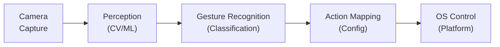
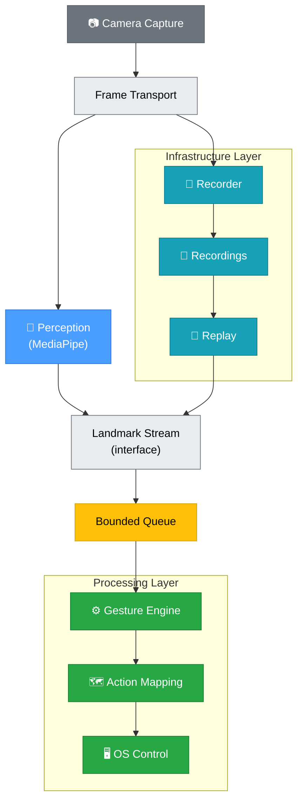

# AirOS Architecture

> This document describes the high-level architecture of AirOS. It is a living document that will evolve as the system grows.
>
> The architecture intentionally presents multiple levels of abstraction. The product overview explains what AirOS does, while the engineering architecture explains how the system is structured internally.

## System Overview

AirOS is an AI-powered hand gesture interaction system that processes webcam input in real time to detect hand gestures and map them to desktop actions.

## Pipeline Architecture

The following diagram shows the **product-level** pipeline — the simplest way to understand what AirOS does:

### Stage Descriptions

| Stage | Responsibility | Key Concerns |
|---|---|---|
| **Camera Capture** | Capture raw frames from webcam | Frame rate, resolution, timestamping |
| **Perception** | Detect hands, extract landmarks, estimate 3D coordinates, compute confidence, identify handedness | Model accuracy, latency, GPU/CPU |
| **Gesture Recognition** | Classify hand poses into named gestures | Gesture vocabulary, confidence thresholds |
| **Action Mapping** | Map gestures to system actions | Configuration, customisability |
| **OS Control** | Execute system-level actions | Platform compatibility, permissions |

> [!NOTE]
> This stage was previously named "Hand Detection." It was renamed to "Perception" because the stage does significantly more than detection — it extracts 21 landmarks, estimates 3D coordinates, computes per-landmark confidence scores, and identifies handedness. "Perception" is the standard term in robotics and autonomous systems for the subsystem that converts raw sensor data into structured world representations.

## Engineering Architecture

The product-level diagram above shows *what* AirOS does. The diagram below shows *how* data flows through the system, including infrastructure modules that support replay, debugging, benchmarking, and future machine learning.

Recorder and Replay form AirOS's **engineering infrastructure**. They are not required for live operation, but they enable debugging, benchmarking, regression testing, reproducibility, and future machine learning workflows.

### Key Architectural Properties

| Property | Description |
|---|---|
| **Landmark Stream** | The common interface that both Perception (live) and Replay (offline) produce into. Any module that consumes landmarks reads from this stream — it does not know or care whether the data is live or replayed. If a future module needs landmark data, it subscribes to the stream without modifying Replay or Perception. |
| **Recorder fork** | The Recorder forks **directly from Camera Capture via Frame Transport**, not from Perception. This resolves the architectural conflict between Live Processing (which drops frames via a bounded queue for freshness) and the Recorder (which uses an unbounded queue to preserve absolute completeness). |
| **Infrastructure layer** | The Recorder, Recordings, and Replay system exist to support offline analysis. They do not affect the live processing path. |
| **Processing layer** | The Gesture Engine, Action Mapping, and OS Control form the real-time processing path that translates landmarks into desktop actions. |
| **Bounded queue** | Sits only on the processing path, between the Landmark Stream and the Gesture Engine, as well as before Perception. Decouples stream production speed from processing consumption speed. Prevents memory growth; prioritises fresh data over complete data. |
| **Recorder passivity** | The Recorder writes the original observations to disk. It does not filter, smooth, or interpret data. See [Document 03](handbook/03-recorder-and-replay.md). |

> For the producer–consumer model, bounded queues, latency budgets, and freshness-over-completeness trade-off, see [Engineering Document 04: Real-Time Systems](handbook/04-real-time-systems.md). For the Recorder's responsibilities and data schema, see [Engineering Document 03: Recorder and Replay Architecture](handbook/03-recorder-and-replay.md).

## Design Principles

1. **Each stage is a module** — Stages communicate through well-defined interfaces. Any stage can be swapped without affecting others.
2. **Configuration over code** — Gesture-to-action mappings are config, not hardcoded.
3. **Research ≠ Production** — Experiments happen in `research/`. Proven approaches graduate to `src/`.
4. **Measure everything** — Latency and accuracy benchmarks are first-class citizens.
5. **Infrastructure supports processing** — The Recorder and Replay system exist to make the processing layer debuggable, benchmarkable, and trainable.

## Module Boundaries

### Camera Capture

The Camera Capture module is the primary producer of facts. Its sole responsibility is to acquire raw frames from the webcam, attach a timestamp and sequential frame number, and publish them via Frame Transport. It operates independently of any consumers and makes no decisions about data interpretation.

### Perception

The Perception stage wraps the hand detection and landmark extraction model (currently MediaPipe). It receives image frames and produces structured landmark data with confidence scores and handedness. If AirOS migrates to a different model, only this module changes — all downstream modules depend on the landmark format, not on MediaPipe specifically.

The Landmark Stream is the stable contract between Perception and downstream consumers. Future perception implementations must preserve this contract even if the underlying CV model changes.

### Recorder

The Recorder is a passive infrastructure module responsible for preserving the original observations emitted by Camera Capture, without interpretation. Its responsibilities, design philosophy, data schema, and role in replay, benchmarking, debugging, and machine learning are documented in [Engineering Document 03: Recorder and Replay Architecture](handbook/03-recorder-and-replay.md). Note that while Document 03 initially placed the Recorder after Perception, Document 04 formally moved it to fork directly from Camera Capture to resolve queue policy conflicts.

### Replay

The Replay module reads recorded sessions from disk and emits landmark data into the Landmark Stream. It produces the same interface as live Perception — downstream consumers cannot distinguish live from replayed data.

<!-- TODO: Expand when Replay is implemented -->

### Gesture Engine

The Gesture Engine consumes landmark data from the Landmark Stream (via the Bounded Queue) and classifies hand poses into named gestures.

<!-- TODO: Expand when Gesture Engine is implemented -->

### Action Mapping

Action Mapping translates recognised gestures into system actions (e.g., mouse move, click, scroll). Mappings are driven by configuration, not hardcoded.

<!-- TODO: Expand when Action Mapping is implemented -->

### OS Control

OS Control executes system-level input events on the host platform. Currently targets macOS. If multi-platform support is added, this module will be refactored and the rename considered via an ADR.

<!-- TODO: Expand when OS Control is implemented -->

## Key Technical Decisions

See [Architecture Decision Records](adr/) for the reasoning behind significant technical choices.

## Engineering Handbook

For foundational concepts — landmarks, coordinate systems, data pipelines, producer/consumer patterns, and engineering principles — see the [Engineering Handbook](handbook/).
