# Hand Landmarks and Coordinate System Fundamentals

> **AirOS Engineering Handbook · Document 01**

---

| Field | Value |
|---|---|
| **Document Version** | v1.1 |
| **Last Updated** | 2026-07-06 |
| **Author** | Varun |
| **Status** | Living Document |
| **Prerequisites** | None — this is the foundational document |
| **Next Reading** | [02-data-pipeline.md](./02-data-pipeline.md) |

---

## Objective

This document establishes the foundational understanding of **hand landmarks** and the **coordinate system** that all AirOS subsystems depend on. After reading this document, the reader should be able to:

- Explain what a webcam does and does not do
- Describe the end-to-end pipeline from physical hand to desktop action
- Identify any of the 21 MediaPipe hand landmarks by index
- Interpret normalized (x, y, z) coordinates correctly
- Distinguish between position and confidence
- Apply defensive programming strategies to sensor data
- Select the minimum set of landmarks required for a given gesture

---

## Why This Matters

AirOS does not recognize hand gestures by watching a video. It recognizes gestures by interpreting **structured numerical data** — specifically, a set of three-dimensional coordinates called **hand landmarks**. Every algorithm in the system, every threshold, every filter, every classifier, operates on this data. If the data is misunderstood, every decision built on top of it will be unreliable.

> **You cannot build a reliable system on data you do not understand.**

This document exists so that months from now, when a gesture classifier produces unexpected results or a smoothing filter introduces drift, the debugging process starts with the right mental model of what the data actually represents — its structure, its limitations, its noise characteristics, and its failure modes.

---

## Table of Contents

1. [How a Webcam Works](#1-how-a-webcam-works)
2. [From Image to Intelligence](#2-from-image-to-intelligence)
3. [What Are Hand Landmarks?](#3-what-are-hand-landmarks)
4. [Why Exactly 21 Landmarks?](#4-why-exactly-21-landmarks)
5. [Engineering Principle: Minimum Useful Information](#5-engineering-principle-minimum-useful-information)
6. [The Coordinate System](#6-the-coordinate-system)
7. [Understanding the Z Coordinate](#7-understanding-the-z-coordinate)
8. [Confidence vs. Position](#8-confidence-vs-position)
9. [Defensive Programming with Sensor Data](#9-defensive-programming-with-sensor-data)
10. [Feature Selection](#10-feature-selection)
11. [How AirOS Uses This](#11-how-airos-uses-this)
12. [Common Mistakes](#12-common-mistakes)
13. [Engineering Lessons](#13-engineering-lessons)
14. [Key Takeaways](#14-key-takeaways)
15. [Questions for Revision](#15-questions-for-revision)
16. [Appendix: Complete Landmark Reference](#16-appendix-complete-landmark-reference)
17. [Related Documents](#17-related-documents)

---

## 1. How a Webcam Works

A common misconception is that a webcam "sees" things. It does not. A webcam is a **sensor**, and its only job is to convert light into a grid of color values.

### What a Webcam Actually Does

1. Light from the environment enters the lens.
2. The lens focuses that light onto an image sensor (typically a CMOS chip).
3. The sensor converts light intensity into electrical signals.
4. Those signals are digitized into pixel values — a rectangular grid of numbers.
5. The result is a single **image frame**.

This process repeats many times per second (typically 30 or 60 frames per second), producing a continuous stream of frames that we perceive as video.

### What a Webcam Does NOT Do

| Capability | Webcam? |
|---|---|
| Captures images | ✅ Yes |
| Detects hands | ❌ No |
| Understands gestures | ❌ No |
| Tracks motion | ❌ No |
| Measures depth | ❌ No (standard webcam) |
| Identifies objects | ❌ No |

A webcam is the equivalent of a **security camera with no guard watching the monitors**. It faithfully records whatever light hits its sensor. It has no concept of what a hand is, what a finger is, or what "pointing" means.

### Analogy

Think of a webcam like a photocopier. A photocopier does not understand the document it copies — it does not know whether it is copying a contract, a drawing, or a blank page. It simply reproduces the pattern of light and dark on the page. A webcam does the same thing, except it copies the scene in front of it 30 times per second.

> [!NOTE]
> This distinction matters because it defines the boundary of responsibility in the AirOS pipeline. The webcam produces **raw pixel data**. Everything beyond that — detecting a hand, locating fingers, recognizing gestures — is the responsibility of software that runs after the image is captured.

---

## 2. From Image to Intelligence

The journey from a physical hand in front of a camera to a system action on the desktop is a **multi-stage pipeline**. Each stage transforms the data into a progressively more useful representation.

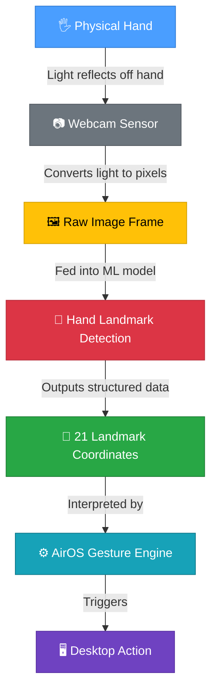

### Stage-by-Stage Breakdown

| Stage | Input | Output | Performed By |
|---|---|---|---|
| **1. Physical Hand** | — | Light reflected from hand surfaces | Physics |
| **2. Webcam Capture** | Light | Raw pixel array (e.g., 640×480×3) | Camera hardware |
| **3. Image Frame** | Pixel array | BGR/RGB image matrix | Camera driver |
| **4. Landmark Detection** | Image frame | 21 × (x, y, z) + confidence | MediaPipe ML model |
| **5. Landmark Interpretation** | Coordinates + confidence | Recognized gesture or control signal | AirOS software |
| **6. Desktop Action** | Control signal | Mouse move, click, scroll, etc. | OS integration layer |

### Why This Pipeline Matters

Each stage in this pipeline has a different **failure mode**:

- The webcam can fail due to poor lighting or occlusion.
- The ML model can fail due to unusual hand positions or fast motion.
- The gesture engine can fail due to incorrect threshold tuning.
- The OS layer can fail due to permission restrictions.

Understanding the pipeline means understanding **where to look** when something goes wrong. If the cursor jitters, the cause could be anywhere from Stage 2 (noisy frames) to Stage 5 (unfiltered coordinates). Knowing the pipeline narrows the search.

---

## 3. What Are Hand Landmarks?

### The Problem That Landmarks Solve

An image of a hand is a grid of millions of pixel values. A 640×480 image contains 307,200 pixels, each with three color channels (red, green, blue), producing 921,600 individual numbers. Most of those numbers describe the background, the lighting, the sleeve of a shirt — things that have nothing to do with gesture recognition.

**Landmarks are a solution to this problem.** Instead of working with hundreds of thousands of irrelevant numbers, a hand landmark model extracts a small set of **meaningful points** that describe the hand's pose.

### Definition

A **landmark** is a specific, anatomically meaningful point on the hand, represented as a set of coordinates (x, y, z) in a defined coordinate space.

Each landmark corresponds to a joint, a fingertip, or a structural point on the hand that is useful for understanding the hand's shape and orientation.

### Pixels vs. Landmarks

| Property | Raw Pixels | Landmarks |
|---|---|---|
| **Quantity** | 300,000+ per frame | 21 per hand |
| **Meaning** | Color intensity at a grid position | Anatomical position of a hand joint |
| **Relevance** | Mostly background/noise | Entirely about the hand |
| **Representation** | 2D grid of RGB values | List of 3D coordinates |
| **Size** | ~900 KB per frame (raw) | ~252 bytes per hand (21 × 3 × float32) |
| **Usable directly?** | No — requires further processing | Yes — directly usable for gesture logic |

### Intuitive Example

Imagine trying to describe someone's hand position over the phone.

You would **not** say: *"The pixel at row 234, column 189 is a warm beige color, and the pixel at row 235 is slightly darker..."*

You **would** say: *"The index finger is pointing up, the thumb is extended to the left, and the other fingers are curled into the palm."*

Landmarks give the computer the second kind of description — a compact, meaningful summary of the hand's pose, rather than a raw dump of color values.

### Key Landmark Identifiers

MediaPipe's hand landmark model detects **21 landmarks** per hand. The following are the most frequently referenced in AirOS:

| Landmark ID | Name | Anatomical Location | AirOS Relevance |
|---|---|---|---|
| **0** | `WRIST` | Base of the hand | Reference point for hand position |
| **4** | `THUMB_TIP` | Tip of the thumb | Pinch gestures, grip detection |
| **8** | `INDEX_FINGER_TIP` | Tip of the index finger | Cursor control, pointing, pinch |
| **12** | `MIDDLE_FINGER_TIP` | Tip of the middle finger | Scroll gestures, multi-finger input |
| **16** | `RING_FINGER_TIP` | Tip of the ring finger | Extended gesture vocabulary |
| **20** | `PINKY_TIP` | Tip of the little finger | Open-hand detection, palm gestures |

### Landmark Topology

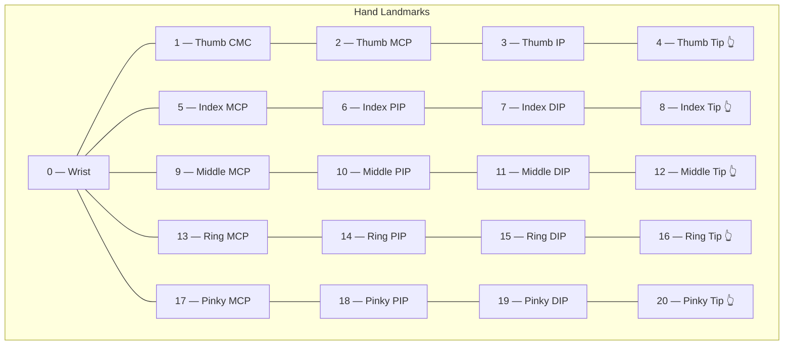

> [!NOTE]
> The 21 landmarks are indexed 0 through 20. Each finger has four landmarks (MCP, PIP, DIP, Tip), and the wrist serves as the root anchor at index 0. Memorizing the six tip indices — **0, 4, 8, 12, 16, 20** — is sufficient for the majority of early AirOS development.

---

## 4. Why Exactly 21 Landmarks?

This is an engineering question, not a mathematical one. The answer lies in **trade-offs**.

### Why Not Fewer (e.g., 10)?

Ten landmarks — for example, five fingertips and five knuckles — would reduce the data further, but at a significant cost:

- **Lost articulation**: You could tell which fingers are extended but not how they are bent.
- **Ambiguous gestures**: A "thumbs up" and a "fist with thumb extended" might produce identical 10-point representations.
- **No palm orientation**: Without the wrist and MCP joints, the hand's rotation in space becomes difficult to infer.

### Why Not More (e.g., 100)?

One hundred landmarks — densely sampling every crease, every skin fold, every nail edge — would provide extraordinary detail, but:

- **Computation cost explodes**: The ML model must predict each landmark's position. More landmarks means a larger model, more parameters, and more floating-point operations per frame.
- **Latency increases**: AirOS must run in real time. Adding 5× more landmarks could push per-frame inference from 5ms to 25ms, violating the latency budget for smooth cursor control.
- **Diminishing returns**: Most of the additional 79 landmarks would be on skin surfaces between joints — positions that can be interpolated from the 21 existing landmarks and that carry minimal gesture information.
- **Noise amplifies**: More landmarks means more points that can be incorrectly predicted, especially on featureless skin surfaces where the model has fewer visual cues.

### The Trade-Off Matrix

| Factor | Fewer Landmarks | 21 Landmarks | More Landmarks |
|---|---|---|---|
| Inference speed | ⚡ Fastest | ⚡ Fast | 🐢 Slower |
| Model complexity | Simple | Moderate | Complex |
| Gesture discrimination | ❌ Poor | ✅ Good | ✅ Marginal gain |
| Noise susceptibility | Low | Moderate | High |
| Real-time viability | ✅ Easy | ✅ Feasible | ⚠️ Constrained |
| Articulation detail | ❌ Insufficient | ✅ Sufficient | ✅ Excessive |

### The Core Insight

Twenty-one is the point where the model captures **enough structural information** to distinguish the full range of common hand gestures, while remaining small enough to run in real time on consumer hardware without a GPU.

This is not a lucky guess — it is the result of anatomical analysis (the human hand has approximately 21 major joints and structural points) combined with computational budget constraints.

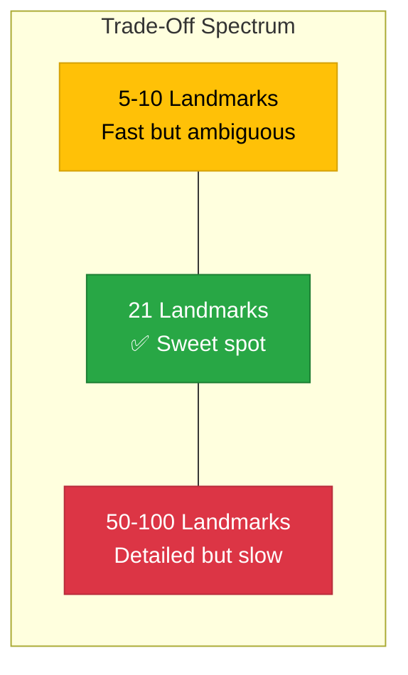

---

## 5. Engineering Principle: Minimum Useful Information

> [!IMPORTANT]
> ### Engineering Principle #1
>
> *"Engineering is not about collecting the maximum amount of data. Engineering is about collecting the **minimum amount of useful information** required to solve the problem reliably."*

This principle appears everywhere in engineering, not just in computer vision:

| Domain | Maximum Data Approach | Minimum Useful Information Approach |
|---|---|---|
| **Structural engineering** | Instrument every square inch of a bridge with strain gauges | Place sensors at the critical stress points identified by structural analysis |
| **Network monitoring** | Log every packet on the network | Monitor aggregate throughput, error rates, and latency at key junctions |
| **Medical diagnostics** | Run every possible test on every patient | Use symptoms to select targeted diagnostic tests |
| **AirOS** | Process all 921,600 pixel values per frame | Extract 21 landmarks (63 numbers) per frame |

### Why This Principle Matters for AirOS

In real-time systems, **every unnecessary byte of data costs time**. Time spent processing irrelevant data is time not spent responding to the user. The 21-landmark representation is a 14,600× reduction in data volume compared to raw pixel processing (921,600 values → 63 values), while preserving essentially all of the information needed for gesture recognition.

This is not a shortcut — it is **information-theoretic efficiency**. The landmarks capture the degrees of freedom of the human hand. Everything else in the image — the lighting, the background, the skin texture — is noise from the perspective of gesture recognition.

### The Practical Consequence

When designing a new gesture for AirOS, the first question is never *"What does the hand look like?"* The first question is always *"Which landmark positions and relationships uniquely define this gesture?"* This reframing — from visual appearance to geometric relationships — is what makes the system tractable.

---

## 6. The Coordinate System

Every landmark is described by three coordinates: **x**, **y**, and **z**. Understanding what these values mean — and what they do not mean — is critical.

### Axes Overview

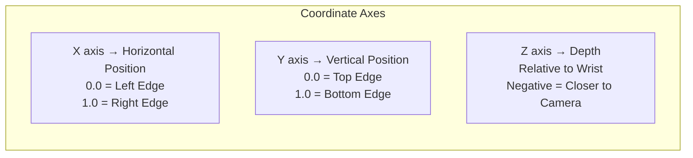

| Axis | Direction | Range | Reference |
|---|---|---|---|
| **x** | Horizontal (left → right) | 0.0 to 1.0 | Image frame width |
| **y** | Vertical (top → bottom) | 0.0 to 1.0 | Image frame height |
| **z** | Depth (toward/away from camera) | Unbounded (relative) | Wrist landmark depth |

### Understanding X

The `x` coordinate represents **horizontal position** within the camera frame.

- `x = 0.0` → The landmark is at the **left edge** of the image.
- `x = 0.5` → The landmark is at the **horizontal center**.
- `x = 1.0` → The landmark is at the **right edge** of the image.

### Understanding Y

The `y` coordinate represents **vertical position** within the camera frame.

- `y = 0.0` → The landmark is at the **top edge** of the image.
- `y = 0.5` → The landmark is at the **vertical center**.
- `y = 1.0` → The landmark is at the **bottom edge** of the image.

> [!NOTE]
> The y-axis is **inverted** compared to standard mathematical convention. In mathematics, y increases upward. In image coordinates (and MediaPipe), y increases **downward**. This is because images are stored as grids that are read top-to-bottom, left-to-right — like reading a page of text.

### Why Normalized Coordinates?

MediaPipe does not return pixel positions like `(342, 187)`. Instead, it returns **normalized coordinates** in the range [0.0, 1.0]. This is a deliberate design choice.

#### The Problem with Pixel Coordinates

Consider a webcam running at 640×480 resolution. The index fingertip is at pixel (320, 240) — the center of the frame. Now the user switches to a 1920×1080 webcam. The same physical finger position would now be at pixel (960, 540).

The finger has not moved. The gesture has not changed. But every threshold, every boundary check, every mapping calculation in the system would break because the numbers changed.

#### How Normalization Solves This

| Resolution | Pixel Position (center) | Normalized Position (center) |
|---|---|---|
| 640 × 480 | (320, 240) | (0.5, 0.5) |
| 1280 × 720 | (640, 360) | (0.5, 0.5) |
| 1920 × 1080 | (960, 540) | (0.5, 0.5) |

With normalized coordinates, the center of the frame is always `(0.5, 0.5)`, regardless of resolution. This means:

- AirOS gesture thresholds work on **any webcam**.
- No recalibration is needed when the camera changes.
- All coordinate logic is **resolution-independent**.

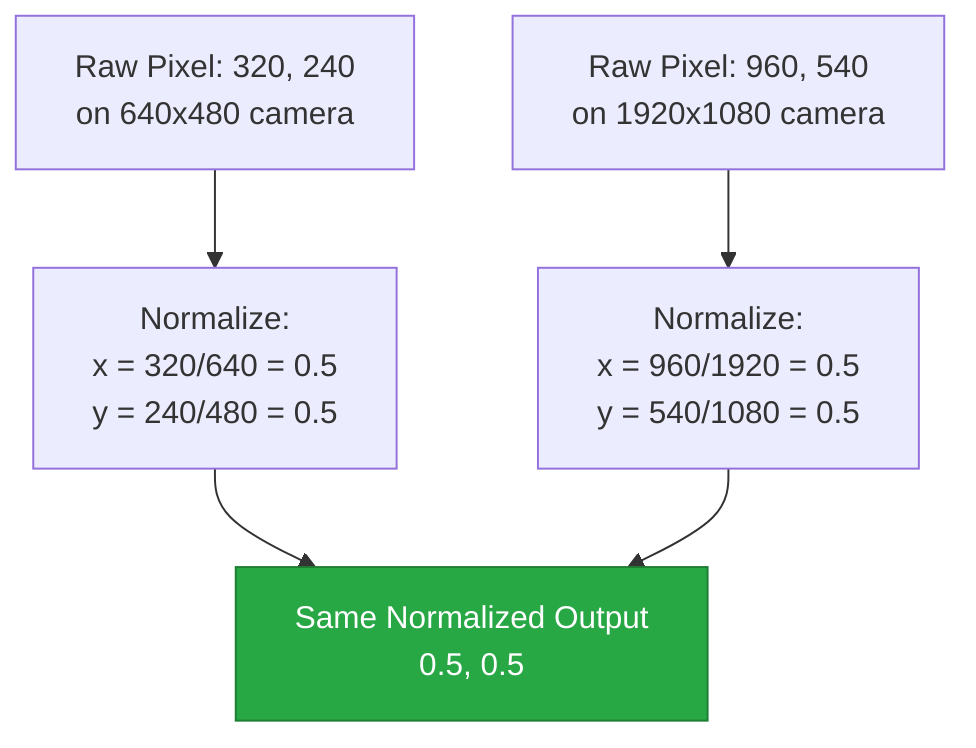

> [!IMPORTANT]
> **All coordinate comparisons and threshold checks in AirOS must use normalized coordinates.** If any module converts to pixel space for internal calculations, it must convert back to normalized space before passing data to other modules. Pixel-space calculations are a common source of resolution-dependent bugs.

---

## 7. Understanding the Z Coordinate

The `z` coordinate is the most misunderstood value in the landmark data, and it behaves fundamentally differently from `x` and `y`.

### How Z Differs from X and Y

| Property | x and y | z |
|---|---|---|
| **Range** | 0.0 to 1.0 (normalized) | Unbounded (positive and negative) |
| **Reference** | Image frame edges | Wrist landmark (approximately) |
| **Physical meaning** | Position on a 2D plane | Relative depth from camera |
| **Accuracy** | High (directly observed in image) | Lower (inferred, not directly observed) |
| **Units** | Fraction of frame dimension | Roughly proportional to hand scale |

### Why Z Is Relative

A standard webcam captures a **2D projection** of the 3D world. It inherently destroys depth information — a small hand close to the camera and a large hand far from the camera can produce identical images.

MediaPipe reconstructs `z` using a learned model trained on 3D hand data, but this reconstruction is an **estimate**, not a measurement. The `z` value is expressed relative to the wrist landmark (index 0), meaning:

- **z = 0** → The landmark is at approximately the same depth as the wrist.
- **z < 0** (negative) → The landmark is **closer to the camera** than the wrist.
- **z > 0** (positive) → The landmark is **further from the camera** than the wrist.

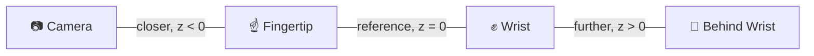

### What Matters: Relative Change, Not Absolute Value

A `z` value of `-0.05` is not inherently meaningful. What is meaningful is the **change** in `z` over time or the **difference** in `z` between landmarks.

| Use Case | What Z Tells AirOS |
|---|---|
| **Pinch detection** | Thumb tip and index tip have similar z values (same depth) |
| **Push gesture** | Fingertip z decreases rapidly (moving toward camera) |
| **Flat hand vs. angled hand** | All fingertip z values are similar (flat) vs. varied (angled) |
| **Tap detection** | Brief negative z spike followed by return to baseline |

> [!NOTE]
> For early AirOS development, the `z` coordinate is primarily useful for **distinguishing between gestures that look similar in 2D but differ in 3D**. For example, a pointing gesture and a pushing gesture may have the same x/y positions but different z trajectories. As the system matures, z will become increasingly important for depth-aware interactions.

---

## 8. Confidence vs. Position

MediaPipe provides two fundamentally different types of information for each landmark, and confusing them is a common source of bugs.

### Position

Position (`x`, `y`, `z`) describes **where** the model thinks the landmark is located.

### Confidence (Visibility / Presence)

Confidence describes **how certain** the model is that the landmark is correctly detected and visible. MediaPipe provides a `visibility` score (0.0 to 1.0) for each landmark.

### The Critical Distinction

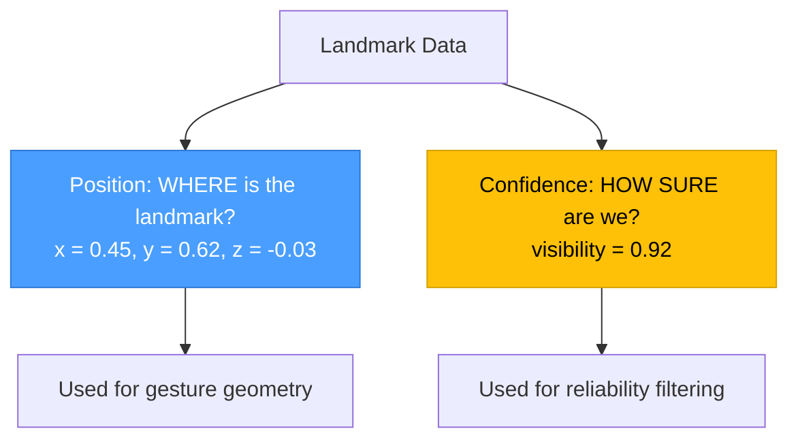

### Why Z ≠ Confidence

A `z` value of `-0.05` means the fingertip is slightly in front of the wrist. It says **nothing** about confidence. Consider these scenarios:

| z value | Confidence | Interpretation |
|---|---|---|
| -0.05 | 0.95 | Fingertip reliably detected, slightly in front of wrist |
| -0.05 | 0.20 | Model is guessing — this position may be completely wrong |
| 0.00 | 0.98 | Fingertip reliably detected at wrist depth |
| 0.00 | 0.10 | Model cannot see the fingertip — position is unreliable |

A low confidence value does not mean the landmark is in a certain position. It means the **model does not know where the landmark is** and is producing a low-quality estimate.

### How AirOS Should Handle Low Confidence

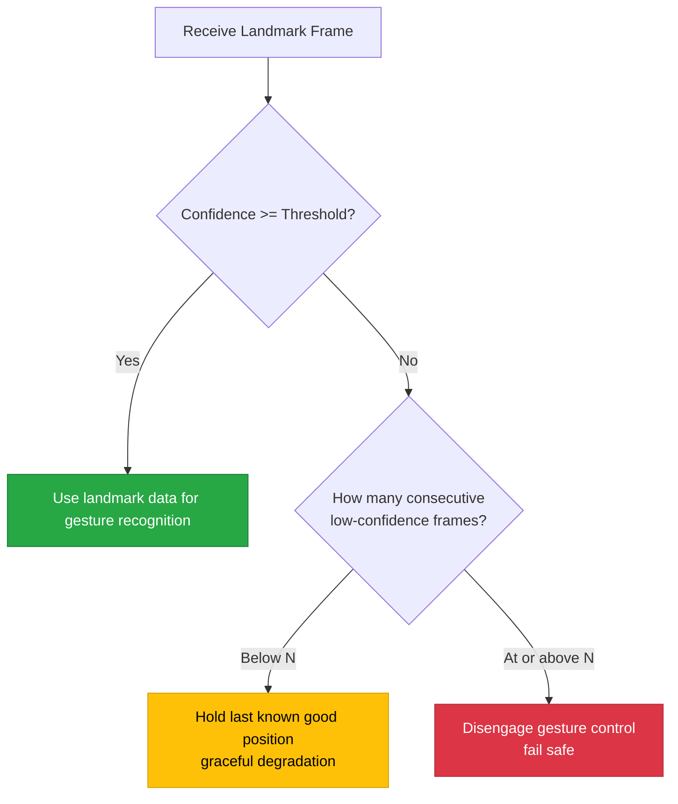

> [!IMPORTANT]
> AirOS must **never** execute a high-consequence action (e.g., a click or a drag) based on low-confidence landmark data. The confidence threshold is a tunable parameter, but it must exist. A system that trusts all data equally will behave erratically whenever the hand is partially occluded, in poor lighting, or at the edge of the frame.

---

## 9. Defensive Programming with Sensor Data

### The Core Rule

> **Production software never blindly trusts sensor input.**

Every sensor — cameras, LiDAR, IMUs, GPS, microphones — produces data that is noisy, occasionally incorrect, and sometimes completely invalid. Systems that assume sensor data is always correct will eventually fail in unpredictable ways.

### Why Sensor Data Is Unreliable

| Failure Mode | Cause | Effect on AirOS |
|---|---|---|
| **Noise** | Electrical interference, compression artifacts | Landmarks jitter by 1–3 pixels between frames |
| **Occlusion** | Fingers overlap from camera's perspective | Model guesses hidden landmark positions |
| **Motion blur** | Fast hand movement exceeds exposure time | Entire frame becomes a smeared blob |
| **Lighting change** | Shadow, backlight, screen glare | Skin detection fails; landmarks drift |
| **Frame drop** | USB bandwidth, CPU load | Landmark stream has temporal gaps |
| **Model failure** | Unusual hand pose, edge of frame | Landmarks placed in physically impossible positions |

### Defensive Strategies

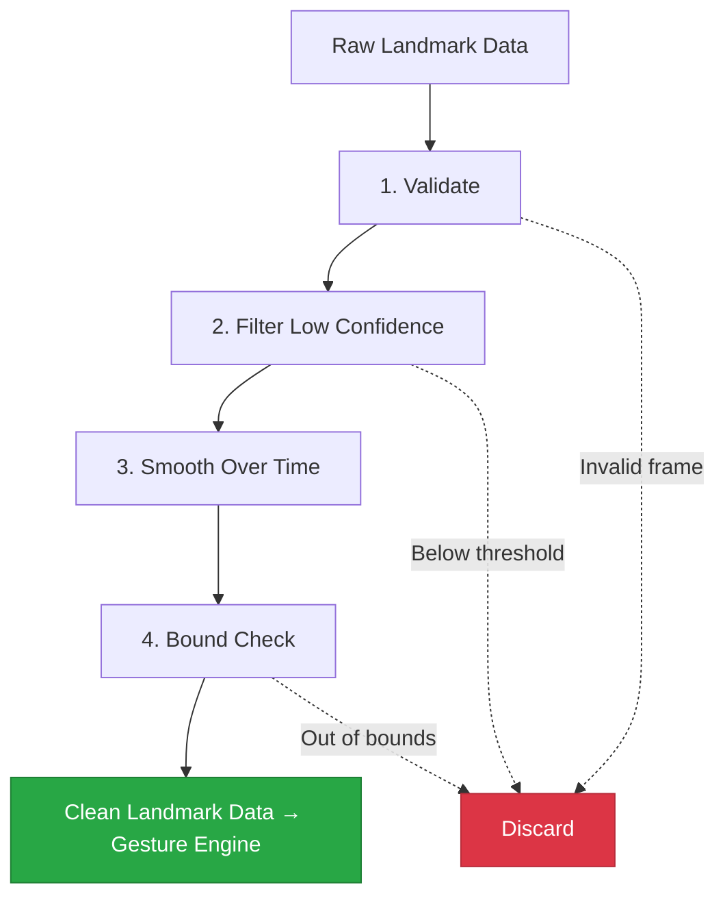

#### 1. Validate: Reject Impossible Data

If a landmark's `x` or `y` value is outside [0.0, 1.0], the data is corrupted. If two landmarks that should be connected (e.g., a fingertip and its adjacent joint) are further apart than anatomically possible, the model has failed. Discard the frame.

#### 2. Filter: Ignore Low-Confidence Frames

If the overall hand detection confidence or individual landmark visibility drops below a threshold, do not use the data. Hold the last known good state or disengage control.

#### 3. Smooth: Reduce Noise Over Time

Apply temporal smoothing (e.g., exponential moving average, one-euro filter) to landmark positions. This reduces frame-to-frame jitter without introducing excessive latency.

#### 4. Bound Check: Constrain Outputs

Even after smoothing, verify that the resulting coordinates produce physically plausible gestures. A cursor that teleports across the screen in a single frame indicates a data anomaly, not a user action.

### Precedent in Other Domains

AirOS is not unique in needing these defenses. The same strategies appear across safety-critical and real-time systems:

| Domain | Defensive Strategy | Analogy to AirOS |
|---|---|---|
| **Autonomous vehicles** | Sensor fusion: cross-check LiDAR against camera against radar | Cross-check landmark positions against expected anatomy |
| **Robotics** | Joint limit enforcement: never command a motor past its safe range | Never map a landmark position to a screen position outside the display |
| **Aviation** | Triple-redundant instruments: reject the outlier | Compare current frame landmarks to recent history; reject outliers |
| **Medical devices** | Signal quality indices: suppress output when input quality is low | Suppress gesture recognition when landmark confidence is low |

> [!CAUTION]
> Skipping defensive programming during prototyping is tempting ("it works on my desk"). But AirOS is a real-time control system — an erroneous click or cursor jump caused by unvalidated sensor data can disrupt the user's workflow. Build the validation pipeline early. Retrofitting it into a system that was designed to trust all data is significantly harder.

---

## 10. Feature Selection

### Not Every Gesture Needs Every Landmark

AirOS detects 21 landmarks per hand per frame. That is 63 values (21 × 3 coordinates) arriving at up to 30 times per second. But most gestures can be recognized using a **subset** of those landmarks.

### Gesture-Specific Landmarks

| Gesture | Required Landmarks | Why |
|---|---|---|
| **Pinch** | 4 (Thumb Tip), 8 (Index Tip) | Pinch is defined by the distance between these two tips |
| **Cursor movement** | 8 (Index Tip) | Cursor position maps from the index fingertip's x/y |
| **Scroll** | 8 (Index Tip), 12 (Middle Tip) | Scroll uses the vertical motion of two extended fingers |
| **Open hand** | 4, 8, 12, 16, 20 (all tips) + 0 (Wrist) | All fingers extended, tips far from wrist |
| **Fist** | 4, 8, 12, 16, 20 (all tips) + 5, 9, 13, 17 (MCPs) | All tips curled near their respective MCPs |

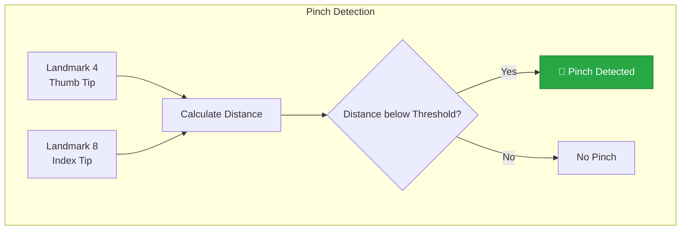

### Why Not Always Use All 21?

For **rule-based** gesture detection (e.g., threshold-based pinch detection), using all 21 landmarks would add unnecessary computation without improving accuracy. The pinch gesture is fully defined by two points — adding the other 19 landmarks provides zero additional information.

### When to Use All 21

However, when AirOS moves to **machine learning-based** gesture classification, the classifier may benefit from all 21 landmarks. A neural network might discover that the position of the ring finger's MCP joint subtly correlates with a more reliable pinch prediction — a relationship that is difficult for a human to notice but that the model can learn.

This is the concept of **feature selection** in machine learning:

> **Feature selection** is the process of identifying which input variables (features) are most relevant to the prediction task. Using fewer, more relevant features often produces models that are faster, more interpretable, and less prone to overfitting — but the optimal feature set may not be obvious in advance.

### The AirOS Approach

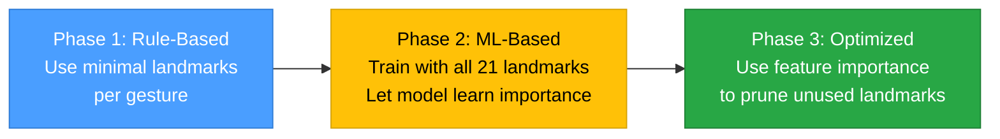

> [!TIP]
> During early development, explicitly selecting which landmarks each gesture uses serves a dual purpose: it reduces computation **and** forces the developer to reason about what geometrically defines each gesture. This geometric reasoning will later inform how training data is labeled and how classifiers are evaluated.

---

## 11. How AirOS Uses This

Every concept in this document connects directly to a current or planned AirOS subsystem. This section maps theory to practice.

### Current Phase: Recorder

The AirOS Recorder captures raw landmark data from MediaPipe and persists it to disk. Understanding landmarks is essential because the Recorder's output **is** the landmark stream — 21 coordinates per hand, per frame, with confidence values.

Without understanding the coordinate system and normalization, the recorded data would be an opaque stream of numbers. With this understanding, the data becomes inspectable, debuggable, and replayable.

| Concept from This Document | How the Recorder Uses It |
|---|---|
| Normalized coordinates | Recorded data is resolution-independent; replay works on any machine |
| 21 landmarks | Defines the schema of each recorded frame |
| Confidence values | Enables post-hoc analysis of detection quality |
| Pipeline stages | Recorder sits between Stage 4 (detection) and Stage 5 (interpretation) |

### Future Phases

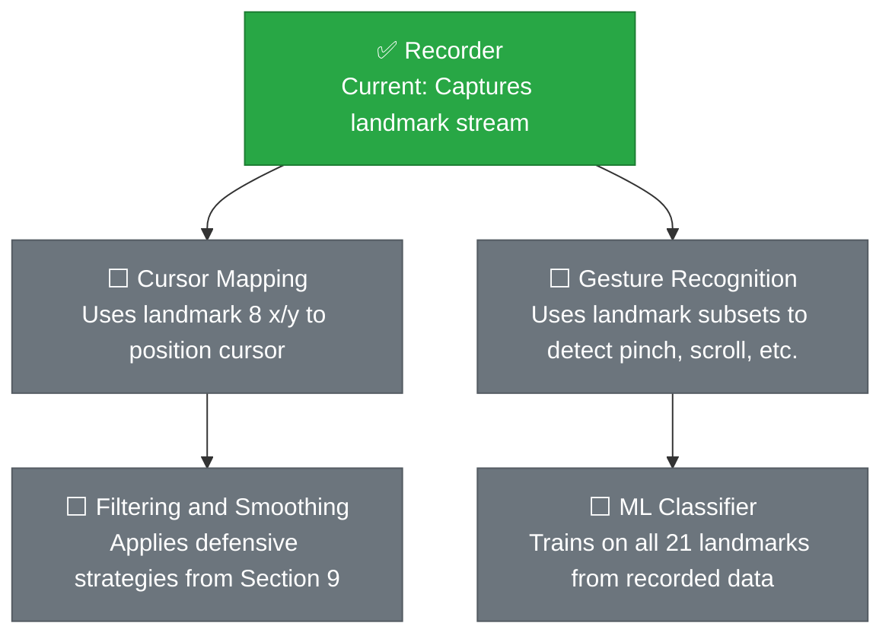

| Future Module | Depends On (from this document) |
|---|---|
| **Cursor Mapping** | Normalized x/y of landmark 8; coordinate system orientation |
| **Gesture Recognition** | Feature selection — which landmarks define each gesture |
| **ML Classifier** | All 21 landmarks as training features; recorded data as training set |
| **Filtering & Smoothing** | Defensive programming strategies; confidence thresholds |
| **Depth Interactions** | Z coordinate behavior; relative vs. absolute depth |

> [!NOTE]
> This is why the Recorder was built first — it captures the raw data that every future module depends on. You cannot train a classifier without labeled data. You cannot tune a smoothing filter without noisy data to study. The Recorder makes all of that possible. See [ADR-0001](../adr/0001-record-architecture-decisions.md) for the decision record on this approach.

---

## 12. Common Mistakes

These are errors that are easy to make and difficult to debug. Document them here so they only happen once.

### Mistake 1: Treating Pixel Coordinates as Normalized

**Symptom**: Gesture thresholds work on one webcam but fail on another.

**Cause**: Threshold values were tuned using pixel positions (e.g., "pinch threshold = 30 pixels") instead of normalized distances. When the camera resolution changes, the pixel distance changes, but the normalized distance stays the same.

**Fix**: Always compute distances in normalized space. A pinch threshold should be something like `0.04` (normalized), not `30` (pixels).

---

### Mistake 2: Confusing Z with Confidence

**Symptom**: Gesture logic behaves as if a landmark is "uncertain" when `z` is close to zero, or "confident" when `z` is large.

**Cause**: The developer assumed `z` encodes certainty. It does not. Z is a spatial coordinate; confidence is a separate `visibility` field.

**Fix**: Always check `visibility` (or `presence`) explicitly. Never infer detection quality from position.

---

### Mistake 3: Trusting Every Frame Equally

**Symptom**: The cursor teleports across the screen, or a click fires while the user's hand is stationary.

**Cause**: A single corrupted or low-confidence frame produced wildly incorrect landmark positions, and the system acted on them without validation.

**Fix**: Implement the full defensive pipeline: validate → filter → smooth → bound-check.

---

### Mistake 4: Hardcoding Landmark Indices Without Constants

**Symptom**: Code becomes unreadable; bugs introduced by using wrong index.

**Cause**: Using raw numbers like `landmarks[8]` instead of named constants like `landmarks[INDEX_FINGER_TIP]`.

**Fix**: Define named constants for every landmark index used in the codebase. The number `8` means nothing to a reader; `INDEX_FINGER_TIP` is self-documenting.

---

### Mistake 5: Ignoring Y-Axis Inversion

**Symptom**: Scroll gesture moves in the wrong direction; "up" movements register as "down."

**Cause**: The developer assumed y increases upward (mathematical convention), but in image space y increases **downward**.

**Fix**: Always remember: `y = 0.0` is the **top** of the frame. When a finger moves physically upward, its `y` value **decreases**.

---

## 13. Engineering Lessons

The following principles, drawn from the material in this document, apply broadly across AirOS and beyond.

1. **Understand the data before writing algorithms.** The structure, range, noise characteristics, and failure modes of your input data determine the ceiling of your system's reliability. No algorithm can compensate for fundamentally misunderstood data.

2. **A sensor is not intelligent.** A webcam does not detect hands. It captures light. The intelligence comes from the software that processes the sensor's output. This distinction defines module boundaries and responsibilities.

3. **Know the pipeline.** Every stage of a processing pipeline transforms data and can introduce errors. When debugging, trace the data through the pipeline stage by stage.

4. **Landmarks are a compressed, meaningful representation.** They reduce 900,000+ pixel values to 63 numbers that capture the essential geometry of the hand. This compression is what makes real-time gesture recognition feasible.

5. **21 landmarks is a trade-off, not a magic number.** It balances anatomical completeness, computational cost, and real-time constraints. Fewer landmarks lose information; more landmarks add cost without proportional benefit.

6. **Collect minimum useful information.** Every unnecessary data point costs compute, increases noise surface, and complicates the system. Efficiency is not laziness — it is engineering discipline.

7. **Normalized coordinates decouple software from hardware.** By working in [0, 1] space, AirOS operates identically regardless of camera resolution. Always default to normalized representations unless pixel space is explicitly required.

8. **Z is relative and estimated.** Unlike x and y (which are directly observed in the image), z is inferred by the model. Use z for relative comparisons and changes over time, not as an absolute distance measurement.

9. **Position and confidence are independent measurements.** A landmark can have a precise position and low confidence, or a vague position and high confidence. Never infer one from the other.

10. **Never trust sensor data unconditionally.** Validate, filter, smooth, and bound-check all input. This applies to every system that processes real-world sensor data, from AirOS to autonomous vehicles.

11. **Select features deliberately.** Not every gesture requires all landmarks. Using the minimum set that uniquely defines a gesture reduces computation and clarifies the gesture's geometric definition.

12. **Design for failure.** Define what the system should do when confidence is low, when frames drop, when landmarks are occluded. The failure behavior is as important as the success behavior.

---

## 14. Key Takeaways

A concise reference for quick revision:

| # | Concept | One-Line Summary |
|---|---|---|
| 1 | Webcam | A light sensor, not an intelligent device |
| 2 | Landmarks | 21 meaningful 3D points that describe hand pose |
| 3 | Normalization | Coordinates in [0, 1] range → resolution-independent |
| 4 | X axis | Horizontal position, 0 = left, 1 = right |
| 5 | Y axis | Vertical position, 0 = top, 1 = bottom (inverted) |
| 6 | Z axis | Relative depth, negative = closer, relative to wrist |
| 7 | Confidence | Model's certainty, separate from position — always check it |
| 8 | Defensive programming | Validate → Filter → Smooth → Bound-check |
| 9 | Feature selection | Use only the landmarks each gesture needs |
| 10 | 21 landmarks | Trade-off: enough detail, fast enough for real time |
| 11 | Minimum useful information | Collect what matters, not everything available |
| 12 | Pipeline thinking | Debug by tracing data through stages |

---

## 15. Questions for Revision

Use these questions to test retention and understanding. If any answer is unclear, re-read the relevant section.

1. A webcam produces images at 30 fps. Does it detect hands? If not, what does?
2. Why does MediaPipe return 21 landmarks and not 50? What would go wrong with 50?
3. What is the normalized coordinate of the center of the frame? Why does this value not change when you switch cameras?
4. The y-axis is inverted. If a user lifts their hand, does the `y` value of landmark 8 increase or decrease?
5. What is the difference between `z = -0.05` and `confidence = 0.20`? Can a landmark have both simultaneously?
6. You detect a pinch gesture. Which landmark indices define it? Why don't you need all 21?
7. A frame arrives where landmark 8 has confidence = 0.12. What should AirOS do? What if this happens for 10 consecutive frames?
8. Name three failure modes of sensor data and the defensive strategy for each.
9. State Engineering Principle #1 in your own words. Give one example from outside computer vision.
10. Why was the Recorder built before cursor control? How does this document explain that decision?

---

## 16. Appendix: Complete Landmark Reference

For completeness, the full set of 21 MediaPipe hand landmarks:

| ID | Name | Finger | Joint Type |
|---|---|---|---|
| 0 | WRIST | — | Root |
| 1 | THUMB_CMC | Thumb | Carpometacarpal |
| 2 | THUMB_MCP | Thumb | Metacarpophalangeal |
| 3 | THUMB_IP | Thumb | Interphalangeal |
| 4 | THUMB_TIP | Thumb | Tip |
| 5 | INDEX_FINGER_MCP | Index | Metacarpophalangeal |
| 6 | INDEX_FINGER_PIP | Index | Proximal Interphalangeal |
| 7 | INDEX_FINGER_DIP | Index | Distal Interphalangeal |
| 8 | INDEX_FINGER_TIP | Index | Tip |
| 9 | MIDDLE_FINGER_MCP | Middle | Metacarpophalangeal |
| 10 | MIDDLE_FINGER_PIP | Middle | Proximal Interphalangeal |
| 11 | MIDDLE_FINGER_DIP | Middle | Distal Interphalangeal |
| 12 | MIDDLE_FINGER_TIP | Middle | Tip |
| 13 | RING_FINGER_MCP | Ring | Metacarpophalangeal |
| 14 | RING_FINGER_PIP | Ring | Proximal Interphalangeal |
| 15 | RING_FINGER_DIP | Ring | Distal Interphalangeal |
| 16 | RING_FINGER_TIP | Ring | Tip |
| 17 | PINKY_MCP | Pinky | Metacarpophalangeal |
| 18 | PINKY_PIP | Pinky | Proximal Interphalangeal |
| 19 | PINKY_DIP | Pinky | Distal Interphalangeal |
| 20 | PINKY_TIP | Pinky | Tip |

---

## 17. Related Documents

### Architecture

- [architecture.md](../architecture.md) — Overall AirOS system design and module interactions

### Architecture Decision Records

- [ADR-0001: Record Architecture Decisions](../adr/0001-record-architecture-decisions.md) — Why AirOS uses ADRs to capture technical decisions

### Engineering Series (Planned)

| Document | Topic | Status |
|---|---|---|
| **01** (this document) | Hand Landmarks and Coordinate System | ✅ Complete |
| **02** | Data Pipeline — Recording, Replay, and Engineering Thinking | ✅ Complete |
| **03** | Recorder and Replay Architecture | ⬜ Planned |
| **04** | Real-Time Systems — Latency budgets and frame timing | ⬜ Planned |
| **05** | Filtering and Smoothing — Noise reduction techniques | ⬜ Planned |
| **06** | Feature Extraction — Deriving gesture features from landmarks | ⬜ Planned |
| **07** | Gesture Recognition — Classification approaches | ⬜ Planned |
| **08** | Machine Learning — Training, evaluation, deployment | ⬜ Planned |

---

*AirOS Engineering Handbook · Hand Landmarks and Coordinate System Fundamentals · v1.1*
