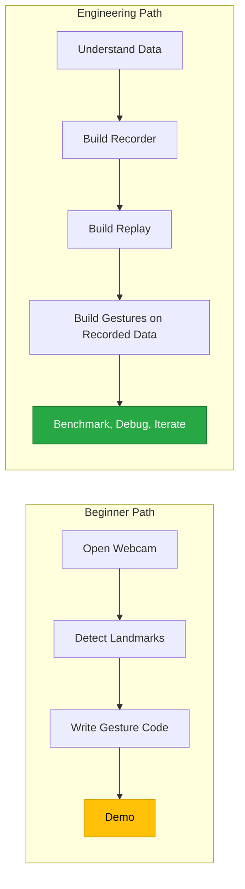
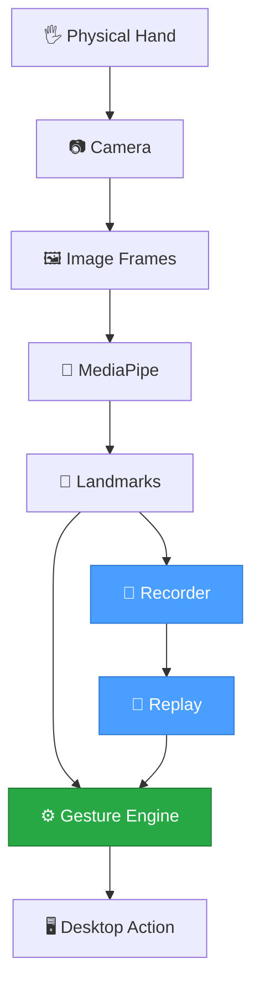
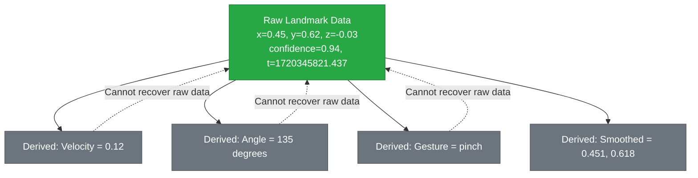
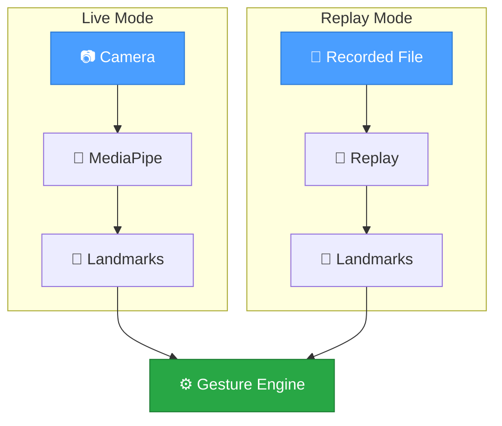
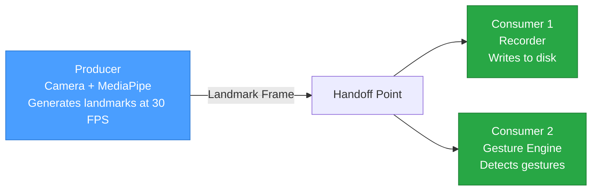
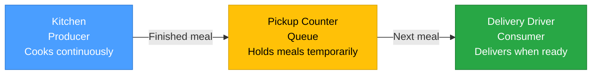
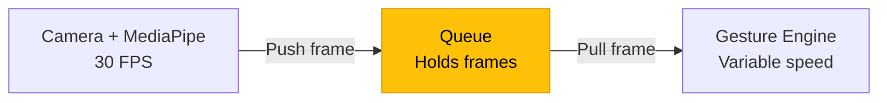
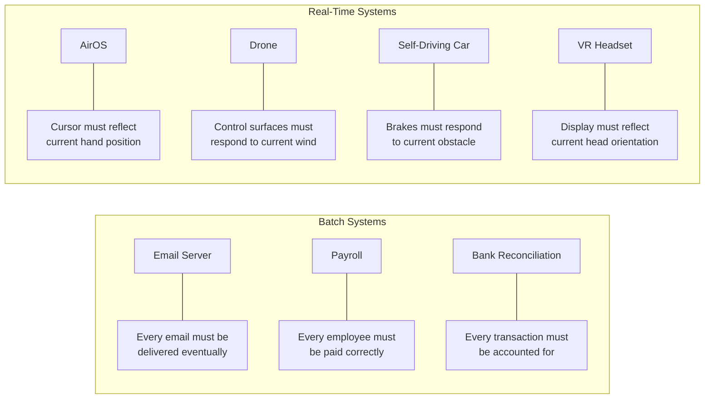
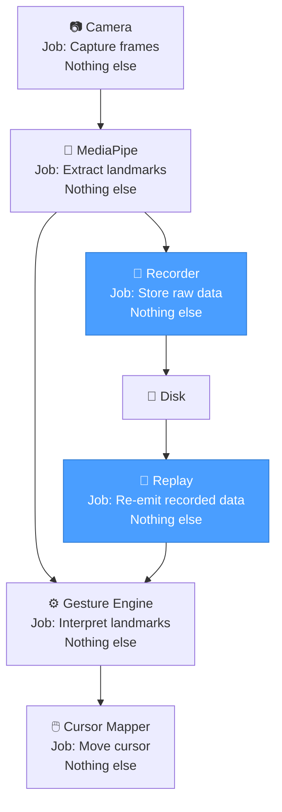
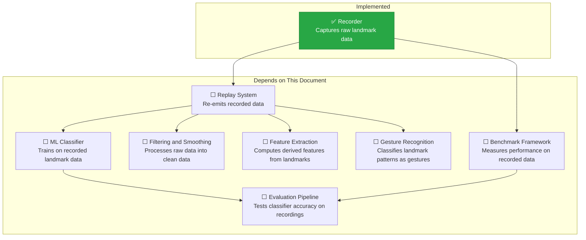

# Data Pipeline — Recording, Replay, and Engineering Thinking

> **AirOS Engineering Handbook · Document 02**

---

| Field | Value |
|---|---|
| **Document Version** | v1.0 |
| **Last Updated** | 2026-07-07 |
| **Author** | Varun |
| **Status** | Living Document |
| **Prerequisites** | [01-hand-landmarks-and-coordinate-system.md](./01-hand-landmarks-and-coordinate-system.md) |
| **Next Reading** | [03-recorder-and-replay.md](./03-recorder-and-replay.md) |

---

## Objective

This document explains the **data pipeline** that carries information from a physical hand to a desktop action, and why AirOS builds **data infrastructure** — the Recorder and Replay system — before building gesture recognition.

After reading this document, the reader should be able to:

- Explain why data infrastructure is built before features
- Describe the complete AirOS data pipeline and the role of each stage
- Distinguish between raw data and derived data, and explain why this matters
- Articulate why replay systems are essential in real-world engineering
- Define Producer and Consumer and explain why they must be decoupled
- Explain why queues exist, why they must be bounded, and what happens when they are not
- Compare batch systems and real-time systems, and explain why AirOS favors freshness over completeness
- Apply the principle of separation of responsibilities to system design

---

## Why This Matters

It is tempting to start a project like AirOS by writing gesture recognition immediately. That is what makes the demo exciting — a pinch gesture moves the cursor, and the project feels real.

But professional engineering does not start with the exciting part. It starts with the **infrastructure that makes everything else possible**.

The Recorder — AirOS's first real module — does nothing visible. It does not move the cursor. It does not recognize gestures. It simply captures raw landmark data and writes it to disk. This seems unimpressive until you realize what it enables:

- **Reproducibility**: Run the same hand motion through a new algorithm without re-performing the gesture.
- **Debugging**: Inspect exactly what the model detected on the frame where the cursor jumped.
- **Benchmarking**: Measure whether a new smoothing filter is faster or slower than the previous one on identical data.
- **Machine Learning**: Train a gesture classifier on thousands of recorded samples without requiring thousands of live performances.

Every one of these capabilities depends on having recorded the raw data first. If the Recorder does not exist, none of them are possible.

> **The most valuable code in a real-time system is often the code that records data, not the code that processes it.**

---

## Table of Contents

1. [Why AirOS Does Not Start With Gesture Recognition](#1-why-airos-does-not-start-with-gesture-recognition)
2. [What Is a Data Pipeline?](#2-what-is-a-data-pipeline)
3. [Raw Data vs. Derived Data](#3-raw-data-vs-derived-data)
4. [Why Replay Systems Exist](#4-why-replay-systems-exist)
5. [Producers and Consumers](#5-producers-and-consumers)
6. [Why Queues Exist](#6-why-queues-exist)
7. [Queue Overflow and Bounded Queues](#7-queue-overflow-and-bounded-queues)
8. [Fresh Data vs. Complete Data](#8-fresh-data-vs-complete-data)
9. [Separation of Responsibilities](#9-separation-of-responsibilities)
10. [Common Mistakes](#10-common-mistakes)
11. [Engineering Principles](#11-engineering-principles)
12. [How AirOS Uses This](#12-how-airos-uses-this)
13. [Key Takeaways](#13-key-takeaways)
14. [Questions for Revision](#14-questions-for-revision)
15. [Related Documents](#15-related-documents)

---

## 1. Why AirOS Does Not Start With Gesture Recognition

### The Beginner Approach

A beginner working on a gesture-controlled system would typically follow this sequence:

1. Open the webcam.
2. Detect landmarks.
3. Write a pinch detector.
4. Move the cursor.
5. Demo it.

This works for a demo. It does not work for a system that needs to be reliable, debuggable, measurable, or improvable over time. Here is why:

- **The gesture failed. Was it the algorithm or the data?** Without recorded data, the only way to investigate is to perform the same gesture again — which will never be exactly the same.
- **A new smoothing filter seems better. Is it?** Without identical data to compare against, "seems better" is the best answer available. That is not engineering; it is guessing.
- **A machine learning classifier needs training data.** Without a recorder, training data must be collected in a separate, dedicated effort — duplicating work that could have been done automatically from day one.

### The Engineering Approach

A professional engineer follows a different sequence:

1. Understand the data (Document 01).
2. Build infrastructure to capture and replay the data (this document).
3. Build features on top of that infrastructure.



The difference is not the final product — both approaches eventually produce gesture recognition. The difference is what happens **after** the first version. The beginner has a demo. The engineer has a system that can be debugged, benchmarked, regression-tested, and trained.

> [!IMPORTANT]
> The Recorder is not a "nice to have." It is the foundation that makes every future improvement possible. Without it, every debugging session requires a live webcam, every benchmark requires a live performance, and every machine learning experiment requires a new data collection effort.

---

## 2. What Is a Data Pipeline?

### Definition

A **data pipeline** is a sequence of processing stages where each stage receives data, transforms it, and passes the result to the next stage. Each stage has a single, well-defined responsibility.

The term "pipeline" is borrowed from physical plumbing — water enters one end of a pipe, flows through a series of connected segments, and exits the other end. Data enters one end of a software pipeline, flows through a series of processing stages, and exits as a result.

### The AirOS Data Pipeline



### Stage-by-Stage Breakdown

| Stage | Input | Output | Responsibility |
|---|---|---|---|
| **Physical Hand** | — | Light | Exists in the physical world |
| **Camera** | Light | Image frames (pixels) | Convert light into digital data |
| **MediaPipe** | Image frame | 21 landmarks with coordinates and confidence | Detect hand and extract structured data |
| **Recorder** | Landmarks + metadata | Persisted data on disk | Store raw data for future use |
| **Replay** | Persisted data on disk | Landmarks + metadata (identical to live) | Reproduce past sessions without a camera |
| **Gesture Engine** | Landmarks (live or replayed) | Recognized gestures | Interpret landmark geometry as gestures |
| **Desktop Action** | Gesture signal | Mouse/keyboard event | Execute system-level actions |

### Why Pipelines Instead of One Function?

A beginner might write a single function that opens the camera, detects landmarks, checks for a pinch, and moves the cursor — all in one block. This works, but it is brittle:

- **You cannot test the pinch detector without a live camera.**
- **You cannot swap MediaPipe for a different model without rewriting everything.**
- **You cannot record data because it is consumed and discarded in the same function.**

A pipeline separates concerns. Each stage can be developed, tested, and replaced independently. The Recorder can be inserted at any point without modifying the stages before or after it.

> [!NOTE]
> Notice that the Gesture Engine accepts landmarks from **both** the live pipeline and the Replay system. It does not know — or care — whether the data came from a real camera or a recorded file. This is not accidental. It is the direct result of designing the pipeline with clean stage boundaries.

---

## 3. Raw Data vs. Derived Data

### The Distinction

Not all data is created equal. Some data is **observed directly** from the source. Other data is **calculated** from observations. This distinction is fundamental.

**Raw data** is what the sensor (or model) reports without modification:

| Raw Data Field | Source | Example Value |
|---|---|---|
| Landmark x, y, z | MediaPipe output | x=0.45, y=0.62, z=-0.03 |
| Timestamp | System clock | 1720345821.437 |
| Confidence / Visibility | MediaPipe output | 0.94 |
| Handedness | MediaPipe output | Right |
| Frame number | Frame counter | 1247 |

**Derived data** is information computed from raw data:

| Derived Data | Computed From | Example |
|---|---|---|
| Velocity | Change in position over change in time | 0.12 units/sec |
| Acceleration | Change in velocity over change in time | 0.04 units/sec² |
| Joint angles | Relative positions of three connected landmarks | 135° |
| Gesture label | Geometric relationships between landmarks | "pinch" |
| Smoothed position | Average of recent raw positions | (0.451, 0.618) |
| Cursor screen position | Normalized landmark mapped to display resolution | (960, 540) |

### Why This Distinction Matters



The arrow from derived data back to raw data is **dashed** because the reverse transformation is usually impossible. If the Recorder stores only the smoothed position `(0.451, 0.618)`, the original jittery raw values that produced that average are lost forever. If it stores only the gesture label `"pinch"`, the exact landmark positions that defined that pinch are gone.

This matters because:

- **A future smoothing algorithm** needs the original noisy data to evaluate whether it reduces jitter better than the current one. If only smoothed data was recorded, this comparison is impossible.
- **A future gesture classifier** needs raw landmark positions, not pre-classified labels. If only labels were recorded, the classifier has nothing to train on.
- **A debugging session** needs to see what MediaPipe actually reported, not what a downstream module interpreted. If only interpretations were stored, the root cause of a bug may be invisible.

### Source of Truth

In database engineering, a **source of truth** is the authoritative, unmodified record from which all other representations are derived. In AirOS, the raw landmark stream is the source of truth.

Everything else — velocities, angles, gestures, cursor positions — can be recomputed from the raw data at any time, using any algorithm, with any parameters. But if the raw data is lost, nothing can be recomputed.

> [!IMPORTANT]
> ### Engineering Principle #2
>
> *"Store facts, not interpretations."*
>
> The Recorder stores raw landmark coordinates, timestamps, confidence values, handedness, and frame numbers. It does **not** store gesture labels, smoothed positions, velocities, or cursor coordinates. Those are interpretations — they depend on the algorithm that computed them, and that algorithm may change tomorrow.

### Analogy: The Court Reporter

A court reporter transcribes exactly what every person says during a trial — word for word, including pauses, interruptions, and unclear statements. The reporter does not summarize, does not interpret, and does not decide what is important.

Why? Because the purpose of the transcript is to serve as an unbiased record that any future reader can interpret independently. A summary written by one person might omit the detail that another person considers critical.

The AirOS Recorder is a court reporter for landmark data. It records exactly what MediaPipe reported, without judgment, so that any future module can interpret the data independently.

---

## 4. Why Replay Systems Exist

### The Problem

Real-time systems like AirOS process data that is **ephemeral** — it exists for one frame and is then gone. If the system does not record the data, there is no way to examine what happened, no way to reproduce a failure, and no way to test a new algorithm on the same input.

This is the engineering equivalent of trying to debug a conversation you did not record. You remember the general topic, but you cannot recall the exact words that caused the misunderstanding.

### What Replay Enables

A **replay system** reads recorded data and feeds it into the pipeline as if it were live data. From the perspective of every module downstream of the Replay, the data is indistinguishable from a live camera feed.



The Gesture Engine receives the same data format regardless of the source. It does not know — and should not need to know — whether the landmarks came from a live camera or a recorded file.

### Five Uses of Replay

| Use Case | What It Enables | Without Replay |
|---|---|---|
| **Testing new algorithms** | Run a new pinch detector on 500 recorded pinch gestures and measure accuracy | Perform 500 live pinches manually |
| **Debugging** | Step through the exact frame sequence where a bug occurred | Try to reproduce the bug live, which may be intermittent |
| **Regression testing** | Verify that a code change did not break existing gesture detection on known recordings | Re-test every gesture manually after every code change |
| **Benchmarking** | Compare two smoothing filters on identical data — same hand motion, same noise, same timing | Compare on different live performances, introducing uncontrolled variables |
| **ML training data** | Use recorded sessions as labeled training samples for a future gesture classifier | Organize separate data collection campaigns |

### The Deeper Principle

Replay achieves something fundamental: it **separates data collection from data processing**.

When these two concerns are tangled together — when the only way to process data is to collect it live — every experiment requires a live performance, every debug session requires a live reproduction, and every benchmark is tainted by variations in the live performance.

When they are separated, data is collected once and processed many times. The data becomes a reusable asset rather than a disposable byproduct.

> [!IMPORTANT]
> ### Engineering Principle #3
>
> *"Separate data collection from data processing."*
>
> Data collection happens in the real world, under real-world conditions, and produces artifacts that can be stored. Data processing happens in software, under controlled conditions, and can be repeated as many times as needed. Coupling them together means every processing run requires a new collection run. Decoupling them means a single collection can fuel unlimited processing experiments.

### Analogy: The Film Set vs. The Editing Room

A film director does not edit footage while filming a scene. The actors perform (data collection), the cameras record (data capture), and the footage is taken to a separate editing room (data processing) where it can be reviewed, cut, rearranged, and refined — without asking the actors to perform again.

AirOS works the same way. The user performs gestures (data collection), the Recorder captures landmarks (data capture), and the Replay system feeds that data into algorithms (data processing) without asking the user to perform again.

---

## 5. Producers and Consumers

### The Concept

In any data pipeline, some components **generate** data and other components **use** data. These roles have standard names:

- A **producer** is a component that generates data and makes it available to others.
- A **consumer** is a component that receives data and processes it.

In AirOS:

| Component | Role | What It Produces or Consumes |
|---|---|---|
| **Camera + MediaPipe** | Producer | Produces landmark frames at ~30 FPS |
| **Recorder** | Consumer | Consumes landmark frames and writes to disk |
| **Gesture Engine** | Consumer | Consumes landmark frames and detects gestures |
| **Replay** | Producer | Produces landmark frames from a recorded file |



### Why Producers and Consumers Must Be Independent

Consider what happens if the producer and consumer are tightly coupled — if the camera waits for the gesture engine to finish processing each frame before capturing the next one:

1. Camera captures frame 1 at t=0ms.
2. Camera hands frame 1 to the gesture engine.
3. Gesture engine takes 50ms to process frame 1.
4. Camera captures frame 2 at t=50ms.
5. But frame 2 should have been captured at t=33ms (at 30 FPS).

The camera has now **missed a frame** because it was waiting for the consumer. In reality, the camera hardware does not wait — it captures frames at a fixed rate regardless of what the software is doing. But if the software cannot receive the frame in time, the frame is dropped silently.

Worse, the gesture engine now processes frame 2 with stale assumptions about timing. The velocity calculation is wrong because the time gap between frames is inconsistent.

### The Rule

> **Producers should never wait for consumers, and consumers should never block producers.**

This is not unique to AirOS. The same principle appears in:

- **Web servers**: The server should not stop accepting new requests because one request handler is slow.
- **Manufacturing**: The assembly line should not stop because one station is temporarily backed up.
- **Logging systems**: The application should not freeze because the log file is being flushed to disk.

The mechanism that enables this independence is a **queue**, which is the subject of the next section.

---

## 6. Why Queues Exist

### The Problem

The camera produces landmark frames at a fixed rate — approximately 30 frames per second. The gesture engine consumes frames at a variable rate — sometimes fast, sometimes slow, depending on the complexity of the current computation.

If the producer and consumer operate at different speeds, one of two things must happen:

1. **The producer waits for the consumer** (blocking) — unacceptable, as discussed above.
2. **The data is placed somewhere temporary** until the consumer is ready — this is a queue.

### What a Queue Is

A **queue** is a temporary holding area for data. Items are added at one end (by the producer) and removed from the other end (by the consumer). Items are processed in the order they arrive — first in, first out (FIFO).

### Analogy: The Restaurant Pickup Counter

Imagine a restaurant kitchen and a delivery driver.

- The **kitchen** (producer) prepares meals and places them on a **pickup counter** (queue).
- The **delivery driver** (consumer) arrives, picks up the next meal, and delivers it.

The kitchen does not stop cooking because the driver is on a delivery. The driver does not enter the kitchen to grab food mid-preparation. The pickup counter decouples them — the kitchen places finished meals on the counter, and the driver takes them when ready.



Without the pickup counter:

- The kitchen would have to wait for the driver to return before plating the next meal.
- The driver would have to wait in the kitchen for each meal to finish cooking.
- Both parties would be idle half the time, and the overall throughput would collapse.

### How Queues Solve the AirOS Problem



The camera pushes a new frame into the queue every ~33ms. The gesture engine pulls frames from the queue whenever it is ready. If the gesture engine is fast, the queue stays nearly empty. If the gesture engine is temporarily slow, frames accumulate in the queue until the engine catches up.

> [!NOTE]
> Queues do not solve the speed mismatch — they **absorb** temporary bursts. If the consumer is consistently slower than the producer, the queue will grow without bound. This leads to the next section.

---

## 7. Queue Overflow and Bounded Queues

### The Danger of Unlimited Queues

What happens when the producer is consistently faster than the consumer?

| Time | Camera (Producer) | Gesture Engine (Consumer) | Queue Size |
|---|---|---|---|
| 0.0 s | Produces frame 1 | — | 1 |
| 0.033 s | Produces frame 2 | Processing frame 1 | 2 |
| 0.066 s | Produces frame 3 | Processing frame 1 | 3 |
| 0.1 s | Produces frame 4 | Finishes frame 1, takes frame 2 | 3 |
| 0.133 s | Produces frame 5 | Processing frame 2 | 4 |
| 0.166 s | Produces frame 6 | Processing frame 2 | 5 |
| 0.2 s | Produces frame 7 | Finishes frame 2, takes frame 3 | 5 |

The pattern is clear: the camera produces 3 frames for every 1 frame the gesture engine processes. The queue grows by approximately 2 frames per cycle.

### The Math

If the camera produces at 30 FPS and the gesture engine processes at 10 FPS:

- **Net accumulation rate**: 30 - 10 = 20 frames per second
- **After 1 minute**: 20 × 60 = 1,200 frames in the queue
- **After 10 minutes**: 12,000 frames
- **After 1 hour**: 72,000 frames

Each landmark frame contains 21 landmarks × 3 coordinates × 4 bytes (float32) = 252 bytes of coordinate data, plus metadata. Even at a modest 500 bytes per frame, 72,000 frames would consume 36 MB — and this assumes constant rates. In practice, garbage collection pauses, disk I/O spikes, and other system events cause unpredictable bursts that make the growth worse.

More critically, those 72,000 queued frames represent **40 minutes of old data**. The gesture engine would be processing hand movements from 40 minutes ago. This is worse than useless — it is actively harmful.

### Bounded Queues

A **bounded queue** has a fixed maximum capacity. When the queue is full and the producer attempts to add a new item, one of two things happens:

1. **The oldest item is dropped** (overwrite policy) — the queue always contains the most recent data.
2. **The producer blocks** until space is available (blocking policy) — the producer is forced to slow down.

For AirOS, the correct policy is almost always **drop the oldest item**. The reasoning is explained in the next section.

```mermaid
graph TD
    subgraph Unbounded Queue
        UQ["Queue grows without limit"] --> OOM["Eventually: Out of Memory"]
        OOM --> CRASH["System crash or swap thrashing"]
    end

    subgraph Bounded Queue, size = 2
        BQ_FULL["Queue is full, 2 frames"] --> NEW["New frame arrives"]
        NEW --> DROP["Oldest frame is dropped"]
        DROP --> BQ_FRESH["Queue always has recent data"]
    end

    style CRASH fill:#dc3545,stroke:#b82d3b,color:#fff
    style BQ_FRESH fill:#28a745,stroke:#1e7e34,color:#fff
```

> [!CAUTION]
> An unbounded queue in a real-time system is a **latent failure**. It does not crash immediately. It grows silently in the background, consuming memory and increasing latency, until the system eventually degrades or runs out of memory. This makes it particularly dangerous because it passes initial testing and only fails under sustained load.

---

## 8. Fresh Data vs. Complete Data

### The Core Trade-Off

When the consumer is slower than the producer and frames must be dropped, a choice emerges:

- **Process every frame**, even if the processing falls further and further behind real time.
- **Skip old frames** and always process the most recent data available.

This is the trade-off between **completeness** (processing every piece of data) and **freshness** (processing the most recent data).

### Why AirOS Prefers Freshness

AirOS controls a cursor in real time. The user moves their hand and expects the cursor to follow **now** — not three seconds from now.

Consider this scenario:

| Strategy | What Happens |
|---|---|
| **Complete processing** | The gesture engine processes every frame in order. After a slowdown, it is processing frames from 2 seconds ago. The cursor follows the user's hand movements with a 2-second delay. The user sees the cursor "chasing" where their hand was, not where it is. |
| **Fresh processing** | The gesture engine skips old frames and always processes the most recent one. After a slowdown, it drops the stale frames and jumps to the current hand position. There may be a brief visual glitch, but the cursor is immediately responsive again. |

A 2-second delay in cursor movement is not a minor inconvenience — it makes the system **unusable**. The user cannot click on a target when the cursor is reflecting their hand position from two seconds ago.

Dropping frames is a loss of information. But **stale information is worse than missing information** in a real-time control system.

### Batch Systems vs. Real-Time Systems

The completeness-vs-freshness trade-off is what separates two fundamentally different categories of systems:

| Property | Batch System | Real-Time System |
|---|---|---|
| **Priority** | Completeness | Freshness |
| **Processing model** | Process all data, however long it takes | Process current data, discard what is too old |
| **Acceptable delay** | Minutes, hours, or even days | Milliseconds |
| **Data loss tolerance** | None — every item must be processed | Tolerable — recent data is more valuable |
| **Example** | Payroll, email delivery, bank reconciliation | AirOS, drones, self-driving cars, VR |



### The Key Insight

In a batch system, data has **permanent value**. An email from three hours ago is just as important as one from three seconds ago. In a real-time system, data has **decaying value**. A landmark position from three seconds ago is not just old — it is **wrong**, because the hand has moved since then.

> [!IMPORTANT]
> ### Engineering Principle #4
>
> *"In real-time systems, freshness is often more valuable than completeness."*
>
> This does not mean data loss is desirable. It means that when forced to choose between processing old data completely and processing current data immediately, a real-time system should choose current data. The Recorder ensures that dropped frames are not truly lost — they exist on disk for later analysis — but the live pipeline must prioritize responsiveness.

---

## 9. Separation of Responsibilities

### The Principle

Each module in the AirOS pipeline has **exactly one job**. It does that job and nothing else. This is not an arbitrary constraint — it is an engineering strategy that produces systems that are easier to build, test, debug, and evolve.

> [!IMPORTANT]
> ### Engineering Principle #5
>
> *"Every module should have exactly one responsibility."*

### AirOS Module Responsibilities

| Module | Responsibility | What It Does NOT Do |
|---|---|---|
| **Camera** | Capture image frames | Does not detect hands, does not process frames |
| **MediaPipe** | Extract landmarks from an image frame | Does not record data, does not recognize gestures |
| **Recorder** | Persist raw landmark data to disk | Does not smooth data, does not label gestures |
| **Replay** | Read recorded data and emit it as a landmark stream | Does not modify data, does not filter data |
| **Gesture Engine** | Interpret landmark geometry as gestures | Does not capture frames, does not store data |
| **Cursor Mapper** | Convert a gesture signal into a screen position | Does not detect gestures, does not record data |



### Why One Job Per Module?

#### 1. Testability

A module with one job can be tested in isolation. The Recorder can be tested by feeding it synthetic landmark data and verifying the output file — no camera, no MediaPipe, no gesture engine needed.

A module with multiple jobs requires its entire environment to be set up before any part of it can be tested.

#### 2. Debuggability

When the cursor behaves unexpectedly, the debugging question is: "Which module is at fault?" With single-responsibility modules, the answer is found by inspecting the output of each stage in sequence:

- Are the landmarks correct? → Check MediaPipe output.
- Is the recorded data faithful? → Compare Recorder output to MediaPipe output.
- Is the gesture detected correctly? → Check Gesture Engine output.
- Is the cursor mapped correctly? → Check Cursor Mapper output.

If the Recorder also performed smoothing, and the Gesture Engine also recorded data, these boundaries would blur and the debugging process would become a tangle.

#### 3. Replaceability

If AirOS migrates from MediaPipe to a different hand detection model, only the MediaPipe stage changes. Every downstream module — Recorder, Gesture Engine, Cursor Mapper — remains untouched, because they depend on the **landmark format**, not on MediaPipe specifically.

If responsibilities were mixed, a model change might cascade through the entire codebase.

#### 4. Parallelism

Modules with independent responsibilities can potentially run concurrently. The Recorder can write to disk while the Gesture Engine processes the same landmarks. If the Recorder also performed gesture recognition, these two operations would be serialized.

### Analogy: The Hospital

A hospital does not have a single department that diagnoses patients, performs surgery, fills prescriptions, and handles billing. It has separate departments — each with a single focus, each staffed with specialists, each with its own processes and quality controls.

A patient (data) flows through departments (modules) in sequence. Each department transforms the patient's status and passes them to the next. A failure in billing does not affect surgery. An improvement in diagnostics does not require retraining the pharmacy.

AirOS is organized the same way — not because software is medicine, but because the same engineering principle applies: **complexity is managed by decomposition into focused units**.

---

## 10. Common Mistakes

These are errors that are easy to make and difficult to debug. They are documented here so they only happen once.

### Mistake 1: Recording Gesture Labels Instead of Landmarks

**Symptom**: A new gesture recognition algorithm is developed, but there is no way to test it on historical data because the old data only contains the labels from the old algorithm.

**Cause**: The Recorder stored derived data (gesture labels) instead of raw data (landmark positions). The labels were computed by an algorithm that is now obsolete.

**Fix**: The Recorder stores only raw sensor data — landmarks, timestamps, confidence, handedness, frame number. Gesture labels are computed downstream, never stored at the source.

**Why it matters**: Gesture labels are **opinions**. They are the output of an algorithm that may change. Landmark positions are **facts**. They are what the model detected, and they remain valid regardless of which algorithm interprets them.

---

### Mistake 2: Using an Unbounded Queue

**Symptom**: The system works for a few minutes, then slows down, then eventually crashes or becomes unresponsive.

**Cause**: The queue between the producer and consumer has no maximum size. When the consumer is slower than the producer, the queue grows without limit, consuming memory and increasing latency.

**Fix**: Use a bounded queue. When the queue is full, drop the oldest frame to make room for the newest.

**Why it matters**: This bug is particularly insidious because it does not appear during short test sessions. It only manifests under sustained operation — exactly when the system needs to be most reliable.

---

### Mistake 3: Mixing Responsibilities

**Symptom**: A change to the gesture recognition algorithm accidentally breaks the Recorder. Or a change to the recording format breaks the gesture engine.

**Cause**: Multiple responsibilities were placed in the same module. Modifying one responsibility inadvertently affected the other.

**Fix**: Each module has exactly one job. If a module seems to need two jobs, it should be split into two modules.

---

### Mistake 4: Recording Processed Data Instead of Raw Data

**Symptom**: A new smoothing algorithm cannot be evaluated because the recorded data was already smoothed by the old algorithm.

**Cause**: The Recorder stored smoothed landmark positions instead of the raw MediaPipe output.

**Fix**: The Recorder stores the unmodified output from MediaPipe. Smoothing, filtering, and any other processing happens downstream and can be applied — or not applied — during replay.

---

### Mistake 5: Blocking the Producer

**Symptom**: The camera frame rate drops from 30 FPS to an inconsistent 15-20 FPS, and the landmark stream has irregular timing gaps.

**Cause**: The camera capture thread was forced to wait for the gesture engine to finish processing before capturing the next frame.

**Fix**: Decouple the producer and consumer with a bounded queue. The camera captures at its natural rate regardless of how fast or slow the downstream processing is.

---

### Mistake 6: Assuming Every Frame Must Be Processed

**Symptom**: The developer spends significant effort ensuring zero frame loss, adding complexity to the pipeline, only to discover that dropping 1-2 frames has no perceptible effect on gesture recognition.

**Cause**: The developer applied batch-system thinking ("every item matters") to a real-time system ("current data matters most").

**Fix**: Measure the actual impact of frame drops on gesture accuracy. In many cases, processing 28 out of 30 frames per second is indistinguishable from processing all 30. The system should be designed to tolerate occasional drops gracefully, not to prevent them at all costs.

---

## 11. Engineering Principles

This document introduces four new engineering principles. Together with Principle #1 from Document 01, they form the beginning of the AirOS Engineering Principles series.

| # | Principle | Introduced In |
|---|---|---|
| **1** | *Collect the minimum useful information required to solve the problem reliably.* | [Document 01](./01-hand-landmarks-and-coordinate-system.md) |
| **2** | *Store facts, not interpretations.* | This document (Section 3) |
| **3** | *Separate data collection from data processing.* | This document (Section 4) |
| **4** | *In real-time systems, freshness is often more valuable than completeness.* | This document (Section 8) |
| **5** | *Every module should have exactly one responsibility.* | This document (Section 9) |

### Why These Principles Matter More Than APIs

APIs, libraries, and frameworks change. MediaPipe may be replaced. Python may be supplemented with another language. The recording format will evolve.

These principles will not change. They apply whether you are building a hand gesture system, a robotics controller, a network monitor, or a data processing pipeline. They are transferable across:

- **Languages**: Python, C++, Rust, Java — the principles are the same.
- **Domains**: Computer vision, distributed systems, embedded systems, web services.
- **Scale**: A single-file script or a system with hundreds of modules.

The principles are the engineering knowledge. The code is the implementation of that knowledge.

---

## 12. How AirOS Uses This

### Current State



### How Each Concept Maps to a Future Module

| Concept from This Document | Future Module | Connection |
|---|---|---|
| Raw vs. derived data | Recorder, Feature Extraction | Recorder stores raw; Feature Extraction computes derived |
| Replay | Replay System | Feeds recorded data into any downstream module |
| Producer/Consumer | Camera → Queue → Gesture Engine | Decouples capture speed from processing speed |
| Bounded queues | Pipeline infrastructure | Prevents memory growth in sustained operation |
| Freshness over completeness | Gesture Engine, Cursor Mapper | Always process the most recent frame available |
| Separation of responsibilities | All modules | Each module has one job; modules are swappable |
| Source of truth | Recorder | Raw recordings are the authoritative data for all experiments |

### Why the Recorder Was Built First

The Recorder was the first module built because it unlocks every module that follows. Without it:

- The Replay system has nothing to replay.
- The Benchmark framework has no data to benchmark against.
- The ML classifier has no training data.
- The Evaluation pipeline has no test set.
- Every debugging session requires a live camera.

Building the Recorder first is an upfront investment that pays compound returns. Every recording made today is a test case, a training sample, and a benchmark input for every future version of AirOS.

> [!TIP]
> Every time you test AirOS with a live camera, the Recorder should be running. These recordings accumulate into a dataset that becomes more valuable over time — for regression testing, for ML training, and for performance benchmarking. The cost of recording is negligible. The cost of not having recordings when you need them is significant.

---

## 13. Key Takeaways

| # | Concept | One-Line Summary |
|---|---|---|
| 1 | Data infrastructure first | Build the Recorder before gesture recognition |
| 2 | Data pipeline | A sequence of stages, each with one job, transforming data step by step |
| 3 | Raw vs. derived data | Store facts (landmarks), not interpretations (gestures) |
| 4 | Source of truth | Raw recordings are the authoritative, reprocessable data |
| 5 | Replay | Record once, replay forever — enables testing, debugging, ML |
| 6 | Producer/Consumer | Producers generate data; consumers process it; they must not block each other |
| 7 | Queues | Temporary buffer between producer and consumer to absorb speed differences |
| 8 | Bounded queues | Fixed-size queues prevent memory growth; drop oldest data when full |
| 9 | Freshness over completeness | In real-time systems, current data matters more than complete data |
| 10 | Batch vs. real-time | Batch systems prioritize completeness; real-time systems prioritize freshness |
| 11 | Separation of responsibilities | Each module has exactly one job — makes the system testable, debuggable, evolvable |
| 12 | Engineering principles | Transferable across languages, domains, and scale |

---

## 14. Questions for Revision

Use these questions to test retention and understanding. If any answer is unclear, re-read the relevant section.

1. Why does AirOS build the Recorder before building gesture recognition? What would be lost if gesture recognition were built first?

2. What is the difference between raw data and derived data? Give two examples of each from the AirOS pipeline.

3. Why should the Recorder never store gesture labels? What happens if a new gesture algorithm is developed and the old labels are all that was recorded?

4. Explain the concept of "source of truth." What is the source of truth in AirOS?

5. A developer says: *"Replay is nice for demos, but we don't really need it."* Give three concrete engineering scenarios where replay is essential.

6. What is a producer? What is a consumer? Why should they not block each other?

7. The camera produces at 30 FPS and the gesture engine processes at 20 FPS. After 5 minutes, how many frames are waiting in an unbounded queue? Show your calculation.

8. Why is an unbounded queue particularly dangerous — why does it not fail during short test sessions?

9. Explain the difference between a batch system and a real-time system. Why is AirOS a real-time system and not a batch system?

10. A gesture engine is 3 frames behind real time due to a processing spike. Should it process all 3 stale frames in order, or skip to the most recent? Explain your reasoning.

11. Why does the Recorder not perform smoothing on landmark data before storing it?

12. State Engineering Principle #5 in your own words. Give an example of what goes wrong when two responsibilities are placed in the same module.

13. A new developer joins the AirOS project and wants to add gesture label logging to the Recorder module. What would you advise, and why?

14. Why are engineering principles more durable than knowledge of specific APIs or libraries?

---

## 15. Related Documents

### Architecture

- [architecture.md](../architecture.md) — Overall AirOS system design and pipeline overview

### Architecture Decision Records

- [ADR-0001: Record Architecture Decisions](../adr/0001-record-architecture-decisions.md) — Why AirOS uses ADRs to capture technical decisions

### Prerequisite Reading

- [01-hand-landmarks-and-coordinate-system.md](./01-hand-landmarks-and-coordinate-system.md) — Landmark fundamentals, coordinate system, and Engineering Principle #1

### Engineering Series

| Document | Topic | Status |
|---|---|---|
| **01** | Hand Landmarks and Coordinate System | ✅ Complete |
| **02** (this document) | Data Pipeline — Recording, Replay, and Engineering Thinking | ✅ Complete |
| **03** | Recorder and Replay Architecture | 🟡 In Progress |
| **04** | Real-Time Systems — Latency budgets and frame timing | ⬜ Planned |
| **05** | Filtering and Smoothing — Noise reduction techniques | ⬜ Planned |
| **06** | Feature Extraction — Deriving gesture features from landmarks | ⬜ Planned |
| **07** | Gesture Recognition — Classification approaches | ⬜ Planned |
| **08** | Machine Learning — Training, evaluation, deployment | ⬜ Planned |

### Engineering Principles Index

| # | Principle | Source |
|---|---|---|
| 1 | Collect the minimum useful information | Document 01 |
| 2 | Store facts, not interpretations | Document 02 |
| 3 | Separate data collection from data processing | Document 02 |
| 4 | In real-time systems, freshness is often more valuable than completeness | Document 02 |
| 5 | Every module should have exactly one responsibility | Document 02 |
| 6 | Infrastructure modules preserve facts; they do not make decisions | Document 03 |
| 7 | A module should own only the information required by its responsibility | Document 03 |
| 8 | Privacy-preserving transformations belong to downstream processing modules, not to data capture modules | Document 03 |

---

*AirOS Engineering Handbook · Data Pipeline — Recording, Replay, and Engineering Thinking · v1.0*
