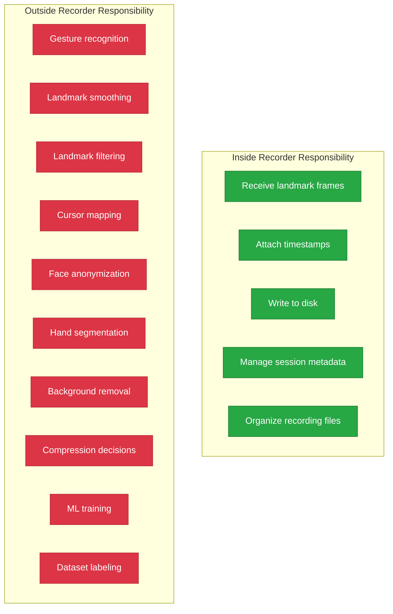
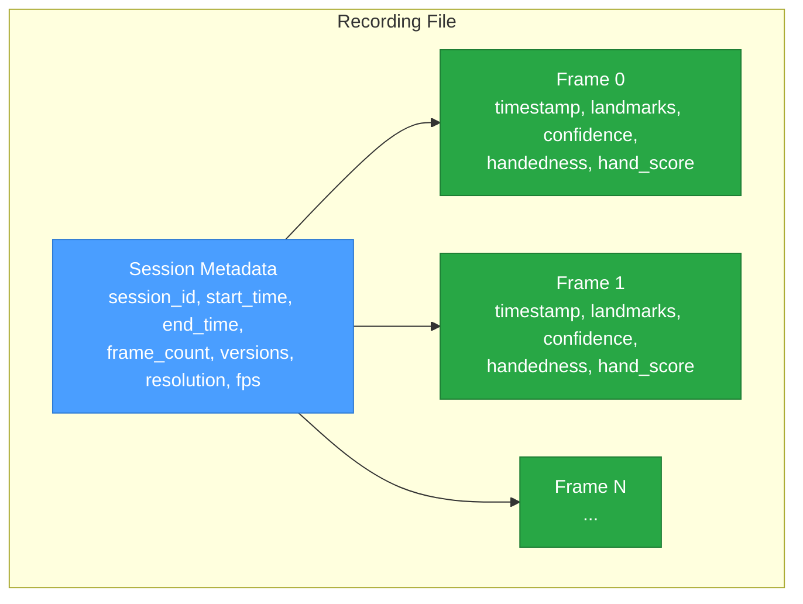
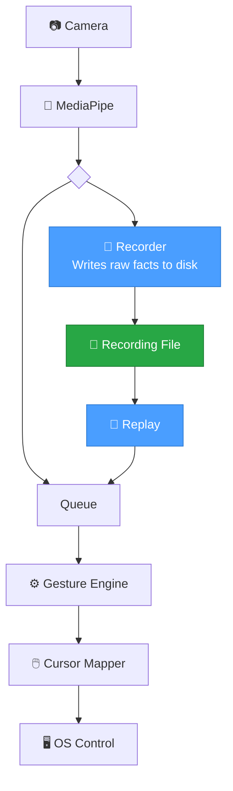
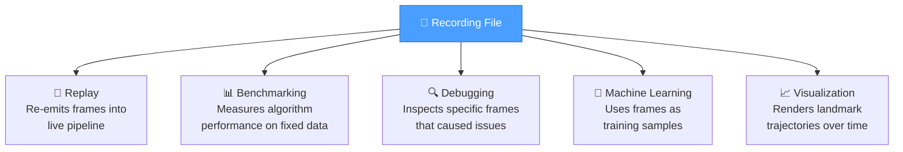
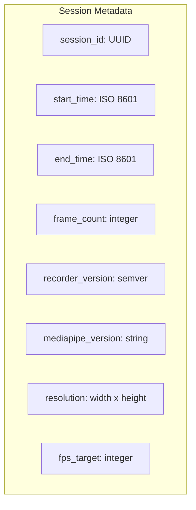
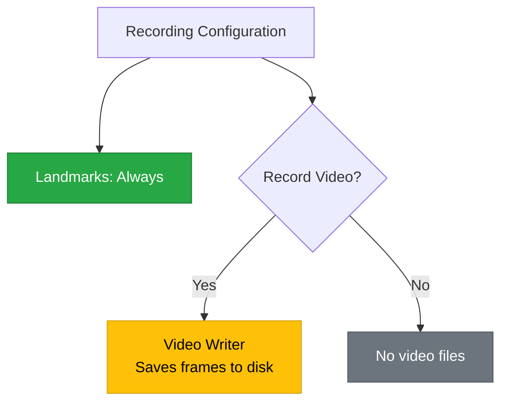
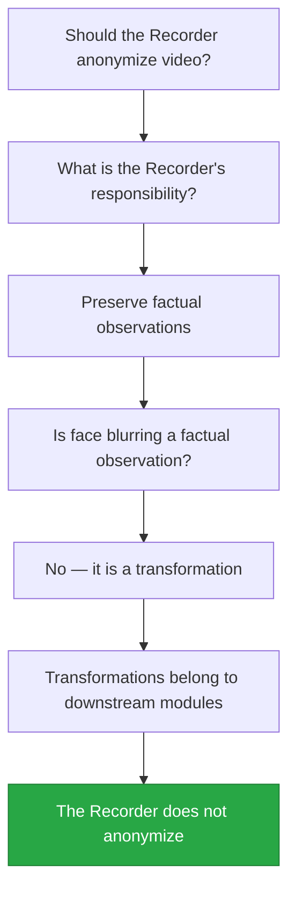

# Recorder and Replay Architecture

> **AirOS Engineering Handbook · Document 03**

---

| Field | Value |
|---|---|
| **Document Version** | v1.0 |
| **Last Updated** | 2026-07-08 |
| **Author** | Varun |
| **Status** | Living Document |
| **Prerequisites** | [01-hand-landmarks-and-coordinate-system.md](./01-hand-landmarks-and-coordinate-system.md), [02-data-pipeline.md](./02-data-pipeline.md) |
| **Next Reading** | [04-real-time-systems.md](./04-real-time-systems.md) |

---

## Objective

This document defines the **architecture** of the AirOS Recorder and Replay system — what it records, how recordings are organized, what format they use, and the engineering trade-offs behind those decisions.

After reading this document, the reader should be able to:

- Explain why the Recorder is a passive infrastructure module with no decision-making authority
- Distinguish between information the Recorder owns and information it must never own
- Describe the Recorder's exact data schema — what fields are stored and why
- Design a recording session with proper metadata, session IDs, and file organization
- Evaluate recording format trade-offs (human-readability vs. performance vs. longevity)
- Explain why anonymization and privacy transformations do not belong in the Recorder
- Apply Engineering Principles #6, #7, and #8 to system design decisions

---

## Why This Matters

Document 02 established *why* the Recorder exists — replay, debugging, benchmarking, ML training. This document answers a different question: *what exactly does the Recorder record, and how?*

This distinction matters because a Recorder that captures the wrong information, or captures it in the wrong format, undermines every system that depends on it:

- If it records too little, replay cannot reproduce the original session.
- If it records too much, it violates its single responsibility and couples itself to downstream modules.
- If its format is fragile, recordings become unreadable after a few months of code evolution.
- If its metadata is missing, recordings become anonymous data files with no context.

The Recorder is the simplest module in the AirOS pipeline — and precisely because of its simplicity, its design must be deliberate. A mistake here propagates into every module that consumes recordings.

---

## Table of Contents

1. [Why the Recorder Exists](#1-why-the-recorder-exists)
2. [The Recorder's Single Responsibility](#2-the-recorders-single-responsibility)
3. [Facts vs. Interpretations](#3-facts-vs-interpretations)
4. [What the Recorder Owns](#4-what-the-recorder-owns)
5. [What the Recorder Never Owns](#5-what-the-recorder-never-owns)
6. [Recorder in the AirOS Pipeline](#6-recorder-in-the-airos-pipeline)
7. [Recorder Consumers](#7-recorder-consumers)
8. [Reproducibility](#8-reproducibility)
9. [Recording Sessions and Metadata](#9-recording-sessions-and-metadata)
10. [File Organization](#10-file-organization)
11. [Recording Format Design](#11-recording-format-design)
12. [Recording Strategies](#12-recording-strategies)
13. [Privacy vs. Storage Trade-offs](#13-privacy-vs-storage-trade-offs)
14. [Why Anonymization Is Not the Recorder's Responsibility](#14-why-anonymization-is-not-the-recorders-responsibility)
15. [Engineering Principles Introduced](#15-engineering-principles-introduced)
16. [Common Mistakes](#16-common-mistakes)
17. [Key Takeaways](#17-key-takeaways)
18. [Questions for Revision](#18-questions-for-revision)
19. [Related Documents](#19-related-documents)

---

## 1. Why the Recorder Exists

The Recorder was introduced in Document 02 as the module that enables replay, debugging, benchmarking, and ML training. This section adds the architectural perspective: the Recorder exists because **ephemeral data has no engineering value**.

In a live AirOS session, landmark data flows through the pipeline and is consumed. Once consumed, it is gone. If the gesture engine misclassified a pinch, there is no way to inspect the landmarks that caused the misclassification — they no longer exist.

The Recorder intercepts this data and **persists it** before it is consumed, creating a permanent record that can be replayed, inspected, and analyzed at any point in the future.


The Recorder does not modify the data. It does not delay the pipeline. It does not make decisions about the data. It simply writes what it receives. This passivity is not a limitation — it is the design.

---

## 2. The Recorder's Single Responsibility

### Definition

The Recorder is a **passive infrastructure module** whose sole responsibility is to preserve factual observations from the perception pipeline.

The word "passive" is deliberate. The Recorder:

- ✅ Receives landmark data
- ✅ Writes it to disk with timestamps and metadata
- ✅ Organizes it into sessions
- ❌ Does not filter, smooth, or transform the data
- ❌ Does not interpret the data as gestures
- ❌ Does not decide which frames are "important"
- ❌ Does not modify pixel data or landmark values

### The Boundary Diagram



### Why Passivity Matters

If the Recorder filters landmarks (removing low-confidence frames), a future replay cannot evaluate whether a different confidence threshold would have been better — the filtered frames are lost.

If the Recorder smooths landmarks, a future smoothing algorithm cannot be compared against the original data — only against already-smoothed data, which corrupts the comparison.

If the Recorder labels gestures, a future classifier cannot be trained on the same data without inheriting the biases of the labeling algorithm.

Every decision the Recorder makes is a decision that a future module **cannot unmake**. Passivity preserves optionality.

---

## 3. Facts vs. Interpretations

Document 02 introduced the distinction between raw data and derived data. This section refines that distinction into the language the Recorder uses: **facts** and **interpretations**.

### What Is a Fact?

A fact is something that was **directly observed** by the sensor or model at a specific moment in time. It is not computed from other observations. It does not depend on an algorithm's parameters or thresholds.

### What Is an Interpretation?

An interpretation is something **computed from facts** using an algorithm. It depends on the algorithm's logic, its parameters, and its version. If the algorithm changes, the interpretation changes — but the underlying facts do not.

### The Fact/Interpretation Table

| Data | Fact or Interpretation? | Reasoning |
|---|---|---|
| Landmark x=0.45 | **Fact** | Directly reported by MediaPipe for this frame |
| Landmark y=0.62 | **Fact** | Directly reported by MediaPipe for this frame |
| Landmark z=-0.03 | **Fact** | Directly reported by MediaPipe for this frame |
| Confidence = 0.94 | **Fact** | Directly reported by MediaPipe for this frame |
| Timestamp = 1720345821.437 | **Fact** | Recorded by the system clock at capture time |
| Handedness = Right | **Fact** | Directly reported by MediaPipe for this frame |
| Frame number = 1247 | **Fact** | Sequential counter at capture time |
| Velocity = 0.12 units/sec | **Interpretation** | Computed from position change over time — depends on smoothing |
| Joint angle = 135° | **Interpretation** | Computed from three landmark positions — depends on which landmarks |
| Gesture = "pinch" | **Interpretation** | Output of a classifier — depends on thresholds, algorithm version |
| Smoothed x = 0.451 | **Interpretation** | Output of a smoothing filter — depends on filter type and window size |
| Cursor position = (960, 540) | **Interpretation** | Mapped from normalized coordinates — depends on mapping function and screen resolution |
| "This frame is a click" | **Interpretation** | Output of a gesture-to-action mapping — depends on configuration |

### The Rule

> **The Recorder stores facts. It never stores interpretations.**

This rule is absolute. If something requires an algorithm to produce it, it is an interpretation and does not belong in the Recorder's output. If something was directly observed at capture time, it is a fact and belongs in the recording.

> [!NOTE]
> There is a subtle edge case: **MediaPipe's landmark positions are themselves the output of a machine learning model**, which means they are technically "interpretations" of the raw pixel data. However, from the Recorder's perspective, MediaPipe is the **upstream perception model** — the Recorder treats its output as the observational facts of the perception pipeline. The distinction between "raw sensor data" (pixels) and "perception output" (landmarks) is addressed in Section 12 under Recording Strategies.

---

## 4. What the Recorder Owns

The Recorder's data schema defines **exactly** what information is persisted for each frame and each session. Every field must justify its existence.

### Per-Frame Data

| Field | Type | Why It Exists |
|---|---|---|
| `frame_number` | Integer | Sequential ordering — enables replay in correct sequence |
| `timestamp` | Float (seconds) | Temporal position — required for velocity, timing analysis, and replay pacing |
| `landmarks` | Array of 21 × (x, y, z) | The core observational data — positions of all hand landmarks |
| `confidence` | Array of 21 × float | Per-landmark visibility — required for downstream confidence filtering |
| `handedness` | String ("Left" / "Right") | Which hand was detected — required for gesture interpretation |
| `hand_score` | Float | Overall hand detection confidence — required for frame-level quality assessment |

### Per-Session Metadata

| Field | Type | Why It Exists |
|---|---|---|
| `session_id` | UUID string | Unique identifier — enables referencing specific recordings |
| `start_time` | ISO 8601 timestamp | When the recording began — human-readable, sortable |
| `end_time` | ISO 8601 timestamp | When the recording ended — enables duration calculation |
| `frame_count` | Integer | Total frames recorded — enables quick validation without reading entire file |
| `recorder_version` | String (semver) | Which version of the Recorder produced this file — critical for format migration |
| `mediapipe_version` | String | Which version of MediaPipe produced the landmarks — models change between versions |
| `resolution` | Object (width, height) | Camera resolution during capture — may be needed for pixel-space analysis |
| `fps_target` | Integer | Target frame rate — enables replay at correct speed |



### Why `recorder_version` Matters

The recording format will evolve. New fields will be added. Existing fields may change units or precision. Without a version stamp, a replay module has no way to know whether a file uses the current format or an older one.

With a version stamp, the replay module can implement **format migration** — reading old formats correctly even as the format evolves. This is the same principle used by database migrations, file format headers (PNG, PDF), and protocol versioning (HTTP/1.1 vs. HTTP/2).

> [!TIP]
> Include the version stamp from the very first recording. Adding versioning retroactively to a corpus of unversioned files is significantly harder than starting with it.

---

## 5. What the Recorder Never Owns

The exclusion list is as important as the inclusion list. Every item below has been explicitly considered and rejected from the Recorder's schema.

| Excluded Field | Why It Does Not Belong |
|---|---|
| **Gesture labels** ("pinch", "scroll") | Output of a classifier — depends on algorithm version and thresholds |
| **Cursor position** (960, 540) | Computed from landmark mapping — depends on mapping function and screen resolution |
| **Click / drag / scroll events** | Action decisions — depend on gesture-to-action configuration |
| **Smoothed landmark positions** | Output of a filter — depends on filter type and parameters |
| **Velocity / acceleration** | Derived from position differences — depends on which frames are used and how deltas are computed |
| **Joint angles** | Derived from triplets of landmarks — depends on which joints are selected |
| **Feature vectors** | Engineered features for ML — depend on the feature extraction pipeline |
| **"Is this frame good?"** | Quality judgment — depends on the threshold definition of "good" |
| **Anonymized video** | Privacy transformation — belongs to a downstream processing module |
| **Cropped hand images** | Segmentation decision — belongs to a downstream processing module |

### The Reasoning

Every excluded field shares one property: **it depends on a decision that might change**.

If the pinch threshold changes from 0.04 to 0.035, the gesture labels change. If the smoothing filter changes from a moving average to a one-euro filter, the smoothed positions change. If the feature extraction pipeline adds a new feature, the feature vectors change.

The Recorder cannot anticipate these changes. If it records an interpretation, it records a snapshot of today's algorithm — and tomorrow's algorithm cannot benefit from the recording.

By recording only facts, the Recorder creates data that is **algorithm-agnostic**. Any future algorithm can process the same recording and produce its own interpretations.

> [!IMPORTANT]
> ### Engineering Principle #7
>
> *"A module should own only the information required by its responsibility."*
>
> The Recorder's responsibility is to preserve observations. It owns observation data: landmarks, timestamps, confidence, handedness, and session metadata. It does not own gesture labels, cursor positions, or any other information that is the responsibility of another module. Owning information outside your responsibility creates coupling — and coupling makes systems fragile.

---

## 6. Recorder in the AirOS Pipeline

### Position in the Pipeline

The Recorder sits **immediately after** the perception model (MediaPipe) and **before** any processing or interpretation modules. This placement is deliberate — it captures data before any transformation has a chance to modify it.



### Data Flow Properties

| Property | Value |
|---|---|
| **Input** | Landmark frames from MediaPipe |
| **Output** | Recording files on disk |
| **Side effects** | Disk I/O only |
| **Feedback to pipeline** | None — the Recorder does not send data back upstream |
| **Blocking behavior** | Non-blocking — the Recorder must never slow the live pipeline |
| **Failure behavior** | If the Recorder fails, the live pipeline continues unaffected |

### Why Non-Blocking Matters

The Recorder writes to disk, and disk I/O can be slow — especially on spinning disks, full SSDs, or when the OS is under memory pressure. If the Recorder blocked the pipeline while waiting for a disk write to complete, it would introduce latency into the live gesture recognition path.

The Recorder must buffer writes and perform them asynchronously. If disk I/O is too slow, the Recorder may drop frames from its own buffer — but it must **never** cause the live pipeline to drop frames.

> [!NOTE]
> This is another application of the producer/consumer pattern from Document 02. MediaPipe is the producer, and the Recorder is a consumer. The consumer must not block the producer. If the Recorder cannot keep up, it degrades gracefully — it may lose some recorded frames, but the live system remains responsive.

---

## 7. Recorder Consumers

The Recorder produces recording files. Multiple downstream systems **consume** these files for different purposes. Each consumer reads the same recording but interprets it differently.



### Replay

The Replay module reads a recording file and emits landmark frames into the pipeline as if they were coming from a live camera. The Gesture Engine cannot distinguish between live and replayed data — this is by design (see Document 02, Section 4).

**Depends on**: Accurate timestamps (for replay pacing), correct frame ordering (for sequential playback), session metadata (for context).

### Benchmarking

The Benchmark module runs a processing algorithm (e.g., a smoothing filter or gesture classifier) on a recorded session and measures performance metrics — latency per frame, accuracy against known labels, jitter magnitude.

**Depends on**: Identical data across runs (for fair comparison), frame timestamps (for latency measurement), session metadata (for reporting).

### Debugging

When the cursor jumps unexpectedly or a gesture is misclassified, the developer loads the recording from that session and inspects the specific frames where the issue occurred.

**Depends on**: Frame numbers (for seeking to specific frames), raw landmark values (for inspecting exactly what MediaPipe reported), confidence values (for checking whether the model was uncertain).

### Machine Learning

A future gesture classifier needs training data — labeled examples of each gesture. The recording provides the landmark features; a separate labeling tool (not the Recorder) adds the labels.

**Depends on**: Raw landmark positions (as feature vectors), timestamps (for temporal features), large volumes of recordings (for dataset size).

### Visualization

A visualization tool renders the hand skeleton over time, showing how landmarks move, how confidence fluctuates, and how the hand's pose changes across frames.

**Depends on**: All 21 landmark positions per frame, timestamps (for animation timing), confidence (for color-coding reliable vs. unreliable landmarks).

> [!TIP]
> Notice that every consumer depends on the **same raw data** — they just use it differently. This is the direct benefit of storing facts instead of interpretations: one recording serves five different purposes without any modification.

---

## 8. Reproducibility

### What Reproducibility Means

A recording is **reproducible** if replaying it produces the same downstream results every time, regardless of when or where the replay occurs.

This sounds simple, but several things can break it:

| Threat to Reproducibility | Why It Breaks Things |
|---|---|
| **Missing timestamps** | Replay cannot pace frames correctly; velocity calculations produce different results |
| **Missing confidence values** | Downstream confidence filters cannot reproduce their original decisions |
| **Missing handedness** | Left/right mirroring logic produces different landmark interpretations |
| **Missing session metadata** | No way to correlate a recording with the conditions under which it was captured |
| **Format changes without versioning** | Replay module parses old recordings incorrectly, producing corrupt data |
| **Storing derived data** | If the derivation algorithm changes, the stored values are stale and inconsistent with the current algorithm |

### The Reproducibility Rule

> **A recording must contain enough information to reproduce the full pipeline output, given the same downstream algorithms.**

This does not mean the recording stores the pipeline output — it stores the pipeline **input** (facts), and the pipeline can be re-run to produce the output (interpretations). As long as the input is complete and correct, the output is reproducible.

### What "Complete" Means

A recording is complete if every field required by any downstream consumer is present. The schema in Section 4 was designed with this constraint — every field exists because at least one consumer needs it.

If a future consumer requires information that is not in the recording (e.g., the camera's serial number, the ambient light level), the schema must be extended. This is why `recorder_version` exists — it marks the boundary between what was captured and what was not.

---

## 9. Recording Sessions and Metadata

### What Is a Session?

A **session** is a single continuous recording — from the moment the user starts recording to the moment they stop. A session might last 10 seconds (a quick test) or 30 minutes (a sustained interaction).

Each session produces one recording file (or one set of related files). Each session has a unique identity.

### Session IDs

Every session is identified by a **UUID** (Universally Unique Identifier) — a 128-bit identifier that is statistically guaranteed to be unique across all recordings, on all machines, forever.

Example: `a3f1b2c4-5d6e-7f8a-9b0c-1d2e3f4a5b6c`

#### Why UUIDs Instead of Sequential Numbers?

| Approach | Problem |
|---|---|
| Sequential numbers (001, 002, 003...) | Two machines recording simultaneously produce duplicate IDs |
| Timestamp-based names | Two sessions started in the same second produce duplicates |
| User-provided names | Typos, inconsistency, forgotten names |
| UUIDs | Statistically unique without coordination; no conflicts ever |

Sequential numbers require a central authority to assign the next number. Timestamps have second-level (or even millisecond-level) collision risk. UUIDs are generated locally and are unique by mathematical design.

#### Why Not Just Timestamps?

Timestamps are **still used** — as human-readable labels and for sorting. But they are not the primary identifier. The session ID is the UUID; the timestamp is metadata *about* the session.

### Metadata Schema

Session metadata is stored at the **beginning of the recording** (or in a separate sidecar file, depending on format — see Section 11). It provides context that makes the recording self-describing.



#### Why ISO 8601 for Timestamps?

ISO 8601 (`2026-07-08T23:08:25+05:30`) is an international standard for date/time representation. It is:

- **Unambiguous**: No confusion between DD/MM/YYYY and MM/DD/YYYY
- **Sortable**: Lexicographic sorting produces chronological order
- **Timezone-aware**: Includes the UTC offset, preventing timezone-related bugs
- **Human-readable**: A developer can glance at it and know when the session occurred

#### Why Store `frame_count`?

Because it allows a consumer to **validate** a recording without reading every frame. If the metadata says 900 frames but the file contains 850, the recording may be corrupt (e.g., the Recorder was terminated mid-write). This is a simple integrity check.

#### Why Store Versions?

MediaPipe models change between releases. A landmark at position (0.45, 0.62) in MediaPipe 0.10.9 may appear at (0.46, 0.61) in MediaPipe 0.10.11 for the same hand pose. Storing the version enables a consumer to know which model produced the data and to account for cross-version differences.

Similarly, the Recorder's own format will evolve. `recorder_version` enables the replay module to handle format changes gracefully.

> [!IMPORTANT]
> Metadata is not optional. A recording without metadata is an anonymous array of numbers with no context. It cannot be reproduced, cannot be attributed to a specific session, and cannot be validated for integrity. Metadata transforms a data file into an engineering artifact.

---

## 10. File Organization

### Directory Structure

Recordings are stored in the `recordings/` directory at the project root. Each session is a subdirectory named by its session ID.

```
recordings/
├── a3f1b2c4-5d6e-7f8a-9b0c-1d2e3f4a5b6c/
│   ├── metadata.json
│   └── landmarks.jsonl
├── b7e2d1a3-8c4f-6e9b-0a1d-2c3e4f5a6b7d/
│   ├── metadata.json
│   └── landmarks.jsonl
└── ...
```

### Why UUID Directories Instead of Date-Based Directories?

| Approach | Structure | Problem |
|---|---|---|
| Date-based | `recordings/2026-07-08/session1/` | Multiple sessions per day require sub-naming; nesting adds complexity |
| Flat files | `recordings/session_2026-07-08_001.jsonl` | All files in one directory; hard to associate metadata with frame data |
| UUID directories | `recordings/<uuid>/` | Each session is self-contained; no naming conflicts; simple |

The UUID directory approach makes each session **self-contained**. Everything about a session — its metadata, its frame data, and any future additions (e.g., video files) — lives in one directory. Moving, copying, or deleting a session is a single directory operation.

### Why Separate `metadata.json` and `landmarks.jsonl`?

Metadata is read once (at the start of replay). Frame data is read sequentially (one frame at a time during replay). Separating them means:

- A consumer can read metadata without loading the entire frame data file.
- The frame data file can be streamed — read line by line without loading the entire file into memory.
- Metadata can be indexed (e.g., to build a catalog of all sessions) without touching frame data.

> [!NOTE]
> The `.jsonl` extension stands for **JSON Lines** — a format where each line is a valid JSON object. This format is explained in Section 11.

---

## 11. Recording Format Design

The choice of recording format is an engineering decision with long-term consequences. A format chosen today must still be readable months or years from now.

### Candidates

| Format | Human-Readable? | Parse Speed | File Size | Ecosystem Support |
|---|---|---|---|---|
| **JSON** (single object) | ✅ Yes | 🐢 Slow for large files (must parse entire file) | Large | Universal |
| **JSON Lines** (.jsonl) | ✅ Yes | ⚡ Fast (line-by-line streaming) | Large | Widely supported |
| **CSV** | ✅ Yes | ⚡ Fast | Moderate | Universal |
| **Protocol Buffers** | ❌ No | ⚡ Very fast | Small | Requires schema |
| **MessagePack** | ❌ No | ⚡ Fast | Small | Library required |
| **SQLite** | Partial (with tools) | ⚡ Fast (indexed queries) | Moderate | Universal |

### Why JSON Lines for AirOS

AirOS uses **JSON Lines** (`.jsonl`) for frame data. Each line in the file is a single JSON object representing one frame.

#### Advantages

1. **Human-readable**: Open the file in any text editor and immediately see what each frame contains. No special tools required.
2. **Streamable**: Read one line at a time. No need to parse the entire file to access a single frame. Memory usage is constant regardless of file size.
3. **Appendable**: New frames can be appended without rewriting the file. If the Recorder crashes mid-session, all previously written frames are intact — only the last incomplete line is lost.
4. **Debuggable**: `head -n 5 landmarks.jsonl` shows the first 5 frames. `wc -l landmarks.jsonl` shows the total frame count. `grep` can search for specific values. Standard Unix tools work without custom parsers.
5. **Future-proof**: JSON is a universal format. Any language, any platform, any tool can parse it. Binary formats require specific libraries that may become unmaintained.

#### Disadvantages

1. **File size**: JSON is verbose. A binary format like Protocol Buffers would produce files 3–5× smaller. For AirOS's current scale (landmark data only, no video), this is acceptable — a 30-minute session at 30 FPS produces approximately 54,000 frames × ~500 bytes = ~27 MB.
2. **Parse speed**: JSON parsing is slower than binary deserialization. For replay at 30 FPS, parsing one JSON line per frame is well within budget. This may need revisiting if AirOS scales to much larger data volumes.

### Why JSON for Metadata

Session metadata is stored as a standard JSON file (`metadata.json`). It is a single object, read once per session, and small enough that parse speed is irrelevant. JSON is chosen for readability and universal tooling support.

### Designing for Longevity

A recording format should be readable **years** after it was written. The following design decisions support this:

| Decision | Reasoning |
|---|---|
| **Text-based format** | Does not depend on a specific library version to decode |
| **Self-describing field names** | `"index_finger_tip_x": 0.45` is readable without documentation |
| **Version stamped** | Replay can detect and handle format changes |
| **No external dependencies** | The format does not require a running database, a specific OS, or a network connection |
| **One session per directory** | Sessions are self-contained and can be archived, moved, or shared as a unit |

> [!CAUTION]
> **Premature optimization of the recording format is a common mistake.** It is tempting to choose a binary format for space efficiency, but the engineering cost of debugging binary files, writing custom parsers, and maintaining backward compatibility far outweighs the disk space savings — especially at AirOS's current scale. Start with human-readable formats. Optimize only when profiling shows that the format is a bottleneck.

---

## 12. Recording Strategies

Not every recording needs to capture the same information. AirOS supports multiple recording strategies, each appropriate for different use cases.

### Strategy 1: Landmarks Only

| Property | Value |
|---|---|
| **What is recorded** | Per-frame landmark data + session metadata |
| **What is NOT recorded** | Video frames (raw pixel data) |
| **File size (30 min)** | ~27 MB |
| **Privacy impact** | Low — no identifiable images |
| **Primary use cases** | Replay, gesture development, benchmarking, ML training |

This is the **default** strategy. It captures everything needed for gesture recognition without the storage and privacy costs of video.

### Strategy 2: Video + Landmarks

| Property | Value |
|---|---|
| **What is recorded** | Per-frame landmark data + raw video frames + session metadata |
| **What is NOT recorded** | — (captures everything) |
| **File size (30 min)** | ~1–5 GB (depending on resolution and codec) |
| **Privacy impact** | High — contains identifiable images of the user |
| **Primary use cases** | Debugging MediaPipe failures, retraining perception models, visualization overlays |

Video recording is useful when the issue is **upstream** of landmarks — when MediaPipe itself is producing incorrect landmarks and the developer needs to see what the camera actually saw.

### Strategy 3: Configurable Recording

The Recorder's strategy is a **configuration option**, not a code change. A configuration file specifies:

- Whether to record landmarks (always yes)
- Whether to record video (default: no)
- Video resolution (if recording video)
- Target FPS



> [!NOTE]
> Even when video is recorded, the Recorder does not process it. It saves the raw frames. Any processing — face blurring, cropping, compression — is the responsibility of a separate downstream module. This is a direct application of the Recorder's single responsibility.

---

## 13. Privacy vs. Storage Trade-offs

Video recording introduces two interrelated concerns: **privacy** and **storage**.

### Privacy

A video recording of an AirOS session captures the user's face, their environment, and potentially other people in the background. This data is sensitive:

- It can identify the user.
- It may capture unintended information (e.g., documents on a desk, other people).
- If shared (e.g., for ML training), it exposes personal data.

### Storage

Video files are orders of magnitude larger than landmark files:

| Data Type | 30 min at 30 FPS | 1 Hour | 8 Hours |
|---|---|---|---|
| **Landmarks only** | ~27 MB | ~54 MB | ~432 MB |
| **Video (720p, compressed)** | ~1.5 GB | ~3 GB | ~24 GB |
| **Video (1080p, compressed)** | ~4 GB | ~8 GB | ~64 GB |

For a developer running AirOS daily, video recordings would quickly consume significant disk space.

### The Trade-Off

| Factor | Landmarks Only | Video + Landmarks |
|---|---|---|
| Privacy risk | Low | High |
| Storage cost | Negligible | Significant |
| Debugging capability | Gesture-level debugging | Perception-level debugging |
| ML training value | Gesture classification | Model retraining |
| Default? | ✅ Yes | ❌ No — opt-in only |

The default is **landmarks only**. Video recording is an opt-in feature for specific debugging or research scenarios. This default minimizes privacy exposure and storage consumption while preserving all the data needed for the primary use cases (replay, benchmarking, ML).

---

## 14. Why Anonymization Is Not the Recorder's Responsibility

### The Question

If video recording introduces privacy concerns, should the Recorder anonymize the video — for example, by blurring the user's face before saving?

### The Answer

**No.** Anonymization is not the Recorder's responsibility.

### The Reasoning



1. **Face blurring modifies data.** A blurred frame is no longer the factual observation — it is a processed version of the observation. If a future module needs the original frame (e.g., to retrain a face detection model or to debug a MediaPipe failure near the face region), the original is lost.

2. **Anonymization logic evolves.** What counts as "sufficient" anonymization changes over time — regulations change, model capabilities improve, new attack vectors emerge. If the Recorder embeds today's anonymization logic, it becomes coupled to privacy policy decisions that are outside its domain.

3. **Separation of concerns.** Anonymization is a distinct responsibility that deserves its own module — an **Anonymization Pipeline** that reads raw recordings and produces anonymized versions. This module can be updated, replaced, or configured independently of the Recorder.

4. **The Recorder already has a privacy default.** By defaulting to landmarks-only recording (no video), the Recorder avoids the privacy concern entirely. Video recording is opt-in, and the user consciously accepts the privacy implications when enabling it.

> [!IMPORTANT]
> ### Engineering Principle #8
>
> *"Privacy-preserving transformations belong to downstream processing modules, not to data capture modules."*
>
> This principle is a specific instance of the single responsibility principle applied to privacy. The data capture module captures data faithfully. The privacy module transforms data according to policy. Combining them produces a module that is neither a reliable recorder nor a reliable anonymizer.

---

## 15. Engineering Principles Introduced

This document introduces three new engineering principles. Together with Principles #1–5 from Documents 01 and 02, they form the growing AirOS Engineering Principles series.

### Engineering Principle #6

> *"Infrastructure modules preserve facts; they do not make decisions."*

The Recorder is infrastructure. Its job is to faithfully preserve what was observed, not to judge, filter, or interpret those observations. Every decision the Recorder makes is a degree of freedom removed from future modules.

**Cross-domain examples:**

| Domain | Infrastructure Module | Fact It Preserves | Decision It Avoids |
|---|---|---|---|
| **Databases** | Transaction log (WAL) | Every write operation in order | Whether the write was "important" |
| **Networking** | Packet capture (tcpdump) | Every packet on the wire | Whether the packet is malicious |
| **Aviation** | Flight data recorder (black box) | Sensor readings every second | Whether the readings indicate a problem |
| **AirOS** | Recorder | Every landmark frame | Whether the frame contains a gesture |

---

### Engineering Principle #7

> *"A module should own only the information required by its responsibility."*

Ownership of information creates coupling. If the Recorder owns gesture labels, it must be updated whenever the gesture vocabulary changes. If it owns cursor positions, it must be updated whenever the screen mapping changes. By owning only observation data, the Recorder is immune to changes in downstream modules.

---

### Engineering Principle #8

> *"Privacy-preserving transformations belong to downstream processing modules, not to data capture modules."*

Data capture and data transformation are different responsibilities. Combining them produces a module that does both poorly — it cannot be trusted as a faithful recorder (because it modifies data) and cannot be trusted as a privacy tool (because privacy is not its primary concern).

---

### Full Principles Index

| # | Principle | Source |
|---|---|---|
| 1 | Collect the minimum useful information required to solve the problem reliably | Document 01 |
| 2 | Store facts, not interpretations | Document 02 |
| 3 | Separate data collection from data processing | Document 02 |
| 4 | In real-time systems, freshness is often more valuable than completeness | Document 02 |
| 5 | Every module should have exactly one responsibility | Document 02 |
| 6 | Infrastructure modules preserve facts; they do not make decisions | Document 03 |
| 7 | A module should own only the information required by its responsibility | Document 03 |
| 8 | Privacy-preserving transformations belong to downstream processing modules, not to data capture modules | Document 03 |

---

## 16. Common Mistakes

### Mistake 1: The Recorder That Thinks

**Symptom**: The Recorder drops frames it considers "low quality" — frames where confidence is below a threshold.

**Cause**: The developer added quality filtering to the Recorder, reasoning that "bad frames are useless."

**Why it is wrong**: A future analysis might specifically study low-confidence frames to understand when MediaPipe fails. By discarding them, the Recorder has destroyed the very data that the analysis needs. The Recorder should record all frames; downstream modules decide which frames to use.

---

### Mistake 2: Missing Metadata

**Symptom**: A directory of recording files exists, but no one knows when they were recorded, what camera was used, or what version of MediaPipe produced them.

**Cause**: The developer considered metadata "boilerplate" and skipped it.

**Why it is wrong**: Without metadata, recordings are anonymous data files. They cannot be correlated with specific sessions, cannot be validated for integrity, and cannot be replayed at the correct speed. Metadata is not overhead — it is what makes a recording useful.

---

### Mistake 3: Version-less Format

**Symptom**: A format change breaks the replay module for all previously recorded sessions.

**Cause**: No version stamp was included in recordings. The replay module assumed all files use the current format.

**Why it is wrong**: The recording format will evolve. Without a version stamp, there is no way to distinguish old-format files from new-format files. With a version stamp, the replay module can implement backward-compatible parsing.

---

### Mistake 4: Storing Interpretations Alongside Facts

**Symptom**: A recording file contains both raw landmarks and gesture labels. A new gesture algorithm produces different labels for the same landmarks, creating an inconsistency within the same file.

**Cause**: The developer added gesture labels to the Recorder "for convenience."

**Why it is wrong**: The recording now contains contradictory information — the landmarks say one thing, the labels say another. The recording is neither a pure factual record nor a reliable labeled dataset. It is a hybrid that serves neither purpose well.

---

### Mistake 5: Monolithic Session Files

**Symptom**: A 2 GB recording file takes 30 seconds to load. Seeking to a specific frame requires scanning the entire file.

**Cause**: All session data — metadata, landmarks, and video — was written to a single file.

**Why it is wrong**: Different data types have different access patterns. Metadata is read once. Landmarks are streamed sequentially. Video frames are large and may be accessed randomly. Combining them into a single file forces every access to pay the cost of the largest data type.

---

### Mistake 6: Recording Anonymized Video as the Primary Record

**Symptom**: A debugging session requires seeing what the camera actually captured, but only blurred frames are available.

**Cause**: The Recorder applied face blurring before saving, treating the blurred version as the primary record.

**Why it is wrong**: If anonymization is applied at capture time, the original frames are permanently lost. Anonymization should be a downstream transformation that produces a secondary, privacy-safe version — leaving the original intact (with appropriate access controls) for cases where the original is needed.

---

## 17. Key Takeaways

| # | Concept | One-Line Summary |
|---|---|---|
| 1 | Recorder's role | Passive infrastructure — preserves facts, makes no decisions |
| 2 | Facts vs. interpretations | Facts are observed; interpretations are computed — store only facts |
| 3 | Data schema | Landmarks, timestamps, confidence, handedness, session metadata |
| 4 | Exclusion list | No gestures, no cursor positions, no smoothed data, no labels |
| 5 | Session identity | UUID per session — unique, conflict-free, locally generated |
| 6 | Metadata | Session context (times, versions, resolution) — not optional |
| 7 | Format choice | JSON Lines — human-readable, streamable, appendable, future-proof |
| 8 | File organization | One directory per session, separate metadata and frame data files |
| 9 | Recording strategies | Landmarks-only (default) vs. video+landmarks (opt-in) |
| 10 | Privacy default | No video by default — minimizes exposure without losing gesture data |
| 11 | Anonymization | Downstream responsibility — never in the Recorder |
| 12 | Non-blocking | Recorder must never slow the live pipeline |
| 13 | Reproducibility | Recordings must contain enough data to reproduce pipeline output |
| 14 | Version stamping | Enables format migration and backward-compatible replay |

---

## 18. Questions for Revision

1. What is the Recorder's single responsibility? Name three things it must **not** do.

2. A colleague suggests adding gesture labels to the recording "so we don't have to recompute them later." Explain why this violates the Recorder's design and which engineering principle it breaks.

3. What is the difference between a fact and an interpretation? Give two examples of each from the AirOS pipeline.

4. Why does the Recorder use UUIDs for session IDs instead of sequential numbers or timestamps?

5. The `metadata.json` file contains `recorder_version`. Why is this field essential? What problem does it solve that would be impossible without it?

6. Why does AirOS use JSON Lines instead of a single JSON file for frame data? Name three advantages.

7. A 30-minute session at 30 FPS produces approximately how many frames? Approximately how large is the landmarks-only recording?

8. The Recorder sits **before** the Gesture Engine in the pipeline. Why is this placement important? What would be lost if it sat **after** the Gesture Engine?

9. Why is video recording opt-in rather than default? Name both the privacy and the storage reasons.

10. A developer adds face-blurring to the Recorder before saving video frames. Explain why this is architecturally wrong using Engineering Principle #8.

11. The Recorder writes to disk, and disk I/O can be slow. What should happen if the disk write takes longer than expected — should the live pipeline slow down? Why or why not?

12. Name three downstream consumers of recording files and explain what each one depends on from the recording.

13. A recording file has `frame_count: 900` in its metadata, but the file contains only 850 lines of frame data. What does this indicate, and why is `frame_count` useful here?

14. State Engineering Principle #6 in your own words. Give an example from outside software engineering.

---

## 19. Related Documents

### Architecture

- [architecture.md](../architecture.md) — Overall AirOS system design and pipeline overview

### Architecture Decision Records

- [ADR-0001: Record Architecture Decisions](../adr/0001-record-architecture-decisions.md) — Why AirOS uses ADRs to capture technical decisions

### Prerequisite Reading

- [01-hand-landmarks-and-coordinate-system.md](./01-hand-landmarks-and-coordinate-system.md) — Landmark fundamentals, coordinate system, and Engineering Principle #1
- [02-data-pipeline.md](./02-data-pipeline.md) — Data pipeline concepts, producer/consumer, queues, and Engineering Principles #2–5

### Engineering Series

| Document | Topic | Status |
|---|---|---|
| **01** | Hand Landmarks and Coordinate System | ✅ Complete |
| **02** | Data Pipeline — Recording, Replay, and Engineering Thinking | ✅ Complete |
| **03** (this document) | Recorder and Replay Architecture | 🟡 In Progress |
| **04** | Real-Time Systems — Latency budgets and frame timing | ⬜ Planned |
| **05** | Filtering and Smoothing — Noise reduction techniques | ⬜ Planned |
| **06** | Feature Extraction — Deriving gesture features from landmarks | ⬜ Planned |
| **07** | Rule-Based Gesture Recognition — Threshold-based classification | ⬜ Planned |
| **08** | Machine Learning Fundamentals | ⬜ Planned |
| **09** | Training and Evaluation | ⬜ Planned |
| **10** | Performance Optimization | ⬜ Planned |
| **11** | Production Readiness | ⬜ Planned |

### Engineering Principles Index

| # | Principle | Source |
|---|---|---|
| 1 | Collect the minimum useful information required to solve the problem reliably | Document 01 |
| 2 | Store facts, not interpretations | Document 02 |
| 3 | Separate data collection from data processing | Document 02 |
| 4 | In real-time systems, freshness is often more valuable than completeness | Document 02 |
| 5 | Every module should have exactly one responsibility | Document 02 |
| 6 | Infrastructure modules preserve facts; they do not make decisions | Document 03 |
| 7 | A module should own only the information required by its responsibility | Document 03 |
| 8 | Privacy-preserving transformations belong to downstream processing modules, not to data capture modules | Document 03 |

---

*AirOS Engineering Handbook · Recorder and Replay Architecture · v1.0*
