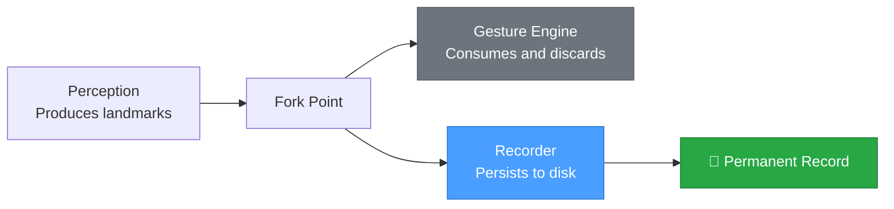
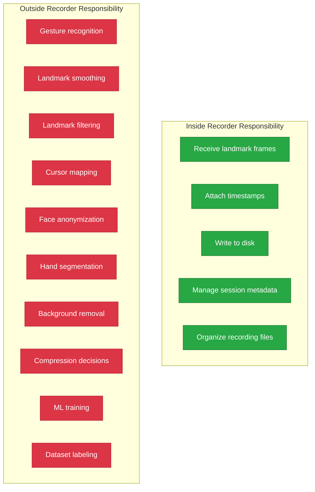
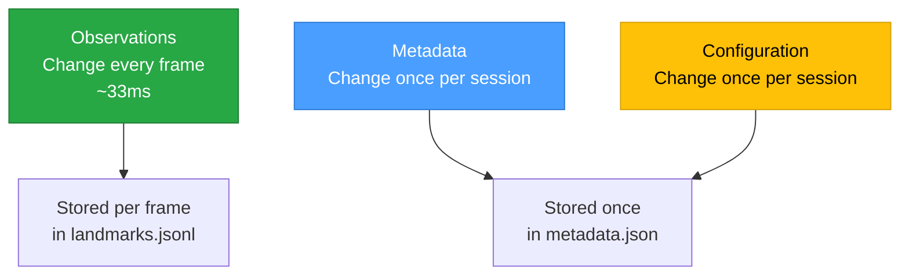
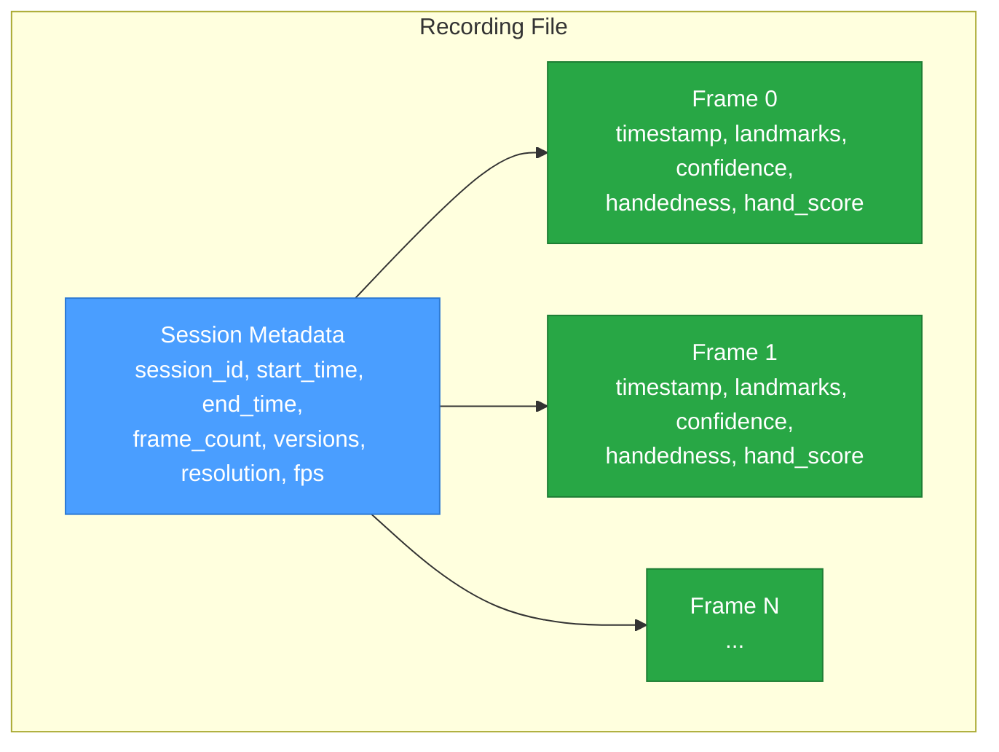
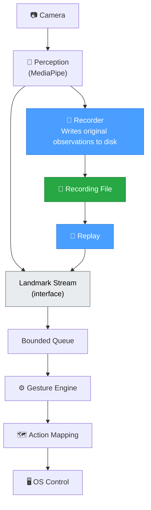
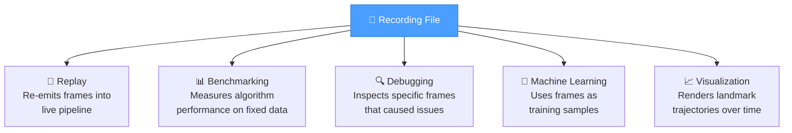
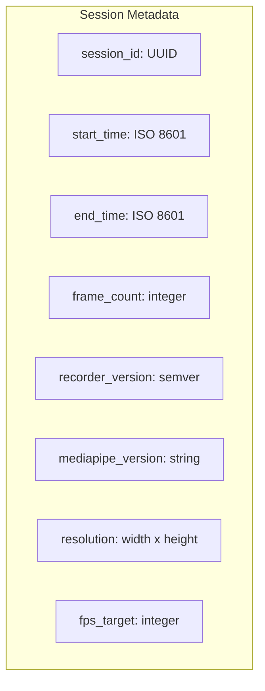
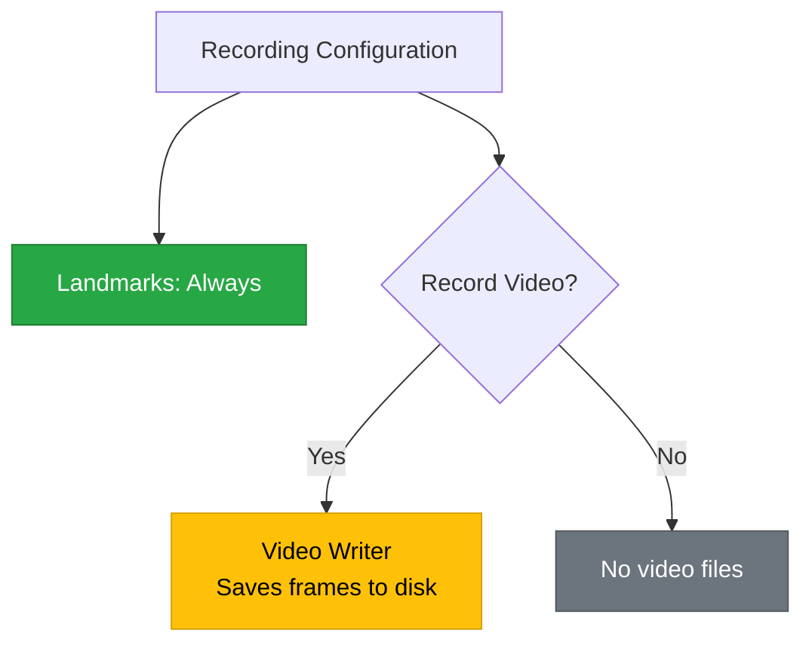
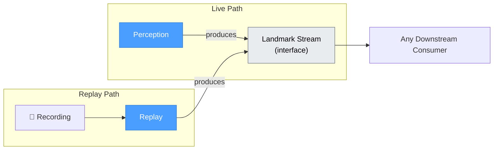

# Recorder and Replay Architecture

> **AirOS Engineering Handbook · Document 03**

---

| Field | Value |
|---|---|
| **Document Version** | v3.0 |
| **Last Updated** | 2026-07-09 |
| **Author** | Varun |
| **Status** | Living Document |
| **Prerequisites** | [01-hand-landmarks-and-coordinate-system.md](./01-hand-landmarks-and-coordinate-system.md), [02-data-pipeline.md](./02-data-pipeline.md) |
| **Next Reading** | [04-real-time-systems.md](./04-real-time-systems.md) |

---

## Objective

This document defines the **architecture** of the AirOS Recorder and Replay system — what it records, how recordings are organized, what format they use, and the engineering trade-offs behind those decisions.

After reading this document, the reader should be able to:

- Explain why the Recorder is a passive infrastructure module with no decision-making authority
- Distinguish between information the Recorder owns and information it must never own
- Describe the Recorder's exact data schema — what fields are stored and why
- Identify the three categories of recorded information (observations, metadata, configuration) and explain why they are stored differently
- Design a recording session with proper metadata, session IDs, and file organization
- Explain why metadata is immutable and what breaks when it is not
- Evaluate recording format trade-offs (human-readability vs. performance vs. longevity)
- Explain why recording formats should evolve through extension rather than replacement
- Explain why anonymization and privacy transformations do not belong in the Recorder
- Describe the Replay module's architecture: Landmark Stream interface, timestamp preservation, and policy-based speed control
- Apply Engineering Principles #6 through #15 to system design decisions

### Scope and Assumptions

- This document covers the Recorder and Replay modules only. It does not cover the Gesture Engine, Action Mapping, or OS Control.
- Assumes single-hand detection per frame (AirOS V1). Multi-hand recording is a future extension.
- Assumes local filesystem storage. Network or cloud storage is out of scope.
- Assumes a single user per session.

---

## Why This Matters

Document 02 established *why* the Recorder exists — replay, debugging, benchmarking, ML training. This document answers a different question: *what exactly does the Recorder record, and how?*

This distinction matters because a Recorder that captures the wrong information, or captures it in the wrong format, undermines every system that depends on it:

- If it records too little, replay cannot reproduce the original session.
- If it records too much, it violates its single responsibility and couples itself to downstream modules.
- If its format is fragile, recordings become unreadable after a few months of code evolution.
- If its metadata is missing, recordings become anonymous data files with no context.

The Recorder is the simplest module in the AirOS pipeline — and precisely because of its simplicity, its design must be deliberate. A mistake here propagates into every module that consumes recordings.

---

## Table of Contents

1. [Why the Recorder Exists](#1-why-the-recorder-exists)
2. [The Recorder's Single Responsibility](#2-the-recorders-single-responsibility)
3. [Facts vs. Interpretations](#3-facts-vs-interpretations)
4. [What the Recorder Owns](#4-what-the-recorder-owns)
5. [What the Recorder Never Owns](#5-what-the-recorder-never-owns)
6. [Recorder in the AirOS Pipeline](#6-recorder-in-the-airos-pipeline)
7. [Recorder Consumers](#7-recorder-consumers)
8. [Reproducibility](#8-reproducibility)
9. [Recording Sessions and Metadata](#9-recording-sessions-and-metadata)
10. [File Organization](#10-file-organization)
11. [Recording Format Design](#11-recording-format-design)
12. [Recording Strategies](#12-recording-strategies)
13. [Privacy vs. Storage Trade-offs](#13-privacy-vs-storage-trade-offs)
14. [Why Anonymization Is Not the Recorder's Responsibility](#14-why-anonymization-is-not-the-recorders-responsibility)
15. [Recordings as Long-Term Engineering Assets](#15-recordings-as-long-term-engineering-assets)
16. [Replay Architecture](#16-replay-architecture)
17. [Engineering Principles Introduced](#17-engineering-principles-introduced)
18. [Common Mistakes](#18-common-mistakes)
19. [Key Takeaways](#19-key-takeaways)
20. [Questions for Revision](#20-questions-for-revision)
21. [Related Documents](#21-related-documents)

---

## 1. Why the Recorder Exists

The Recorder was introduced in Document 02 as the module that enables replay, debugging, benchmarking, and ML training. This section adds the architectural perspective: the Recorder exists because **ephemeral data has no engineering value**.

In a live AirOS session, landmark data flows through the pipeline and is consumed. Once consumed, it is gone. If the gesture engine misclassified a pinch, there is no way to inspect the landmarks that caused the misclassification — they no longer exist.

The Recorder intercepts this data and **persists it** before it is consumed, creating a permanent record that can be replayed, inspected, and analyzed at any point in the future.



The Recorder does not modify the data. It does not delay the pipeline. It does not make decisions about the data. It simply writes what it receives. This passivity is not a limitation — it is the design.

---

## 2. The Recorder's Single Responsibility

### Definition

The Recorder is a **passive infrastructure module** whose sole responsibility is to preserve factual observations from the perception pipeline.

The word "passive" is deliberate. The Recorder:

- ✅ Receives landmark data
- ✅ Writes it to disk with timestamps and metadata
- ✅ Organizes it into sessions
- ❌ Does not filter, smooth, or transform the data
- ❌ Does not interpret the data as gestures
- ❌ Does not decide which frames are "important"
- ❌ Does not modify pixel data or landmark values

### The Boundary Diagram



### Why Passivity Matters

If the Recorder filters landmarks (removing low-confidence frames), a future replay cannot evaluate whether a different confidence threshold would have been better — the filtered frames are lost.

If the Recorder smooths landmarks, a future smoothing algorithm cannot be compared against the original data — only against already-smoothed data, which corrupts the comparison.

If the Recorder labels gestures, a future classifier cannot be trained on the same data without inheriting the biases of the labeling algorithm.

Every decision the Recorder makes is a decision that a future module **cannot unmake**. Passivity preserves optionality.

---

## 3. Facts vs. Interpretations

Document 02 introduced the distinction between raw data and derived data. This section refines that distinction into the language the Recorder uses: **facts** and **interpretations**.

### What Is a Fact?

A fact is something that was **directly observed** by the sensor or model at a specific moment in time. It is not computed from other observations. It does not depend on an algorithm's parameters or thresholds.

### What Is an Interpretation?

An interpretation is something **computed from facts** using an algorithm. It depends on the algorithm's logic, its parameters, and its version. If the algorithm changes, the interpretation changes — but the underlying facts do not.

### The Fact/Interpretation Table

| Data | Fact or Interpretation? | Reasoning |
|---|---|---|
| Landmark x=0.45 | **Fact** | Directly reported by MediaPipe for this frame |
| Landmark y=0.62 | **Fact** | Directly reported by MediaPipe for this frame |
| Landmark z=-0.03 | **Fact** | Directly reported by MediaPipe for this frame |
| Confidence = 0.94 | **Fact** | Directly reported by MediaPipe for this frame |
| Timestamp = 1720345821.437 | **Fact** | Recorded by the system clock at capture time |
| Handedness = Right | **Fact** | Directly reported by MediaPipe for this frame |
| Frame number = 1247 | **Fact** | Sequential counter at capture time |
| Velocity = 0.12 units/sec | **Interpretation** | Computed from position change over time — depends on smoothing |
| Joint angle = 135° | **Interpretation** | Computed from three landmark positions — depends on which landmarks |
| Gesture = "pinch" | **Interpretation** | Output of a classifier — depends on thresholds, algorithm version |
| Smoothed x = 0.451 | **Interpretation** | Output of a smoothing filter — depends on filter type and window size |
| Cursor position = (960, 540) | **Interpretation** | Mapped from normalized coordinates — depends on mapping function and screen resolution |
| "This frame is a click" | **Interpretation** | Output of a gesture-to-action mapping — depends on configuration |

### The Rule

> **The Recorder stores facts. It never stores interpretations.**

This rule is absolute. If something requires an algorithm to produce it, it is an interpretation and does not belong in the Recorder's output. If something was directly observed at capture time, it is a fact and belongs in the recording.

> [!NOTE]
> There is a subtle edge case: **MediaPipe's landmark positions are themselves the output of a machine learning model**, which means they are technically "interpretations" of the raw pixel data. However, from the Recorder's perspective, MediaPipe is the **upstream perception model** — the Recorder treats its output as the observational facts of the perception pipeline. The distinction between "raw sensor data" (pixels) and "perception output" (landmarks) is addressed in Section 12 under Recording Strategies.

---

## 4. What the Recorder Owns

The Recorder stores three distinct categories of information. Understanding the boundaries between them prevents a common architectural mistake: mixing concerns that change at different frequencies.

### Category 1: Observations

Observations are the **per-frame data** emitted by the Perception stage. They change every frame — every 33 milliseconds at 30 FPS.

| Example | Changes Every |
|---|---|
| Landmark coordinates | Frame |
| Per-landmark confidence | Frame |
| Handedness | Frame |
| Hand detection score | Frame |
| Frame timestamp | Frame |
| Frame number | Frame |

### Category 2: Metadata

Metadata describes the **recording session itself**. It is established once — at the start of a session — and does not change during the session.

| Example | Changes Every |
|---|---|
| Session ID | Never (per session) |
| Start time | Never (per session) |
| End time | Set once at session end |
| Camera resolution | Never (per session) |
| Recorder format version | Never (per session) |
| MediaPipe version | Never (per session) |
| AirOS version | Never (per session) |

### Category 3: Configuration

Configuration describes **how** the recording was performed. Like metadata, it is established at session start.

| Example | Changes Every |
|---|---|
| Target FPS | Never (per session) |
| Selected camera device | Never (per session) |
| Video recording enabled | Never (per session) |
| Recording strategy | Never (per session) |

### Why the Categories Matter



The engineering value of this separation is **storage efficiency** and **conceptual clarity**:

- If metadata were repeated in every frame, a 30-minute session at 30 FPS would duplicate the same session ID, version strings, and resolution 54,000 times. This is wasteful and introduces the possibility of inconsistency (what if frame 12,000 has a different resolution value than frame 1?).
- If observations were stored in the metadata file, the metadata file would need to be rewritten every frame — defeating the purpose of having a stable, read-once metadata document.

> ### Engineering Principle #9
>
> **See [Engineering Principle #9: Frequency of Change](../engineering-principles.md#9-frequency-of-change)**

### The Schema

The Recorder's data schema defines **exactly** what information is persisted for each frame and each session. Every field must justify its existence.

### Per-Frame Data

| Field | Type | Why It Exists |
|---|---|---|
| `frame_number` | Integer | Sequential ordering — enables replay in correct sequence |
| `timestamp` | Float (seconds) | Temporal position — required for velocity, timing analysis, and replay pacing |
| `landmarks` | Array of 21 × (x, y, z) | The core observational data — positions of all hand landmarks |
| `confidence` | Array of 21 × float | Per-landmark visibility — required for downstream confidence filtering |
| `handedness` | String ("Left" / "Right") | Which hand was detected — required for gesture interpretation |
| `hand_score` | Float | Overall hand detection confidence — required for frame-level quality assessment |

### Per-Session Metadata

| Field | Type | Why It Exists |
|---|---|---|
| `session_id` | UUID string | Unique identifier — enables referencing specific recordings |
| `start_time` | ISO 8601 timestamp | When the recording began — human-readable, sortable |
| `end_time` | ISO 8601 timestamp | When the recording ended — enables duration calculation |
| `frame_count` | Integer | Total frames recorded — enables quick validation without reading entire file |
| `recorder_version` | String (semver) | Which version of the Recorder produced this file — critical for format migration |
| `mediapipe_version` | String | Which version of MediaPipe produced the landmarks — models change between versions |
| `resolution` | Object (width, height) | Camera resolution during capture — may be needed for pixel-space analysis |
| `fps_target` | Integer | Target frame rate — enables replay at correct speed |



### Why `recorder_version` Matters

The recording format will evolve. New fields will be added. Existing fields may change units or precision. Without a version stamp, a replay module has no way to know whether a file uses the current format or an older one.

With a version stamp, the replay module can implement **format migration** — reading old formats correctly even as the format evolves. This is the same principle used by database migrations, file format headers (PNG, PDF), and protocol versioning (HTTP/1.1 vs. HTTP/2).

> [!TIP]
> Include the version stamp from the very first recording. Adding versioning retroactively to a corpus of unversioned files is significantly harder than starting with it.

---

## 5. What the Recorder Never Owns

The exclusion list is as important as the inclusion list. Every item below has been explicitly considered and rejected from the Recorder's schema.

| Excluded Field | Why It Does Not Belong |
|---|---|
| **Gesture labels** ("pinch", "scroll") | Output of a classifier — depends on algorithm version and thresholds |
| **Cursor position** (960, 540) | Computed from landmark mapping — depends on mapping function and screen resolution |
| **Click / drag / scroll events** | Action decisions — depend on gesture-to-action configuration |
| **Smoothed landmark positions** | Output of a filter — depends on filter type and parameters |
| **Velocity / acceleration** | Derived from position differences — depends on which frames are used and how deltas are computed |
| **Joint angles** | Derived from triplets of landmarks — depends on which joints are selected |
| **Feature vectors** | Engineered features for ML — depend on the feature extraction pipeline |
| **"Is this frame good?"** | Quality judgment — depends on the threshold definition of "good" |
| **Anonymized video** | Privacy transformation — belongs to a downstream processing module |
| **Cropped hand images** | Segmentation decision — belongs to a downstream processing module |

### The Reasoning

Every excluded field shares one property: **it depends on a decision that might change**.

If the pinch threshold changes from 0.04 to 0.035, the gesture labels change. If the smoothing filter changes from a moving average to a one-euro filter, the smoothed positions change. If the feature extraction pipeline adds a new feature, the feature vectors change.

The Recorder cannot anticipate these changes. If it records an interpretation, it records a snapshot of today's algorithm — and tomorrow's algorithm cannot benefit from the recording.

By recording only facts (Principle #6), the Recorder creates data that is **algorithm-agnostic**. Any future algorithm can process the same recording and produce its own interpretations.

> ### Engineering Principle #7
>
> **See [Engineering Principle #7: Strict Ownership](../engineering-principles.md#7-strict-ownership)**

---

## 6. Recorder in the AirOS Pipeline

### Position in the Pipeline

The Recorder sits **immediately after** the perception model (MediaPipe) and **before** any processing or interpretation modules. This placement is deliberate — it captures data before any transformation has a chance to modify it.



### Data Flow Properties

| Property | Value |
|---|---|
| **Input** | Landmark frames from MediaPipe |
| **Output** | Recording files on disk |
| **Side effects** | Disk I/O only |
| **Feedback to pipeline** | None — the Recorder does not send data back upstream |
| **Blocking behavior** | Non-blocking — the Recorder must never slow the live pipeline |
| **Failure behavior** | If the Recorder fails, the live pipeline continues unaffected |

### Why Non-Blocking Matters

The Recorder writes to disk, and disk I/O can be slow — especially on spinning disks, full SSDs, or when the OS is under memory pressure. If the Recorder blocked the pipeline while waiting for a disk write to complete, it would introduce latency into the live gesture recognition path.

The Recorder must buffer writes and perform them asynchronously. If disk I/O is too slow, the Recorder may drop frames from its own buffer — but it must **never** cause the live pipeline to drop frames.

> [!NOTE]
> This is another application of the producer/consumer pattern from Document 02. MediaPipe is the producer, and the Recorder is a consumer. The consumer must not block the producer. If the Recorder cannot keep up, it degrades gracefully — it may lose some recorded frames, but the live system remains responsive.

### Failure Behaviour

If the Recorder encounters an issue (e.g., disk full, write permission denied, or process crash), it must degrade gracefully:
- **I/O Errors**: The Recorder logs the error and stops recording. The live pipeline continues unaffected. The partial recording up to the point of failure is preserved (JSON Lines inherently guarantees this).
- **Crash Recovery**: The `frame_count` in the metadata enables detection of incomplete recordings. If `frame_count` is missing or does not match the file's line count, the recording is flagged as incomplete.
- **Scope**: The Recorder's failure mode is an architectural property: "degrade gracefully, never corrupt the pipeline."

---

## 7. Recorder Consumers

The Recorder produces recording files. Multiple downstream systems **consume** these files for different purposes. Each consumer reads the same recording but interprets it differently.



### Replay

The Replay module reads a recording file and emits landmark frames into the pipeline as if they were coming from a live camera. The Gesture Engine cannot distinguish between live and replayed data — this is by design (see Document 02, Section 4).

**Depends on**: Accurate timestamps (for replay pacing), correct frame ordering (for sequential playback), session metadata (for context).

### Benchmarking

The Benchmark module runs a processing algorithm (e.g., a smoothing filter or gesture classifier) on a recorded session and measures performance metrics — latency per frame, accuracy against known labels, jitter magnitude.

**Depends on**: Identical data across runs (for fair comparison), frame timestamps (for latency measurement), session metadata (for reporting).

### Debugging

When the cursor jumps unexpectedly or a gesture is misclassified, the developer loads the recording from that session and inspects the specific frames where the issue occurred.

**Depends on**: Frame numbers (for seeking to specific frames), raw landmark values (for inspecting exactly what MediaPipe reported), confidence values (for checking whether the model was uncertain).

### Machine Learning

A future gesture classifier needs training data — labeled examples of each gesture. The recording provides the landmark features; a separate labeling tool (not the Recorder) adds the labels.

**Depends on**: Raw landmark positions (as feature vectors), timestamps (for temporal features), large volumes of recordings (for dataset size).

### Visualization

A visualization tool renders the hand skeleton over time, showing how landmarks move, how confidence fluctuates, and how the hand's pose changes across frames.

**Depends on**: All 21 landmark positions per frame, timestamps (for animation timing), confidence (for color-coding reliable vs. unreliable landmarks).

> [!TIP]
> Notice that every consumer depends on the **same raw data** — they just use it differently. This is the direct benefit of storing facts instead of interpretations: one recording serves five different purposes without any modification.

---

## 8. Reproducibility

### What Reproducibility Means

A recording is **reproducible** if replaying it produces the same downstream results every time, regardless of when or where the replay occurs.

This sounds simple, but several things can break it:

| Threat to Reproducibility | Why It Breaks Things |
|---|---|
| **Missing timestamps** | Replay cannot pace frames correctly; velocity calculations produce different results |
| **Missing confidence values** | Downstream confidence filters cannot reproduce their original decisions |
| **Missing handedness** | Left/right mirroring logic produces different landmark interpretations |
| **Missing session metadata** | No way to correlate a recording with the conditions under which it was captured |
| **Format changes without versioning** | Replay module parses old recordings incorrectly, producing corrupt data |
| **Storing derived data** | If the derivation algorithm changes, the stored values are stale and inconsistent with the current algorithm |

### The Reproducibility Rule

> **A recording must contain enough information to reproduce the full pipeline output, given the same downstream algorithms.**

This does not mean the recording stores the pipeline output — it stores the pipeline **input** (facts), and the pipeline can be re-run to produce the output (interpretations). As long as the input is complete and correct, the output is reproducible.

### What "Complete" Means

A recording is complete if every field required by any downstream consumer is present. The schema in Section 4 was designed with this constraint — every field exists because at least one consumer needs it.

If a future consumer requires information that is not in the recording (e.g., the camera's serial number, the ambient light level), the schema must be extended. This is why `recorder_version` exists — it marks the boundary between what was captured and what was not.

---

## 9. Recording Sessions and Metadata

> **See [ADR-0003: Session Structure](../adr/0003-session-structure.md)**

### What Is a Session?

A **session** is a single continuous recording — from the moment the user starts recording to the moment they stop. A session might last 10 seconds (a quick test) or 30 minutes (a sustained interaction).

Each session produces one recording file (or one set of related files). Each session has a unique identity.

### Session IDs

Every session is identified by a **UUID** (Universally Unique Identifier) — a 128-bit identifier that is statistically guaranteed to be unique across all recordings, on all machines, forever.

Example: `a3f1b2c4-5d6e-7f8a-9b0c-1d2e3f4a5b6c`

#### Why UUIDs Instead of Sequential Numbers?

| Approach | Problem |
|---|---|
| Sequential numbers (001, 002, 003...) | Two machines recording simultaneously produce duplicate IDs |
| Timestamp-based names | Two sessions started in the same second produce duplicates |
| User-provided names | Typos, inconsistency, forgotten names |
| UUIDs | Statistically unique without coordination; no conflicts ever |

Sequential numbers require a central authority to assign the next number. Timestamps have second-level (or even millisecond-level) collision risk. UUIDs are generated locally and are unique by mathematical design.

#### Why Not Just Timestamps?

Timestamps are **still used** — as human-readable labels and for sorting. But they are not the primary identifier. The session ID is the UUID; the timestamp is metadata *about* the session.

### Metadata Schema

Session metadata is stored at the **beginning of the recording** (or in a separate sidecar file, depending on format — see Section 11). It provides context that makes the recording self-describing.



#### Why ISO 8601 for Timestamps?

ISO 8601 (`2026-07-08T23:08:25+05:30`) is an international standard for date/time representation. It is:

- **Unambiguous**: No confusion between DD/MM/YYYY and MM/DD/YYYY
- **Sortable**: Lexicographic sorting produces chronological order
- **Timezone-aware**: Includes the UTC offset, preventing timezone-related bugs
- **Human-readable**: A developer can glance at it and know when the session occurred

#### Why Store `frame_count`?

Because it allows a consumer to **validate** a recording without reading every frame. If the metadata says 900 frames but the file contains 850, the recording may be corrupt (e.g., the Recorder was terminated mid-write). This is a simple integrity check.

#### Why Store Versions?

MediaPipe models change between releases. A landmark at position (0.45, 0.62) in MediaPipe 0.10.9 may appear at (0.46, 0.61) in MediaPipe 0.10.11 for the same hand pose. Storing the version enables a consumer to know which model produced the data and to account for cross-version differences.

Similarly, the Recorder's own format will evolve. `recorder_version` enables the replay module to handle format changes gracefully.

> [!IMPORTANT]
> Metadata is not optional. A recording without metadata is an anonymous array of numbers with no context. It cannot be reproduced, cannot be attributed to a specific session, and cannot be validated for integrity. Metadata transforms a data file into an engineering artifact.

### Session Coherence

### What Is a Coherent Session?

A recording session should represent **one coherent experiment**. It is the unit of work — the atomic recording that a consumer (replay, benchmark, ML trainer) operates on.

A coherent session has:

- A single, unbroken time range (start to end)
- Consistent metadata throughout (same camera, same resolution, same FPS target)
- A single purpose (even if that purpose is just "general testing")

### What Breaks Coherence

| Event | Impact |
|---|---|
| Camera disconnects and reconnects | Resolution or device may change — metadata is no longer accurate |
| User changes recording settings mid-session | Configuration is no longer consistent |
| Long pause (user walks away for 30 minutes) | Time gap creates misleading velocity/timing data during replay |

### The AirOS V1 Rule

For AirOS V1, the policy is simple: **when conditions change, stop the current session and start a new one**. This keeps each recording internally consistent without adding complexity to the Recorder.

In advanced systems, mid-session changes can be represented as **events** within the recording (e.g., a "ResolutionChanged" event at frame 4,500), allowing the session to continue while preserving an accurate record of what changed and when. This is a future enhancement — it adds complexity that is not justified at the current stage.

> ### Engineering Principle #10
>
> **See [Engineering Principle #10: Session Coherence](../engineering-principles.md#10-session-coherence)**

### Metadata Immutability

### The Rule

Metadata should be **immutable** once the session begins. It is established at recording start and never modified during the session.

### Why Immutability Matters

If metadata is mutable, every frame must be interpreted in the context of "what was the metadata at the time this frame was captured?" This transforms a simple lookup (read metadata once, apply to all frames) into a stateful computation (track metadata changes across frames, determine which metadata applies to each frame).

Immutable metadata is simpler to reason about, simpler to implement, and eliminates an entire class of bugs (stale metadata, partial updates, race conditions between metadata writes and frame writes).

### The Exception: End Time and Frame Count

Two metadata fields are written **after** the session ends: `end_time` and `frame_count`. These are not mutations — they are completions. They are set exactly once, when the session is finalized, and never changed again.

> [!TIP]
> Think of session metadata like the label on a jar: you write it before you seal the jar, and you do not rewrite it afterward. The contents of the jar (observations) may vary from frame to frame, but the label is fixed.

---

## 10. File Organization

### Directory Structure

Recordings are stored in the `recordings/` directory at the project root. Each session is a subdirectory named by its session ID.

```
recordings/
├── a3f1b2c4-5d6e-7f8a-9b0c-1d2e3f4a5b6c/
│   ├── metadata.json
│   └── landmarks.jsonl
├── b7e2d1a3-8c4f-6e9b-0a1d-2c3e4f5a6b7d/
│   ├── metadata.json
│   └── landmarks.jsonl
└── ...
```

### Why UUID Directories Instead of Date-Based Directories?

| Approach | Structure | Problem |
|---|---|---|
| Date-based | `recordings/2026-07-08/session1/` | Multiple sessions per day require sub-naming; nesting adds complexity |
| Flat files | `recordings/session_2026-07-08_001.jsonl` | All files in one directory; hard to associate metadata with frame data |
| UUID directories | `recordings/<uuid>/` | Each session is self-contained; no naming conflicts; simple |

The UUID directory approach makes each session **self-contained**. Everything about a session — its metadata, its frame data, and any future additions (e.g., video files) — lives in one directory. Moving, copying, or deleting a session is a single directory operation.

### Why Separate `metadata.json` and `landmarks.jsonl`?

Metadata is read once (at the start of replay). Frame data is read sequentially (one frame at a time during replay). Separating them means:

- A consumer can read metadata without loading the entire frame data file.
- The frame data file can be streamed — read line by line without loading the entire file into memory.
- Metadata can be indexed (e.g., to build a catalog of all sessions) without touching frame data.

> [!NOTE]
> The `.jsonl` extension stands for **JSON Lines** — a format where each line is a valid JSON object. This format is explained in Section 11.

---

## 11. Recording Format Design

> **See [ADR-0002: Recording Format](../adr/0002-recording-format.md)**

The choice of recording format is an engineering decision with long-term consequences. A format chosen today must still be readable months or years from now.

### Candidates

| Format | Human-Readable? | Parse Speed | File Size | Ecosystem Support |
|---|---|---|---|---|
| **JSON** (single object) | ✅ Yes | 🐢 Slow for large files (must parse entire file) | Large | Universal |
| **JSON Lines** (.jsonl) | ✅ Yes | ⚡ Fast (line-by-line streaming) | Large | Widely supported |
| **CSV** | ✅ Yes | ⚡ Fast | Moderate | Universal |
| **Protocol Buffers** | ❌ No | ⚡ Very fast | Small | Requires schema |
| **MessagePack** | ❌ No | ⚡ Fast | Small | Library required |
| **SQLite** | Partial (with tools) | ⚡ Fast (indexed queries) | Moderate | Universal |

### Why JSON Lines for AirOS

AirOS uses **JSON Lines** (`.jsonl`) for frame data. Each line in the file is a single JSON object representing one frame.

#### Advantages

1. **Human-readable**: Open the file in any text editor and immediately see what each frame contains. No special tools required.
2. **Streamable**: Read one line at a time. No need to parse the entire file to access a single frame. Memory usage is constant regardless of file size.
3. **Appendable**: New frames can be appended without rewriting the file. If the Recorder crashes mid-session, all previously written frames are intact — only the last incomplete line is lost.
4. **Debuggable**: `head -n 5 landmarks.jsonl` shows the first 5 frames. `wc -l landmarks.jsonl` shows the total frame count. `grep` can search for specific values. Standard Unix tools work without custom parsers.
5. **Future-proof**: JSON is a universal format. Any language, any platform, any tool can parse it. Binary formats require specific libraries that may become unmaintained.

#### Disadvantages

1. **File size**: JSON is verbose. A binary format like Protocol Buffers would produce files 3–5× smaller. For AirOS's current scale (landmark data only, no video), this is acceptable — a 30-minute session at 30 FPS produces approximately 54,000 frames × ~500 bytes = ~27 MB.
2. **Parse speed**: JSON parsing is slower than binary deserialization. For replay at 30 FPS, parsing one JSON line per frame is well within budget. This may need revisiting if AirOS scales to much larger data volumes.

### Why JSON for Metadata

Session metadata is stored as a standard JSON file (`metadata.json`). It is a single object, read once per session, and small enough that parse speed is irrelevant. JSON is chosen for readability and universal tooling support.

### Designing for Longevity

A recording format should be readable **years** after it was written. The following design decisions support this:

| Decision | Reasoning |
|---|---|
| **Text-based format** | Does not depend on a specific library version to decode |
| **Self-describing field names** | `"index_finger_tip_x": 0.45` is readable without documentation |
| **Version stamped** | Replay can detect and handle format changes |
| **No external dependencies** | The format does not require a running database, a specific OS, or a network connection |
| **One session per directory** | Sessions are self-contained and can be archived, moved, or shared as a unit |

> [!CAUTION]
> **Premature optimization of the recording format is a common mistake.** It is tempting to choose a binary format for space efficiency, but the engineering cost of debugging binary files, writing custom parsers, and maintaining backward compatibility far outweighs the disk space savings — especially at AirOS's current scale. Start with human-readable formats. Optimize only when profiling shows that the format is a bottleneck.

### Format Evolution

### The Challenge

The recording format will change. New fields will be added. Existing fields may be restructured. AirOS will evolve, and the format must evolve with it — without destroying the value of existing recordings.

### Extend, Do Not Replace

A recording format should evolve through **extension** rather than **replacement** whenever possible.

| Evolution Strategy | Meaning | Impact on Old Recordings |
|---|---|---|
| **Extension** | Add new optional fields; existing fields remain unchanged | Old recordings remain valid; new fields default to absent |
| **Replacement** | Change the meaning or structure of existing fields | Old recordings become incompatible; migration required |

Extension is preferred because it preserves **backward compatibility** — a newer replay module can still read older recordings, and an older replay module can still read newer recordings (ignoring fields it does not recognize).

### Forward and Backward Compatibility

| Direction | Definition | How AirOS Achieves It |
|---|---|---|
| **Backward compatible** | New software reads old recordings | `recorder_version` enables version-aware parsing; old fields are never removed or renamed |
| **Forward compatible** | Old software reads new recordings | Unknown optional fields are ignored; unknown required fields trigger a graceful error |

### The Required vs. Optional Distinction

When a new field is added to the recording format, the designer must decide: is this field **required** or **optional**?

- **Required fields**: A replay module that does not understand a required field must refuse to replay the recording — attempting to replay without understanding a required field would produce incorrect results.
- **Optional fields**: A replay module that does not understand an optional field can safely ignore it — the replay will still be correct, just missing some information.

> ### Engineering Principle #12
>
> **See [Engineering Principle #12: Evolution by Extension](../engineering-principles.md#12-evolution-by-extension)**

---

## 12. Recording Strategies

Not every recording needs to capture the same information. AirOS supports multiple recording strategies, each appropriate for different use cases.

### Strategy 1: Landmarks Only

| Property | Value |
|---|---|
| **What is recorded** | Per-frame landmark data + session metadata |
| **What is NOT recorded** | Video frames (raw pixel data) |
| **File size (30 min)** | ~27 MB |
| **Privacy impact** | Low — no identifiable images |
| **Primary use cases** | Replay, gesture development, benchmarking, ML training |

This is the **default** strategy. It captures everything needed for gesture recognition without the storage and privacy costs of video.

### Strategy 2: Video + Landmarks

| Property | Value |
|---|---|
| **What is recorded** | Per-frame landmark data + raw video frames + session metadata |
| **What is NOT recorded** | — (captures everything) |
| **File size (30 min)** | ~1–5 GB (depending on resolution and codec) |
| **Privacy impact** | High — contains identifiable images of the user |
| **Primary use cases** | Debugging MediaPipe failures, retraining perception models, visualization overlays |

Video recording is useful when the issue is **upstream** of landmarks — when MediaPipe itself is producing incorrect landmarks and the developer needs to see what the camera actually saw.

### Strategy 3: Configurable Recording

The Recorder's strategy is a **configuration option**, not a code change. A configuration file specifies:

- Whether to record landmarks (always yes)
- Whether to record video (default: no)
- Video resolution (if recording video)
- Target FPS



> [!NOTE]
> Even when video is recorded, the Recorder does not process it. It saves the raw frames. Any processing — face blurring, cropping, compression — is the responsibility of a separate downstream module. This is a direct application of the Recorder's single responsibility.

---

## 13. Privacy vs. Storage Trade-offs

Video recording introduces two interrelated concerns: **privacy** and **storage**.

### Privacy

A video recording of an AirOS session captures the user's face, their environment, and potentially other people in the background. This data is sensitive:

- It can identify the user.
- It may capture unintended information (e.g., documents on a desk, other people).
- If shared (e.g., for ML training), it exposes personal data.

### Storage

Video files are orders of magnitude larger than landmark files:

| Data Type | 30 min at 30 FPS | 1 Hour | 8 Hours |
|---|---|---|---|
| **Landmarks only** | ~27 MB | ~54 MB | ~432 MB |
| **Video (720p, compressed)** | ~1.5 GB | ~3 GB | ~24 GB |
| **Video (1080p, compressed)** | ~4 GB | ~8 GB | ~64 GB |

For a developer running AirOS daily, video recordings would quickly consume significant disk space.

### The Trade-Off

| Factor | Landmarks Only | Video + Landmarks |
|---|---|---|
| Privacy risk | Low | High |
| Storage cost | Negligible | Significant |
| Debugging capability | Gesture-level debugging | Perception-level debugging |
| ML training value | Gesture classification | Model retraining |
| Default? | ✅ Yes | ❌ No — opt-in only |

The default is **landmarks only**. Video recording is an opt-in feature for specific debugging or research scenarios. This default minimizes privacy exposure and storage consumption while preserving all the data needed for the primary use cases (replay, benchmarking, ML).

---

## 14. Why Anonymization Is Not the Recorder's Responsibility

### The Question

If video recording introduces privacy concerns, should the Recorder anonymize the video — for example, by blurring the user's face before saving?

### The Answer

**No.** Anonymization is not the Recorder's responsibility.

### The Reasoning

1. **Separation of concerns.** Anonymization is a distinct responsibility that deserves its own module — an **Anonymization Pipeline** that reads raw recordings and produces anonymized versions. This module can be updated, replaced, or configured independently of the Recorder.

2. **The Recorder already has a privacy default.** By defaulting to landmarks-only recording (no video), the Recorder avoids the privacy concern entirely. Video recording is opt-in, and the user consciously accepts the privacy implications when enabling it.

> ### Engineering Principle #8
>
> **See [Engineering Principle #8: Downstream Privacy](../engineering-principles.md#8-downstream-privacy)**

---


## 15. Recordings as Long-Term Engineering Assets

### The Mindset Shift

Beginners treat recordings as temporary debug files — useful for the current task, then forgotten or deleted.

Professional engineers treat recordings as **long-term assets**. A recording made in week 1 of the project becomes a regression test in month 3, a training sample in month 6, and a benchmark baseline in year 1.

This mindset has practical consequences:

| Temporary Mindset | Asset Mindset |
|---|---|
| Recordings are stored in `/tmp` or the desktop | Recordings are stored in a versioned, organized directory structure |
| Metadata is "extra work" | Metadata is what makes the recording useful six months from now |
| Format changes break old recordings | Format evolution preserves old recordings |
| Old recordings are deleted to save space | Old recordings are archived — storage is cheaper than re-recording |
| Recordings have no naming convention | Recordings use UUID directories with structured metadata |

### Self-Describing Recordings

A recording that requires reading the source code to understand is not a long-term asset. A recording should be **self-describing** — a developer who has never seen the codebase should be able to open `metadata.json`, understand what was recorded, and open `landmarks.jsonl` to inspect individual frames.

This is why field names like `index_finger_tip_x` are preferable to `f8_x`, and why the metadata includes human-readable timestamps rather than opaque integer counters.

> ### Engineering Principle #11
>
> **See [Engineering Principle #11: Recordings as Long-Term Assets](../engineering-principles.md#11-recordings-as-long-term-assets)**

---

## 16. Replay Architecture

> **See [ADR-0004: Landmark Stream Interface](../adr/0004-landmark-stream.md)**

### Replay's Role in the Pipeline

The Replay module reads a recording from disk and emits landmark data into the **Landmark Stream** — the same interface that live Perception produces into. From the perspective of every downstream consumer (Gesture Engine, benchmarking tools, visualization), replayed data is indistinguishable from live data.



> ### Engineering Principle #14
>
> **See [Engineering Principle #14: Interface Equivalence](../engineering-principles.md#14-interface-equivalence)**

### Replay Modes

Replay supports multiple playback speeds, but the Replay module itself **does not decide** which speed to use. That decision belongs to a **replay policy** — a separate concern.

| Mode | Behavior | Use Case |
|---|---|---|
| **Real-time** | Emit frames at the original recorded pace | Testing gesture recognition under realistic timing conditions |
| **Fast** | Emit frames faster than real time | Running benchmarks quickly; scanning through a recording |
| **Slow** | Emit frames slower than real time | Debugging timing-sensitive issues; frame-by-frame inspection |
| **Unbounded** | Emit frames as fast as the consumer can process them | Maximum-speed benchmarking; no timing simulation |

> ### Engineering Principle #15
>
> **See [Engineering Principle #15: Policy Injection](../engineering-principles.md#15-policy-injection)**

### Timestamp Preservation

Regardless of replay speed, the Replay module always emits the **original recorded timestamps**. It never generates new timestamps.

This is a critical distinction:

| Approach | Timestamps Emitted | Problem |
|---|---|---|
| **Generate new timestamps** | Current wall clock time | Velocity calculations produce different results than the original session; timing-dependent algorithms behave differently |
| **Preserve original timestamps** | Original recorded timestamps | Velocity calculations, timing gaps, and frame pacing are identical to the original session |

The replay speed affects **when** each frame is emitted (the wall clock delay between frames), but not **what** each frame contains. The timestamps inside the frame data are historical facts — they belong to the original recording and must not be modified.

> ### Engineering Principle #13
>
> **See [Engineering Principle #13: Replay Determinism and Context](../engineering-principles.md#13-replay-determinism-and-context)**

---

## 17. Engineering Principles

For a full list of all engineering principles introduced in this document, see the **[AirOS Engineering Principles](../engineering-principles.md)** repository.

---

## 18. Common Mistakes

### Mistake 1: The Recorder That Thinks

**Symptom**: The Recorder drops frames it considers "low quality" — frames where confidence is below a threshold.

**Cause**: The developer added quality filtering to the Recorder, reasoning that "bad frames are useless."

**Why it is wrong**: A future analysis might specifically study low-confidence frames to understand when MediaPipe fails. By discarding them, the Recorder has destroyed the very data that the analysis needs. The Recorder should record all frames; downstream modules decide which frames to use. *(Violates Principle #6)*

---

### Mistake 2: Missing Metadata

**Symptom**: A directory of recording files exists, but no one knows when they were recorded, what camera was used, or what version of MediaPipe produced them.

**Cause**: The developer considered metadata "boilerplate" and skipped it.

**Why it is wrong**: Without metadata, recordings are anonymous data files. They cannot be correlated with specific sessions, cannot be validated for integrity, and cannot be replayed at the correct speed. Metadata is not overhead — it is what makes a recording useful. *(Violates Principle #11)*

---

### Mistake 3: Version-less Format

**Symptom**: A format change breaks the replay module for all previously recorded sessions.

**Cause**: No version stamp was included in recordings. The replay module assumed all files use the current format.

**Why it is wrong**: The recording format will evolve. Without a version stamp, there is no way to distinguish old-format files from new-format files. With a version stamp, the replay module can implement backward-compatible parsing. *(Violates Principle #12)*

---

### Mistake 4: Storing Interpretations Alongside Facts

**Symptom**: A recording file contains both raw landmarks and gesture labels. A new gesture algorithm produces different labels for the same landmarks, creating an inconsistency within the same file.

**Cause**: The developer added gesture labels to the Recorder "for convenience."

**Why it is wrong**: The recording now contains contradictory information — the landmarks say one thing, the labels say another. The recording is neither a pure factual record nor a reliable labeled dataset. It is a hybrid that serves neither purpose well. *(Violates Principles #2 and #7)*

---

### Mistake 5: Monolithic Session Files

**Symptom**: A 2 GB recording file takes 30 seconds to load. Seeking to a specific frame requires scanning the entire file.

**Cause**: All session data — metadata, landmarks, and video — was written to a single file.

**Why it is wrong**: Different data types have different access patterns. Metadata is read once. Landmarks are streamed sequentially. Video frames are large and may be accessed randomly. Combining them into a single file forces every access to pay the cost of the largest data type. *(Violates Principle #9)*

---

### Mistake 6: Recording Anonymized Video as the Primary Record

**Symptom**: A debugging session requires seeing what the camera actually captured, but only blurred frames are available.

**Cause**: The Recorder applied face blurring before saving, treating the blurred version as the primary record.

**Why it is wrong**: If anonymization is applied at capture time, the original frames are permanently lost. Anonymization should be a downstream transformation that produces a secondary, privacy-safe version — leaving the original intact (with appropriate access controls) for cases where the original is needed. *(Violates Principle #8)*

---

### Mistake 7: Repeating Metadata Every Frame

**Symptom**: Recording files are 3× larger than expected because session ID, version strings, and camera resolution are embedded in every frame.

**Cause**: The developer serialized all available information into every frame object, not distinguishing between observations and metadata.

**Why it is wrong**: Metadata does not change between frames. Repeating it 54,000 times in a 30-minute session wastes space and introduces the possibility of inconsistency. Store metadata once per session; store only observations per frame. *(Violates Principle #9)*

---

### Mistake 8: Replay Generates New Timestamps

**Symptom**: A gesture algorithm produces different results on replay than it did during the live session, despite processing the same landmark positions.

**Cause**: The Replay module replaced the original timestamps with current wall-clock times.

**Why it is wrong**: Timing-dependent computations (velocity, acceleration, gesture hold duration) produce different results when timestamps change. Replay must emit the original timestamps to preserve the temporal relationships from the original session. *(Violates Principle #13)*

---

### Mistake 9: Replay Decides Its Own Speed

**Symptom**: The Replay module has a hardcoded `time.sleep(0.033)` between frames. Benchmarking is slow because every test runs in real time.

**Cause**: The replay speed policy was embedded inside the Replay module.

**Why it is wrong**: Different consumers need different replay speeds — real-time for user-facing demos, unbounded for benchmarks, slow for debugging. If the speed is hardcoded, the Replay module must be modified for each use case. The speed should be a policy passed in by the caller. *(Violates Principle #15)*

---

### Mistake 10: Treating Recordings as Disposable

**Symptom**: Three months into the project, the developer needs baseline recordings from month 1 to measure improvement. The recordings were deleted "to save disk space."

**Cause**: The developer treated recordings as temporary artifacts rather than long-term engineering assets.

**Why it is wrong**: Recordings are the baseline for measuring progress. A new smoothing algorithm is only "better" if compared against the same recordings that the old algorithm was tested on. Without historical recordings, the comparison is impossible. *(Violates Principle #11)*

---

## 19. Key Takeaways

| # | Concept | One-Line Summary |
|---|---|---|
| 1 | Recorder's role | Passive infrastructure — preserves original observations, makes no decisions |
| 2 | Facts vs. interpretations | Facts are observed; interpretations are computed — store only facts |
| 3 | Data schema | Per-frame: landmarks, timestamps, confidence, handedness. Per-session: metadata |
| 4 | Exclusion list | No gestures, no cursor positions, no smoothed data, no labels, no derived features |
| 5 | Three data categories | Observations (per frame), Metadata (per session), Configuration (per session) |
| 6 | Session identity | UUID per session — unique, conflict-free, locally generated |
| 7 | Session coherence | One session = one unbroken experiment with consistent conditions |
| 8 | Metadata immutability | Metadata is set once at session start and never mutated |
| 9 | Format choice | JSON Lines — human-readable, streamable, appendable, future-proof |
| 10 | Format evolution | Extend, do not replace — backward and forward compatibility |
| 11 | File organization | One directory per session; separate metadata.json and landmarks.jsonl |
| 12 | Recording strategies | Landmarks-only (default) vs. video+landmarks (opt-in) |
| 13 | Privacy default | No video by default — minimizes exposure without losing gesture data |
| 14 | Anonymization | Downstream responsibility — never in the Recorder |
| 15 | Recordings as assets | Long-term engineering assets, not temporary debug files |
| 16 | Self-describing recordings | Understandable without reading the implementation |
| 17 | Replay interface | Produces the same Landmark Stream interface as live Perception |
| 18 | Replay timestamp preservation | Emits original recorded timestamps, never generates new ones |
| 19 | Replay speed | Policy supplied by the caller, not decided by Replay |
| 20 | Non-blocking | Recorder must never slow the live pipeline |
| 21 | Reproducibility | Same recording, same algorithms → same results, every time |

---

## 20. Questions for Revision

Use these questions to test engineering reasoning, not memorization. If any answer is unclear, re-read the relevant section.

### Recorder Design

1. What is the Recorder's single responsibility? Name five things it must **not** do.

2. A colleague suggests adding gesture labels to the recording "so we don't have to recompute them later." Explain why this violates the Recorder's design. Which two engineering principles does it break?

3. The Recorder forks **directly from Perception**, not from the processing queue. Why? What would go wrong if the Recorder sat behind the Bounded Queue?

### Data Categories

4. What are the three categories of recorded information? Give two examples of each.

5. Why is session metadata stored separately from per-frame observations? What engineering principle governs this decision?

6. Camera resolution is metadata, not a per-frame observation. Why? Under what circumstances would it need to become an event?

### Sessions and Identity

7. Why does AirOS use UUIDs for session IDs instead of sequential numbers or timestamps?

8. A recording session should represent "one coherent experiment." What events would cause you to end one session and start a new one? Why?

9. Metadata is described as "immutable" once the session begins. What are the two exceptions, and why are they not true mutations?

### Format Design

10. Why does AirOS use JSON Lines instead of a single JSON file for frame data? Name three advantages specific to the Recorder's use case.

11. A format evolution adds a new optional field `ambient_light_level`. An older replay module encounters a recording with this field. What should it do? What engineering principle governs this behavior?

12. What is the difference between a required feature and an optional field in a recording format? When should a new addition be required vs. optional?

### Replay Architecture

13. Replay produces the same Landmark Stream interface as live Perception. Why is this interface equivalence architecturally important? What would break if Replay used a different interface?

14. A Replay module plays a recording at 2× speed. Does this change the timestamps inside the emitted frames? Explain why or why not.

15. A developer hardcodes `time.sleep(0.033)` inside the Replay module. What engineering principle does this violate, and what is the correct design?

16. Replaying a recording from three months ago produces exactly the same landmark data as the original session. However, the Gesture Engine now classifies a particular frame differently. Is this a bug? Explain.

### Engineering Reasoning

17. State Engineering Principle #6 in your own words. Give an example from outside software engineering (aviation, medicine, journalism, or law).

18. A new developer joins the project and proposes adding a "recording quality score" to `metadata.json` that rates how good the session's data is. Evaluate this proposal. Which principles are relevant?

19. Explain why recordings are described as "long-term engineering assets" rather than "debug files." Give three concrete scenarios where a recording from month 1 is valuable in month 6.

20. The Recorder, by design, does not decide replay speed, does not decide what to filter, and does not decide recording quality. All of these are described as "policies." Why is the distinction between infrastructure and policy architecturally important?

---

## 21. Related Documents

### Architecture

- [architecture.md](../architecture.md) — Overall AirOS system design, engineering architecture diagram, and module boundaries

### Architecture Decision Records

- [ADR-0001: Record Architecture Decisions](../adr/0001-record-architecture-decisions.md) — Why AirOS uses ADRs to capture technical decisions

### Prerequisite Reading

- [01-hand-landmarks-and-coordinate-system.md](./01-hand-landmarks-and-coordinate-system.md) — Landmark fundamentals, coordinate system, and Engineering Principle #1
- [02-data-pipeline.md](./02-data-pipeline.md) — Data pipeline concepts, producer/consumer, queues, and Engineering Principles #2–5

### Engineering Series

| Document | Topic | Status |
|---|---|---|
| **01** | Hand Landmarks and Coordinate System | ✅ Complete |
| **02** | Data Pipeline — Recording, Replay, and Engineering Thinking | ✅ Complete |
| **03** (this document) | Recorder and Replay Architecture | ✅ Complete |
| **04** | Real-Time Systems — Latency budgets and frame timing | ⬜ Planned |
| **05** | Filtering and Smoothing — Noise reduction techniques | ⬜ Planned |
| **06** | Feature Extraction — Deriving gesture features from landmarks | ⬜ Planned |
| **07** | Rule-Based Gesture Recognition — Threshold-based classification | ⬜ Planned |
| **08** | Machine Learning Fundamentals | ⬜ Planned |
| **09** | Training and Evaluation | ⬜ Planned |
| **10** | Performance Optimization | ⬜ Planned |
| **11** | Production Readiness | ⬜ Planned |

### Engineering Principles Index

| # | Principle | Source |
|---|---|---|
| 1 | Collect the minimum useful information required to solve the problem reliably | Document 01 |
| 2 | Store facts, not interpretations | Document 02 |
| 3 | Separate data collection from data processing | Document 02 |
| 4 | In real-time systems, freshness is often more valuable than completeness | Document 02 |
| 5 | Every module should have exactly one responsibility | Document 02 |
| 6 | Infrastructure modules preserve facts; they do not make decisions | Document 03 |
| 7 | A module should own only the information required by its responsibility | Document 03 |
| 8 | Privacy-preserving transformations belong to downstream processing modules, not to data capture modules | Document 03 |
| 9 | Store information at the lowest frequency at which it changes | Document 03 |
| 10 | A recording session should represent one coherent experiment | Document 03 |
| 11 | Recordings are long-term engineering assets — self-describing, durable, and understandable without reading the current implementation | Document 03 |
| 12 | A recording format should evolve through extension rather than replacement whenever possible | Document 03 |
| 13 | The same recording should always reproduce the same observations — including their temporal relationships and original context | Document 03 |
| 14 | Replay should be indistinguishable from live perception to downstream modules | Document 03 |
| 15 | Infrastructure modules execute policies; they should not define them | Document 03 |

---

*AirOS Engineering Handbook · Recorder and Replay Architecture · v3.0*
