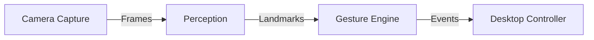
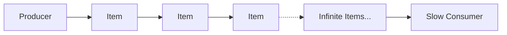
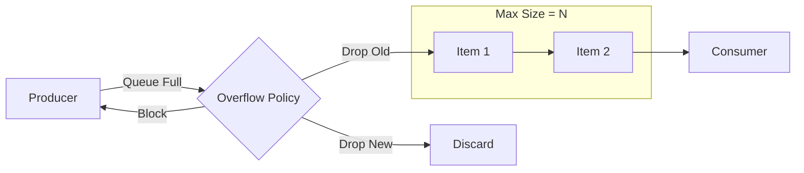
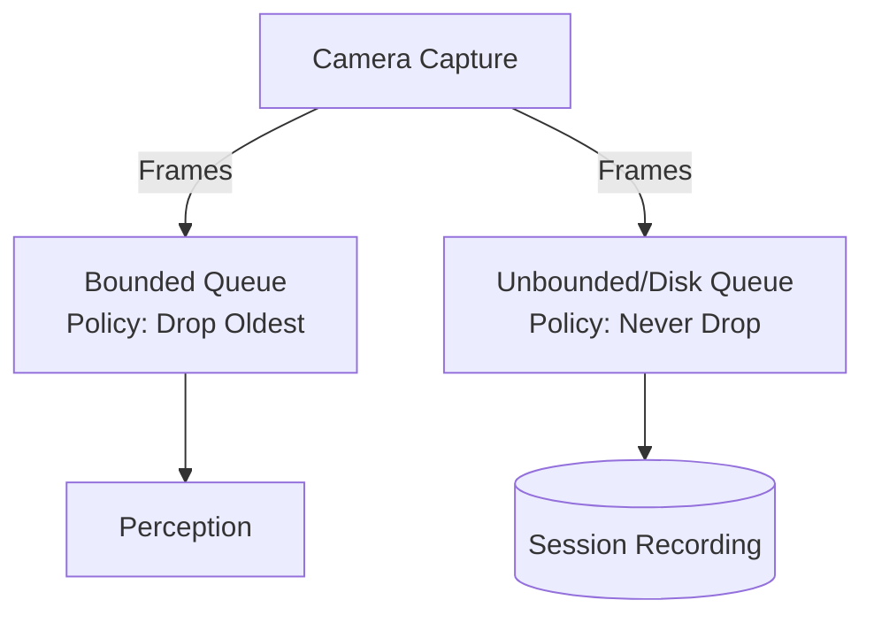
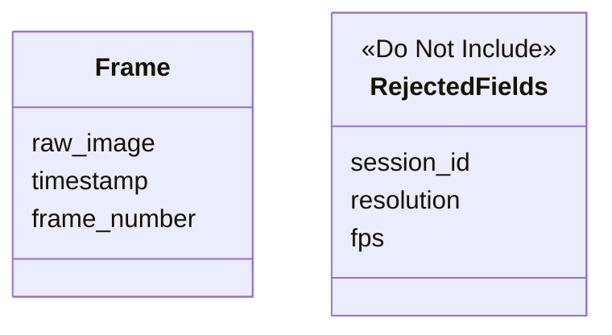
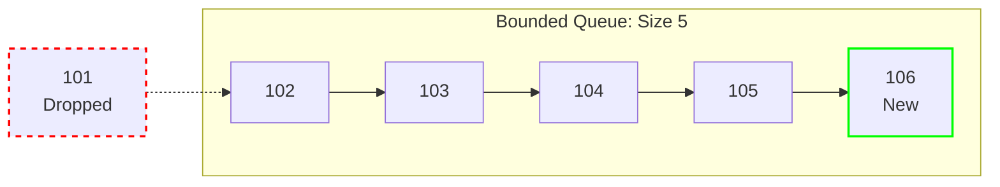
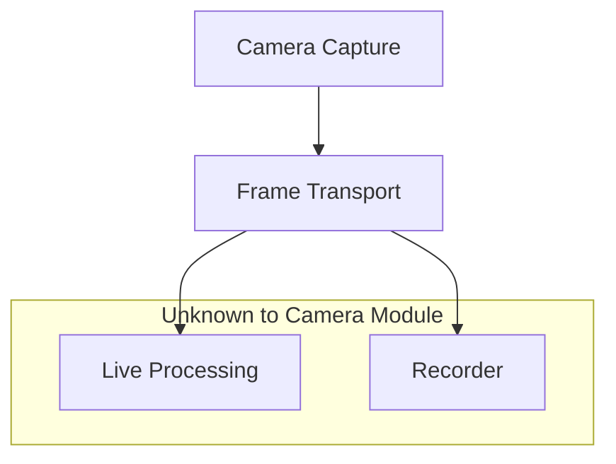

# Real-Time Systems: Latency Budgets and Frame Timing

> **AirOS Engineering Handbook · Document 04**

---

| Field | Value |
|---|---|
| **Document Version** | v1.0 |
| **Last Updated** | 2026-07-11 |
| **Author** | Varun |
| **Status** | Living Document |
| **Prerequisites** | [01-hand-landmarks-and-coordinate-system.md](./01-hand-landmarks-and-coordinate-system.md), [02-data-pipeline.md](./02-data-pipeline.md), [03-recorder-and-replay.md](./03-recorder-and-replay.md) |
| **Next Reading** | N/A |

---

## Objective

This document teaches the real-time engineering concepts required to build AirOS's production camera pipeline. It contrasts offline systems with real-time interactive constraints, explores producer-consumer decoupling, justifies bounded queue policies, and formally documents the Camera Capture module's design review.

---

## Table of Contents

1. [What Makes a System Real-Time](#1-what-makes-a-system-real-time)
2. [Offline Systems vs Real-Time Systems](#2-offline-systems-vs-real-time-systems)
3. [Latency as a Product Requirement](#3-latency-as-a-product-requirement)
4. [Producer–Consumer Architecture](#4-producerconsumer-architecture)
5. [Why Queues Exist](#5-why-queues-exist)
6. [Unbounded vs Bounded Queues](#6-unbounded-vs-bounded-queues)
7. [Queue Overflow Policies](#7-queue-overflow-policies)
8. [Freshness vs Completeness](#8-freshness-vs-completeness)
9. [Architectural Conflict Discovered Today](#9-architectural-conflict-discovered-today)
10. [Engineering Decisions Reached Today](#10-engineering-decisions-reached-today)
11. [Transition to Implementation](#11-transition-to-implementation)
12. [Camera Capture Module — Design Review](#12-camera-capture-module--design-review)

---

## 1. What Makes a System Real-Time

In most software systems, correctness is defined entirely by producing the right answer. If a script calculates the correct final sum, it is correct, whether it took one second or ten.

In a real-time system, correctness is defined by producing the right answer *before the deadline*. A perfect answer delivered too late is identical to a wrong answer. Timing is a structural component of correctness.

For AirOS, cursor control is an interactive real-time system. If the user moves their hand to click a button, but the cursor movement is delayed by 300 milliseconds, the user will overshoot the button. The system is functionally broken, not just slow.

---

## 2. Offline Systems vs Real-Time Systems

Offline systems optimize for final result quality. They can afford to pause, re-process, batch, or wait for missing data. A video rendering job or a batch data pipeline operates this way.

Real-time systems optimize for producing a sufficiently good result before the deadline. They must operate continuously and deterministically under constraints. In AirOS, the system must process camera frames and emit cursor events at least 30 to 60 times per second, continuously, without jitter.

---

## 3. Latency as a Product Requirement

Latency is not just an infrastructure metric; it is a core product requirement for interactive systems. 

Consider two design choices for AirOS:
- 99% gesture accuracy with 250 ms latency
- 94% gesture accuracy with 60 ms latency

AirOS chooses the second design. High latency destroys the feeling of direct manipulation. The user experience is dominated by latency far more than small improvements in accuracy. The user can naturally compensate for a slightly noisy cursor if the feedback loop is tight, but they cannot compensate for a sluggish one.

Note that confidence (how sure the model is) and accuracy (how often it is right) are separate from latency. We constrain the architecture to maintain low latency even if confidence is low.

---

## 4. Producer–Consumer Architecture

A real-time pipeline is structured as a series of producers and consumers.

- **Producer:** An entity that generates data at some rate.
- **Consumer:** An entity that processes data at some rate.

Producers and consumers are decoupled to prevent a slow consumer from blocking a fast producer, or a fast producer from overwhelming a slow consumer. They communicate via queues.

In AirOS, this architecture looks like:

- **Camera Capture:** Produces frames.
- **Perception:** Consumes frames, produces landmarks.
- **Gesture Engine:** Consumes landmarks, produces gesture events.
- **Desktop Controller:** Consumes gesture events.

---

## 5. Why Queues Exist

Queues exist to absorb temporary speed differences between producers and consumers. If the camera produces a frame every 16ms, but Perception occasionally takes 20ms to process a complex frame, the queue holds the next frame until Perception is ready. This buffering prevents the pipeline from locking up due to momentary jitter.

However, queues do not solve sustained throughput imbalances. If the producer is consistently faster than the consumer, the queue will inevitably fill up.

---

## 6. Unbounded vs Bounded Queues

An **unbounded queue** has no size limit. It grows indefinitely as long as memory permits. If a consumer is slower than a producer, an unbounded queue will:
- Increase memory usage infinitely.
- Increase latency infinitely (older frames pile up before being processed).
- Eventually cause the system to crash.

A **bounded queue** has a fixed capacity. When full, it forces an explicit engineering policy to handle the overflow. 

Production real-time systems almost always use bounded queues because they force the system to fail predictably and enforce latency guarantees.

---

## 7. Queue Overflow Policies

When a bounded queue is full, the system must decide what to do with new data. Common strategies include:

- **Block producer:** The producer waits until there is space. This causes backpressure, potentially blocking the camera hardware.
- **Reject new frame (Drop Newest):** The queue ignores the incoming frame. The consumer will process old data.
- **Drop Oldest (Overwrite):** The queue discards the oldest unread frame to make room for the newest one.

For AirOS's live processing pipeline, **Drop Oldest** is the correct policy. If Perception is falling behind, we do not want it to process a 500ms-old frame. We want it to process the frame captured *right now*. 

---

## 8. Freshness vs Completeness

This leads to a core engineering principle for this system:

> Fresh information is often more valuable than complete information.

In cursor control, video conferencing, or robotics, processing an outdated frame is actively harmful. It is better to skip a frame and process the newest one than to process every frame with increasing delay. The live pipeline optimizes for freshness.

---

## 9. Architectural Conflict Discovered Today

During the design process, we identified a fundamental conflict in requirements between two consumers of the camera stream.

- **Live Cursor:** Requires low latency and the freshest frame. (Optimizes for freshness, tolerates dropped frames).
- **Recorder:** Requires complete history and zero frame loss for faithful replay. (Optimizes for completeness, cannot drop frames).

These are conflicting requirements. Therefore, one queue should not attempt to satisfy both.

The recorder must preserve observations independently of any frame-dropping policy used by the live processing pipeline. This follows directly from the principle: *Infrastructure preserves facts.* If the live pipeline drops a frame to maintain latency, the recorder must still capture that frame, because the frame is a fact that occurred.

---

## 10. Engineering Decisions Reached Today

Based on the real-time constraints, we have reached the following architectural decisions:

1. **Camera Capture** is the primary producer of facts (frames).
2. **Perception** acts as both a consumer of frames and a producer of landmarks.
3. The **live processing pipeline** prefers freshness. It will drop old frames if necessary to maintain latency.
4. The **Recorder** prefers completeness. It must capture every frame regardless of the live pipeline's state.
5. Communication between stages will use **bounded queues**.
6. Queue overflow policy belongs to the system design, not the generic queue data structure. The system explicitly chooses "Drop Oldest" for live processing.
7. AirOS optimizes for freshness over fairness.

---

## 11. Transition to Implementation

These concepts directly motivate the implementation of the first production module: **Camera Capture**. 

The Camera Capture module will be responsible for acquiring frames from the hardware at a fixed rate and distributing them to the downstream consumers (Perception and Recorder) while respecting their distinct queueing and latency policies. This module is the foundation of the real-time pipeline.

---

## 12. Camera Capture Module — Design Review

This section documents the engineering decisions made before implementation.

### 12.1 Purpose of the Camera Capture Module

The Camera Capture module has one responsibility:
- Acquire raw frames from the webcam.
- Timestamp each frame.
- Assign sequential frame numbers.
- Publish frames into the live pipeline.

It is a producer. It does not interpret data.

### 12.2 Responsibilities

The Camera Capture module is responsible for:
- Opening the camera.
- Reading frames continuously.
- Creating Frame objects.
- Timestamping observations.
- Assigning frame numbers.
- Publishing frames to the downstream pipeline.
- Handling camera lifecycle.

### 12.3 Explicit Non-Responsibilities

Camera Capture must **NOT**:
- Detect landmarks.
- Run MediaPipe.
- Recognize gestures.
- Predict confidence.
- Smooth data.
- Record sessions.
- Save files.
- Compress images.
- Attach session information.
- Understand replay.

These responsibilities belong to other modules.

### 12.4 Frame Design Decisions

During the design review, we established that a `Frame` object should only contain information that belongs to a single observation.

**Current agreed fields:**
- Raw image
- Timestamp
- Frame number

**Rejected fields and reasoning:**
- **Session ID:** Belongs to Recorder because recording sessions are Recorder concepts.
- **Resolution:** Belongs to camera configuration because it usually remains constant throughout a session.
- **Aspect Ratio:** Belongs to camera configuration rather than individual observations.
- **FPS:** Property of the camera stream rather than an individual frame.
- **Compression information:** Camera Capture does not perform compression.

This reinforces the engineering principle: *Store only information owned by the object.*

### 12.5 Queue Policy Discussion

Live processing values freshness over completeness. Therefore, when the live queue becomes full, the system will **drop the oldest frame**.

**Example:**
- Queue: `101, 102, 103, 104, 105`
- New frame: `106`
- Result: `102, 103, 104, 105, 106`

This keeps processing closer to the user's current hand position. This policy applies only to the live processing pipeline.

### 12.6 Recorder Conflict

Recorder and Live Processing have different goals.
- **Recorder requires:** Complete history, zero observation loss.
- **Live Processing requires:** Low latency, fresh observations.

Therefore, the recorder must not depend on a queue that drops frames. This reinforces the project's principle: *Infrastructure preserves facts.*

### 12.7 Camera Module Philosophy

The Camera Capture module should know as little as possible. It should not know:
- Who consumes the frames.
- Whether recording is enabled.
- Whether replay exists.
- Whether gesture recognition is active.

Its only responsibility is producing timestamped observations.

### 12.8 Engineering Lessons Learned

- Responsibilities are more important than convenience.
- Every piece of data should have a clear owner.
- Separate observations from configuration.
- Separate observations from recording metadata.
- Real-time systems optimize for freshness.
- Different consumers may require different policies.
- Queue policy belongs to system design rather than the queue itself.
- Good software engineering removes responsibilities instead of continuously adding them.

### 12.9 Next Step

The design review is complete. The next milestone is implementing the first production module: **Camera Capture**. 

Future discussions should focus on validating today's design decisions through production-quality code rather than further architectural expansion.
